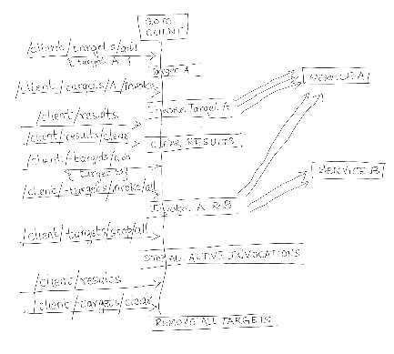
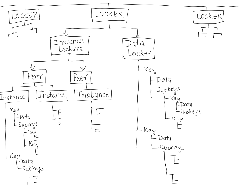

#
# goto

## What is it?
A multi-faceted application to assist with various kinds of automated testing. It can act as a Client, a Server, a Proxy, a Job Executor, a Registry, or even all of these at once.

## Why?
It's hard to find some of these features together in a single tool

## How to use it?
It's available as a docker image: https://hub.docker.com/repository/docker/uk0000/goto.
Or build it locally on your machine
```
go build -o goto .
```

## But what can it do?
- Say you need an application deployed as a service in k8s or on VMs, that can respond to requests on several ports using HTTP, HTTP/2, GRPC or TCP protocols both over plain text and TLS. `Goto` is what you need.
- Say you want to test a client or a proxy, and want to introduce some chaos in your testing, so you need a service that can open or close a port on the fly, or can convert a port from plaintext to TLS and vice versa on the fly. `Goto` does it.
- Say you need to test a client against different specific response payloads, so you need a substitute mock service that can stand in for the real service, where you can configure a payload on the fly for specific request URIs, headers, etc. Go `Goto`.
- A lot more scenarios can benefit from `goto`. See some more scenarios further below in the doc.

## Some simple usage examples?
- Start `goto` as a server with multiple ports and protocols (first port is the default bootstrap port):
  ```
  goto --ports 8080,8081/http,8082/grpc,8000/tcp
  ```
- Add a new listener with GRPC protocol and open immediately
  ```
  curl -X POST localhost:8080/listeners/add --data '{"port":9091, "protocol":"grpc", "open":true}'
  ```
- Add a new listener with TCP protocol without opening it
  ```
  curl -X POST localhost:8080/listeners/add --data '{"port":9000, "protocol":"tcp", "open":false}'
  ```
- Reconfigure TCP configurations of an existing listener to stream certain payload size 
  ```
  curl -X POST localhost:8080/tcp/9000/configure --data '{"stream": true, "streamChunkSize":"250", "streamChunkCount":15, "streamChunkDelay":"1s", "connectionLife":"30s"}'
  ```
- Close a non-default port on the fly
  ```
  curl -X POST localhost:8080/listeners/8081/close
  ```
- Add TLS certs for a non-default port and reopen it to switch to TLS mode
  ```
  curl -X PUT localhost:8080/listeners/8081/cert/add --data-binary @/somepath/goto.cert
  curl -X PUT localhost:8080/listeners/8081/key/add --data-binary @/somepath/goto.key
  curl -X POST localhost:8080/listeners/8081/reopen
  ```
- Configure a `goto` server instance to count number of requests received for headers `foo` and `bar`
  ```
  curl -X PUT localhost:8081/request/headers/track/add/foo,bar
  ```
- Configure a `goto` client instance to send some requests to an HTTP target
  ```
  curl -s localhost:8080/client/targets/add --data '{"name": "t1", "method": "GET", "url": "http://localhost:8081/foo", "body": "some payload", "replicas": 2, "requestCount": 10}'
  ```
- Configure a `goto` client instance to track responses received for headers `foo` and `bar`
  ```
  curl -X PUT localhost:8080/client/track/headers/add/foo,bar
  ```
- More to come... 


## Show me the money!
Keep reading...


<br/>

---

# Overview


Check these flow diagrams to get a visual overview of `Goto` behavior and usage.

### Flow: [Use client APIs to register and invoke traffic to targets ](docs/goto-client-targets.md) <a href="docs/goto-client-targets.md"></a>

### Flow: [Configuring Server Listeners](docs/goto-listeners.md) <a href="docs/goto-listeners.md"></a>

### Flow: [<small>`Goto`</small> Registry - Peer interactions](docs/goto-registry-peers-interactions.md) <a href="docs/goto-registry-peers-interactions.md"></a>

### Overview: [Goto Lockers](docs/goto-lockers.md) <a href="docs/goto-lockers.md"></a>


<br/>

---
# Scenarios

Before we look into detailed features and APIs exposed by the tool, let's look at how this tool can be used in a few scenarios to understand it better.

## Basic Scenarios
#
### Scenario: [Use HTTP client to send requests and track results](docs/scenarios-basic.md#basic-client-usage)

### Scenario: [Use HTTP server to respond to any arbitrary client HTTP requests](docs/scenarios-basic.md#basic-server-usage)

### Scenario: [HTTPS traffic with certificate validation](docs/scenarios-basic.md#basic-https-usage)

### Scenario: [Count number of requests received at each server instance for certain headers](docs/scenarios-basic.md#basic-header-tracking)


## K8S Scenarios

### Scenario: [Run dynamic traffic from K8s pods at startup](docs/scenarios-k8s.md#k8s-traffic-at-startup)

### Scenario: [Deal with transient pods](docs/scenarios-k8s.md#k8s-transient-pods)

### Scenario: [Capture results from pods that may terminate anytime](docs/scenarios-k8s.md#k8s-capture-transient-pod-results)


## Resiliency Scenarios

### Scenario: [Test a client's behavior upon service failure](docs/scenarios-resiliency.md#scenario-test-a-clients-behavior-upon-service-failure)


### Scenario: [Track client hang-ups on server via request/connection timeouts](docs/scenarios-resiliency.md#server-resiliency-client-hangups)

<br/>

  <span style="color:red">
  TODO: There are many more possible scenarios to describe here, to show how this tool can be used for various kinds of chaos testing and investigations.
  </span>

<br/>

#
# Features

It's an HTTP client and server built into a single application. 

As a server, it can act as an HTTP proxy that lets you intercept HTTP requests and get some insights (e.g. based on headers) before forwarding it to its destination. But it can also respond to requests as a server all by itself, while still capturing interesting stats and counters that can be used to correlate information against the client.

As a client, it allows sending requests to various destinations and tracking responses by headers and response status code.

The application exposes all its features via REST APIs as described below. Additionally, it can respond to all undefined URIs with a configurable status code.

The docker image is built with several useful utilities included: `curl`, `wget`, `nmap`, `iputils`, `openssl`, `jq`, etc.

# <a name="toc"></a>
## TOC

### [Startup Command](#goto-startup-command)

### Goto Client Features
* [Targets and Traffic](#goto-client-targets-and-traffic)
* [Client APIs](#client-apis)
* [Client Events](#client-events)
* [Client JSON Schemas](#client-json-schemas)
* [Client APIs and Results Examples](docs/client-api-examples.md)

### [Server Features](#goto-server-features)
* [Goto Response Headers](#goto-response-headers)
* [Server Logs](#goto-server-logs)
* [Goto Version](#-goto-version)
* [Events](#-events)
* [Metrics](#-metrics)
* [Listeners](#-listeners)
* [Listener Label](#-listener-label)
* [TCP Server](#-tcp-server)
* [GRPC Server](#-grpc-server)
* [Request Headers Tracking](#-request-headers-tracking)
* [Request Timeout](#-request-timeout-tracking)
* [URIs](#-uris)
* [Probes](#-probes)
* [Requests Filtering](#-requests-filtering)
* [Response Delay](#-response-delay)
* [Response Headers](#-response-headers)
* [Response Payload](#-response-payload)
* [Ad-hoc Payload](#-ad-hoc-payload)
* [Stream (Chunked) Payload](#-stream-chunked-payload)
* [Response Status](#-response-status)
* [Response Triggers](#-response-triggers)
* [Status API](#-status-api)
* [Delay API](#-delay-api)
* [Echo API](#-echo-api)
* [Catch All](#-catch-all)

### Goto Proxy
* [Proxy Features](#proxy)

### Jobs
* [Jobs Features](#jobs-features)

### Goto Registry
- [Registry Features](#registry)
- [Registry Peers APIs](#registry-peers-apis)
- [Locker Management APIs](#locker-management-apis)
- [Data Sub-Lockers Read APIs](#data-sub-lockers-read-apis)
- [Lockers Read APIs](#lockers-read-apis)
- [Peers Events APIs](#registry-events-apis)
- [Peer Targets Management APIs](#peers-targets-management-apis)
- [Peer Jobs Management APIs](#peers-jobs-management-apis)
- [Peers Config Management APIs](#peers-config-management-apis)
- [Peer Call APIs](#peers-call-apis)
- [Registry clone, dump and load APIs](#registry-clone-dump-and-load-apis)
<br/>

# <a name="goto-startup-command"></a>
# Goto Startup Command
First things first, run the application:
```
go run main.go --port 8080
```
Or, build and run
```
go build -o goto .
./goto
```

The application accepts the following command arguments:

<table>
    <thead>
        <tr>
            <th>Argument</th>
            <th>Description</th>
            <th>Default Value</th>
        </tr>
    </thead>
    <tbody>
        <tr>
          <td rowspan="2"><pre>--port {port}</pre></td>
          <td>Primary port the server listens on. One of <strong>--port</strong> or <strong>--ports</strong> must be given. </td>
          <td rowspan="2">8080</td>
        </tr>
        <tr>
          <td>* Alternately, `--ports` can be used for multiple ports. Additional ports can be opened by making listener API calls on this port. See <a href="#server-listeners">Listeners</a> feature for more details.</td>
        </tr>
        <tr>
          <td rowspan="2"><pre>--ports {ports}</pre></td>
          <td>Initial list of ports that the server should start with. Port list is given as comma-separated list of <pre>{port1}/{protocol1},{port2}/{protocol2},...</pre> The first port in the list is used as primary port. </td>
          <td rowspan="2">""</td>
        </tr>
        <tr>
          <td>* For example: <pre>--ports 8080/http,8081/http,9000/tcp</pre> Protocol is optional, and defaults to http. E.g., to open multiple http ports: <pre>--ports 8080,8081,8082</pre>  Additional ports can be opened by making listener API calls on this port. See <a href="#server-listeners">Listeners</a> feature for more details.</td>
        </tr>
        <tr>
          <td rowspan="2"><pre>--label `{label}`</pre></td>
          <td>Label this server instance will use to identify itself. </td>
          <td rowspan="2">Goto-`IPAddress:Port` </td>
        </tr>
        <tr>
          <td>* This is used both for setting `Goto`'s default response headers as well as when registering with registry.</td>
        </tr>
        <tr>
          <td rowspan="1"><pre>--startupDelay {delay}</pre></td>
          <td>Delay the startup by this duration. </td>
          <td rowspan="1">1s</td>
        </tr>
        <tr>
          <td rowspan="1"><pre>--shutdownDelay {delay}</pre></td>
          <td>Delay the shutdown by this duration after receiving SIGTERM. </td>
          <td rowspan="1">1s</td>
        </tr>
        <tr>
          <td rowspan="2"><pre>--registry {url}</pre></td>
          <td>URL of the Goto Registry instance that this instance should connect to. </td>
          <td rowspan="2"> "" </td>
        </tr>
        <tr>
          <td>* This is used to getting initial configs and optionally report results to registry. See <a href="#registry-features">Registry</a> feature for more details.</td>
        </tr>
        <tr>
          <td rowspan="2"><pre>--locker={true|false}</pre></td>
          <td> Whether this instance should report its results back to the Goto Registry instance. </td>
          <td rowspan="2"> false </td>
        </tr>
        <tr>
          <td>* An instance can be asked to report its results to registry in case the  instance is transient, e.g. pods.</td>
        </tr>
        <tr>
          <td rowspan="2"><pre>--events={true|false}</pre></td>
          <td> Whether this instance should generate events and build a timeline locally. </td>
          <td rowspan="2"> true </td>
        </tr>
        <tr>
          <td>* Events timeline can be helpful in observing how various operations and traffic were interleaved, and help reason about some outcome.</td>
        </tr>
        <tr>
          <td rowspan="2"><pre>--publishEvents={true|false}</pre></td>
          <td> Whether this instance should publish its events to the registry to let registry build a unified timeline of events collected from various peer instances. This flag takes effect only if a registry URL is specified to let this instance connect to a registry instance. </td>
          <td rowspan="2"> false </td>
        </tr>
        <tr>
          <td>* Events timeline can be helpful in observing how various operations and traffic were interleaved, and help reason about some outcome.</td>
        </tr>
        <tr>
          <td rowspan="2"><pre>--certs `{path}`</pre></td>
          <td> Directory path from where to load TLS root certificates. </td>
          <td rowspan="2"> "/etc/certs" </td>
        </tr>
        <tr>
          <td>* The loaded root certificates are used if available, otherwise system default root certs are used.</td>
        </tr>
        <tr>
          <td rowspan="1"><pre>--serverLogs={true|false}</pre></td>
          <td>Enable/Disable all goto server logging. </td>
          <td rowspan="1">true</td>
        </tr>
        <tr>
          <td rowspan="1"><pre>--adminLogs={true|false}</pre></td>
          <td>Enable/Disable logging of admin calls to configure goto. </td>
          <td rowspan="1">true</td>
        </tr>
        <tr>
          <td rowspan="1"><pre>--metricsLogs={true|false}</pre></td>
          <td>Enable/Disable logging of calls to metrics URIs. </td>
          <td rowspan="1">true</td>
        </tr>
        <tr>
          <td rowspan="1"><pre>--probeLogs={true|false}</pre></td>
          <td>Enable/Disable logging of requests received for URIs configured as liveness and readiness probes. See <a href="#server-probes">Probes</a> for more details. </td>
          <td rowspan="1">false</td>
        </tr>
        <tr>
          <td rowspan="1"><pre>--clientLogs={true|false}</pre></td>
          <td>Enable/Disable logging of client activities. </td>
          <td rowspan="1">false</td>
        </tr>
        <tr>
          <td rowspan="1"><pre>--invocationLogs={true|false}</pre></td>
          <td>Enable/Disable client's target invocation logs. </td>
          <td rowspan="1">false</td>
        </tr>
        <tr>
          <td rowspan="1"><pre>--registryLogs={true|false}</pre></td>
          <td>Enable/Disable all registry logs. </td>
          <td rowspan="1">false</td>
        </tr>
        <tr>
          <td rowspan="1"><pre>--lockerLogs={true|false}</pre></td>
          <td>Enable/Disable logging of locker requests on Registry instance. </td>
          <td rowspan="1">false</td>
        </tr>
        <tr>
          <td rowspan="1"><pre>--eventsLogs={true|false}</pre></td>
          <td>Enable/Disable logging of store event calls from peers on Registry instance. </td>
          <td rowspan="1">false</td>
        </tr>
        <tr>
          <td rowspan="1"><pre>--reminderLogs={true|false}</pre></td>
          <td>Enable/Disable reminder logs received from various peer instances (applicable to goto instance acting as registry). </td>
          <td rowspan="1">false</td>
        </tr>
        <tr>
          <td rowspan="1"><pre>--peerHealthLogs={true|false}</pre></td>
          <td>Enable/Disable logging of requests received from Registry for peer health checks </td>
          <td rowspan="1">true</td>
        </tr>
    </tbody>
</table>

Once the server is up and running, rest of the interactions and configurations are done purely via REST APIs.

###### <small> [Back to TOC](#toc) </small>

<br/>

# <a name="goto-client-targets-and-traffic"></a>
# Goto Client: Targets and Traffic
As a client tool, `goto` offers the feature to configure multiple targets and send http traffic:
- Allows targets to be configured and invoked via REST APIs
- Configure targets to be invoked ahead of time before invocation, as well as auto-invoke targets upon configuration
- Invoke selective targets or all configured targets in batches
- Control various parameters for a target: number of concurrent, total number of requests, minimum wait time after each replica set invocation per target, various timeouts, etc
- Headers can be set to track results for target invocations, and APIs make those results available for consumption as JSON output.
- Retry requests for specific response codes, and option to use a fallback URL for retries
- Make simultaneous calls to two URLs to perform an A-B comparison of responses. In AB mode, the same request ID (enabled via sendID flag) are used for both A and B calls, but with a suffix `-B` used for B calls. This allows tracking the A and B calls in logs.

The invocation results get accumulated across multiple invocations until cleared explicitly. Various results APIs can be used to read the accumulated results. Clearing of all results resets the invocation counter too, causing the next invocation to start at counter 1 again. When a peer is connected to a registry instance, it stores all its invocation results in a registry locker. The peer publishes its invocation results to the registry at an interval of 3-5 seconds depending on the flow of results. See Registry APIs for detail on how to query results accumulated from multiple peers.

In addition to keeping the results in the `goto` client instance, those are also stored in locker on registry instance if enabled. (See `--locker` command arg). Various events are added to the peer timeline related to target invocations it performs, which are also reported to the registry. These events can be seen in the event timeline on the peer instance as well as its event timeline from the registry.


# <a name="client-apis"></a>
#### Client APIs
|METHOD|URI|Description|
|---|---|---|
| POST      | /client/targets/add                   | Add a target for invocation. [See `Client Target JSON Schema` for Payload](#client-target-json-schema) |
| POST      |	/client/targets/`{targets}`/remove      | Remove given targets |
| POST      | /client/targets/`{targets}`/invoke      | Invoke given targets |
| POST      |	/client/targets/invoke/all            | Invoke all targets |
| POST      | /client/targets/`{targets}`/stop        | Stops a running target |
| POST      | /client/targets/stop/all              | Stops all running targets |
| GET       |	/client/targets                       | Get list of currently configured targets |
| POST      |	/client/targets/clear                 | Remove all targets |
| GET       |	/client/targets/active                | Get list of currently active (running) targets |
| POST      |	/client/targets/cacert/add            | Store CA cert to use for all target invocations |
| POST      |	/client/targets/cacert/remove         | Remove stored CA cert |
| PUT, POST |	/client/track/headers/add/`{headers}`   | Add headers for tracking response counts per target |
| PUT, POST |	/client/track/headers/remove/`{header}`| Remove header (single) from tracking set |
| POST      | /client/track/headers/clear           | Remove all tracked headers |
| GET       |	/client/track/headers                 | Get list of tracked headers |
| GET       |	/client/results                       | Get combined results for all invocations since last time results were cleared. See [`Results Schema`](#client-results-schema) |
| GET       |	/client/results/invocations           | Get invocation results broken down for each invocation that was triggered since last time results were cleared |
| POST      | /client/results/clear                 | Clear previously accumulated invocation results |
| POST      | /client/results/clear                 | Clear previously accumulated invocation results |
| POST      | /client/results/all/`{enable}`          | Enable/disable collection of cumulative results across all targets. This gives high level overview of all traffic, but at a performance overhead. Disabled by default. |
| POST      | /client/results/invocations/`{enable}`          | Enable/disable collection of results by invocations. This gives more detailed visibility into results per invocation but has performance overhead. Disabled by default. |

###### <small> [Back to TOC](#toc) </small>

# <a name="client-events"></a>
#### Client Events
- `Target Added`: an invocation target was added
- `Targets Removed`: one or more invocation targets were removed
- `Targets Cleared`: all invocation targets were removed
- `Tracking Headers Added`: headers added for tracking against invocation responses
- `Tracking Headers Removed`: one or more tracking headers were removed
- `Tracking Headers Cleared`: all tracking headers were removed
- `Client CA Cert Stored`: CA cert was added for validating TLS cert presented by target
- `Client CA Cert Removed`: CA cert was removed
- `Results Cleared`: all collected invocation results were cleared
- `Target Invoked`: one or more invocation targets were invoked
- `Targets Stopped`: one or more invocation targets were stopped
- `Invocation Started`: invocation started for a target
- `Invocation Finished`: invocation finished for a target
- `Invocation Response Status`: Either first invocation response received, or the HTTP response status was different from previous response from a target during an invocation
- `Invocation Repeated Response Status`: All HTTP responses after the first response from a target where the response status code was same as previous are accumulated and reported in summary. This event is sent out when the next response is found to carry a different response status code, or if all requests to a target completed for an invocation.
- `Invocation Failure`: Event reported upon first failed request, or if a request fails after previous successful request.
- `Invocation Repeated Failure`: All request failures after a failed request are accumulated and reported in summary, either when the next request succeeds or when the invocation completes.

###### <small> [Back to TOC](#toc) </small>

# <a name="client-json-schemas"></a>
### Client JSON Schemas

#### Client Target JSON Schema
|Field|Data Type|Default Value|Description|
|---|---|---|---|
| name         | string         || Name for this target |
| method       | string         || HTTP method to use for this target |
| url          | string         || URL for this target   |
| burls        | []string       || Secondary URLs to use for `fallback` or `AB Mode` (see below)   |
| verifyTLS    | bool           |false| Whether the TLS certificate presented by the target is verified. (Also see `--certs` command arg) |
| headers      | [][]string     || Headers to be sent to this target |
| body         | string         || Request body to use for this target|
| autoPayload  | string         || Auto-generate payload of this size when making calls to this target. This field supports numeric sizes (e.g. `1000`) as well as byte size suffixes `K`, `KB`, `M` and `MB` (e.g. `1K`). If auto payload is specified, `body` field is ignored. |
| protocol     | string         |`HTTP/1.1`| Request Protocol to use. Supports `HTTP/1.1` (default) and `HTTP/2.0`.|
| autoUpgrade  | bool           |false| Whether client should negotiate auto-upgrade from http/1.1 to http/2. |
| replicas     | int            |1| Number of parallel invocations to be done for this target. |
| requestCount | int            |1| Number of requests to be made per replicas for this target. The final request count becomes replicas * requestCount   |
| initialDelay | duration       || Minimum delay to wait before starting traffic to a target. Actual delay will be the max of all the targets being invoked in a given round of invocation. |
| delay        | duration       |10ms| Minimum delay to be added per request. The actual added delay will be the max of all the targets being invoked in a given round of invocation, but guaranteed to be greater than this delay |
| retries      | int            |0| Number of retries to perform for requests to this target for connection errors or for `retriableStatusCodes`.|
| retryDelay   | duration       |1s| Time to wait between retries.|
| retriableStatusCodes| []int|| HTTP response status codes for which requests should be retried |
| sendID       | bool           |false| Whether or not a unique ID be sent with each client request. If this flag is set, a query param `x-request-id` will be added to each request, which can help with tracing requests on the target servers |
| connTimeout  | duration       |10s| Timeout for opening target connection |
| connIdleTimeout | duration    |5m| Idle Timeout for target connection |
| requestTimeout | duration     |30s| Timeout for HTTP requests to the target |
| autoInvoke   | bool           |false| Whether this target should be invoked as soon as it's added |
| fallback     | bool           |false| If enabled, retry attempts will use secondary urls (`burls`) instead of the primary url. The query param `x-request-id` will carry suffixes of `-<counter>` for each retry attempt. |
| abMode       | bool           |false| If enabled, each request will simultaneously be sent to all secondary urls (`burls`) in addition to the primary url. The query param `x-request-id` will carry suffixes of `-B-<index>` for each secondary URL. |

###### <small> [Back to TOC](#toc) </small>


#### Client Results Schema (output of API /client/results)
The results are keyed by targets, with an empty key "" used to capture all results (across all targets) if "capturing of all results" is enabled (via API `/client/results/all/`{enable}``).
The schema below describes fields per target.

|Field|Data Type|Description|
|---|---|---|
| target            | string | Target for which these results are captured |
| invocationCounts      | int                 | Total requests sent to this target |
| firstResponse        | time                | Time of first response received from the target |
| lastResponse         | time                | Time of last response received from the target |
| retriedInvocationCounts | int | Total requests to this target that were retried at least once |
| countsByStatus       | string->int   | Response counts by HTTP Status |
| countsByStatusCodes  | string->int   | Response counts by HTTP Status Code |
| countsByURIs         | string->int   | Response counts by URIs |
| countsByHeaders      | string->HeaderCounts   | Response counts by header, with detailed info captured in `HeaderCounts` object described below |


#### HeaderCounts schema
The schema below describes fields per target.

|Field|Data Type|Description|
|---|---|---|
| target            | string | Target for which these results are captured |
| count       | CountInfo   | request counts info for this header |
| countsByValues | string->CountInfo   | request counts info per header value for this header |
| countsByStatusCodes | int->CountInfo   | request counts info per status code for this header |
| countsByValuesStatusCodes | string->int->CountInfo   | request counts info per status code per header value for this header |
| crossHeaders | string->HeaderCounts   | HeaderCounts for each cross-header for this header |
| crossHeadersByValues | string->string->HeaderCounts   | HeaderCounts for each cross-header per header value for this header |
| firstResponse        | time | Time of first response received for this header |
| lastResponse         | time | Time of last response received for this header |


#### CountInfo schema
The schema below describes fields per target.

|Field|Data Type|Description|
|---|---|---|
| value       | int | number of responses in this set  |
| retries     | int | number of requests that were retried in this set |
| firstResponse | time | Time of first response in this set  |
| lastResponse  | time | Time of last response received in this set |


#### Invocation Results Schema (output of API /client/results/invocations)
* Reports results for all invocations since last clearing of results, as an Object with invocation counter as key and invocation's results as value. The results for each invocation have same schema as `Client Results Schema`, with an additional bool flag `finished` to indicate whether the invocation is still running or has finished. See example below.

#### Active Targets Schema (output of API /client/targets/active)
* Reports set of targets for which traffic is running at the time of API invocation. Result is an object with invocation counter as key, and value as object that has status for all active targets in that invocation. For each active target, the following data is reported. Also see example below.
  
|Field|Data Type|Description|
|---|---|---|
| target                | Client Target       | Target details as described in `Client Target JSON Schema`  |
| completedRequestCount | int                 | Number of requests completed for this target in this invocation |
| stopRequested         | bool                | Whether `stop` has been requested for this target |
| stopped               | bool                | Whether the target has already stopped. Quite likely this will not show up as true, because the target gets removed from active set soon after it's stopped |


#### Client API Examples
See [Client APIs and Results Examples](docs/client-api-examples.md)

###### <small> [Back to TOC](#toc) </small>

<br/>

# <a name="goto-server-features"></a>
# Goto Server Features
`Goto` as a server is useful for testing behavior, features or chaos testing of some client application, a proxy/sidecar, a gateway, etc. Or, the server can also be used as a proxy to be put in between a client and a target server application, so that traffic flows through this server where headers can be inspected/tracked before proxying the requests further. The server can add headers, replace request URI with some other URI, add artificial delays to the response, respond with a specific status, monitor request/connection timeouts, etc. The server tracks all the configured parameters, applying those to runtime traffic and building metrics, which can be viewed via various APIs.

###### <small> [Back to TOC](#toc) </small>

<br/>

# <a name="goto-response-headers)"></a>
### Goto Response Headers
`Goto` adds the following common response headers to all http responses it sends:
- `Goto-Host`: identifies the goto instance. This header's value will include hostname, IP, Port, Namespace and Cluster information if available to `Goto` from the following Environment variables: `POD_NAME`, `POD_IP`, `NODE_NAME`, `CLUSTER`, `NAMESPACE`. It falls back to using local compute's IP address if `POD_IP` is not defined. For other fields, it defaults to fixed value `local`.
- `Via-Goto`: carries the label of the listener that served the request. For the bootstrap port, the label used is the one given to `goto` as `--label` startup argument (defaults to auto-generated label).
- `Goto-Port`: carries the port number on which the request was received
- `Goto-Protocol`: identifies whether the request was received over `HTTP` or `HTTPS`
- `Goto-Remote-Address`: remote client's address as visible to `goto`
- `Goto-In-Nanos`: Timestamp in nanoseconds when the request was received by `goto`
- `Goto-Out-Nanos`: Timestamp in nanoseconds when `goto` finished processing the request and sent a response
- `Goto-Took-Nanos`: Total processing time in nanoseconds taken by `goto` to process the request


`Goto` adds the following response headers conditionally:
- `Goto-Response-Delay`: set if `goto` applied a configured delay to the response.
- `Goto-Payload-Length`, `Goto-Payload-Content-Type`: set if `goto` sent a configured response payload
- `Goto-Chunk-Count`, `Goto-Chunk-Length`, `Goto-Chunk-Delay`, `Goto-Stream-Length`, `Goto-Stream-Duration`: set when client requests a streaming response
- `Goto-Requested-Status`: set when `/status` API request is made requesting a specific status
- `Goto-Response-Status`: set on all responses, carrying the HTTP response status code that `goto` has set to the response
- `Goto-Forced-Status`, `Goto-Forced-Status-Remaining`: set when a configured custom response status is applied to a response
- `Goto-Filtered-Request`: set when a request is filtered due to a configured `ignore` or `bypass` filter
- `Request-*`: prefix is added to all request headers and the request headers are sent back as response headers
- `Readiness-Request-*`: prefix is added to all request headers for Readiness probe requests
- `Liveness-Request-*`: prefix is added to all request headers for Liveness probe requests
- `Readiness-Request-Count`: header added to readiness probe responses, carrying the number of readiness requests received so far
- `Readiness-Overflow-Count`: header added to readiness probe responses, carrying the number of times readiness request count has overflown
- `Liveness-Request-Count`: header added to liveness probe responses, carrying the number of liveness requests received so far
- `Liveness-Overflow-Count`: header added to liveness probe responses, carrying the number of times liveness request count has overflown
- `Stopping-Readiness-Request-*`: set when a readiness probe is received while `goto` server is shutting down

###### <small> [Back to TOC](#toc) </small>

<br/>

# <a name="goto-server-logs"></a>
### Goto Server Logs
`goto` server logs are generated with a useful pattern to help figuring out the steps `goto` took for a request. Each log line tells the complete story about request details, how the request was processed, and response sent. Each log line contains the following segments separated by `-->`:
- Request Timestamp
- Listener Host: label of the listener that served the request
- Local and Remote addresses (if available)
- Request Body (first 50 bytes)
- Request Headers (including Host header)
- Request URI, Protocol and Method
- Action(s) taken by `goto` (e.g. delaying a request, echoing back, responding with custom payload, etc.)
- Response Headers
- Response Status Code (final code sent to client after applying any configured overrides)
- Response Body Length

#### Sample log line:
```
2020/11/09 16:59:54 [Goto-Server] --> LocalAddr: [::1]:8080, RemoteAddr: [::1]:62296 --> Request Body: [some payload] --> Request Headers: {"Accept":["*/*"],"Foo":["bar"],"Host":["localhost:8080"],"Protocol":["HTTP/1.1"],"User-Agent":["curl/7.64.1"]} --> Request URI: [/foo], Protocol: [HTTP/1.1], Method: [GET] --> Echoing back --> {"ResponseHeaders": {"Content-Type":["application/json"],"Goto-Host":["localhost@1.2.3.4:8080"],"Goto-In-Nanos":["1613330713218468000"],"Goto-Out-Nanos":["1613330713218686000"],"Goto-Port":["8080"],"Goto-Protocol":["HTTP"],"Goto-Remote-Address":["[::1]:62296"],"Goto-Response-Status":["200"],"Goto-Took-Nanos":["218000"],"Request-Accept":["*/*"],"Request-Foo":["bar"],"Request-Host":["localhost:8080"],"Request-Protocol":["HTTP/1.1"],"Request-Uri":["/foo"],"Request-User-Agent":["curl/7.64.1"],"Via-Goto":["Registry"]}} --> Response Status Code: [200] --> Response Body Length: [229]
```

###### <small> [Back to TOC](#toc) </small>

<br/>

# <a name="goto-version"></a>
## > Goto Version
This API returns version info of the `goto` instance

#### APIs
|METHOD|URI|Description|
|---|---|---|
| GET       | /version          | Get version info of this `goto` instance.  |


###### <small> [Back to TOC](#toc) </small>

<br/>

# <a name="events"></a>
## > Events
`goto` logs various events as it performs operations, responds to admin requests and serves traffic. The Events APIs can be used to read and clear events on a `goto` instance. Additionally, if the `goto` instance is configured to report to a registry, it sends the events to the registry. On registry, events from various peer instances are collected and merged by peer labels. Registry exposes additional APIs to get the event timeline either for a peer (by peer label) or across all connected peers as a single unified timeline. Registry also allows clearing of events timeline on all connected instances through a single API call. See Registry APIs for additional info.

#### APIs

Param `reverse=y` produces the timeline in reverse chronological order. By default events are returned with event's data field set to `...` to reduce the amount of data returned. Param `data=y` returns the events with data.

|METHOD|URI|Description|
|---|---|---|
| POST      | /events/flush    | Publish any pending events to the registry, and clear instance's events timeline. |
| POST      | /events/clear    | Clear the instance's events timeline. |
| GET       | /events?reverse=`[y/n]`&data=`[y/n]` | Get events timeline of the instance. To get combined events from all instances, use the registry's peers events APIs instead.  |
| GET       | /events/search/`{text}`?reverse=`[y/n]`&data=`[y/n]` | Search the instance's events timeline. |


#### Server Events
Each `goto` instance publishes these events at startup and shutdown
- `Server Started`
- `GRPC Server Started`
- `Server Stopped`
- `GRPC Server Stopped`

A `goto` peer that's configured to connect to a `goto` registry publishes the following additional events at startup and shutdown:
- `Peer Registered`
- `Peer Startup Data`
- `Peer Deregistered`

A server generates event `URI First Request` upon receiving first request for a URI. Subsequent requests for that URI are tracked and counted as long as it produces the same response status. Once the response status code changes for a URI, it generates event `Repeated URI Status` to log the accumulated summary of the URI so far, and the logs `URI Status Changed` to report the new status code. The accumulation and tracking logic then proceeds with this new status code, reporting once the status changes again for that URI.

Various other events are published by `goto` peer instances acting as client and server, and by the `goto` registry instance, which are listed in other sections in this Readme.

#### Events API Output Example

<details>
<summary>Example</summary>
<p>

```
curl -s localhost:8081/events

[
  {
    "title": "Listener Added",
    "summary": "9091-1",
    "data": {
      "listener": {"...":"..."},
      "status": "Listener 9091 added and opened."
    },
    "at": "2021-01-30T19:33:10.58548-08:00",
    "peer": "peer1",
    "peerHost": "local.local@1.1.1.1:8081"
  },
  {
    "title": "Peer Registered",
    "summary": "peer1",
    "data": {"...":"..."},
    "at": "2021-01-30T19:33:10.589635-08:00",
    "peer": "peer1",
    "peerHost": "local.local@1.1.1.1:8081"
  },
  {
    "title": "Peer Startup Data",
    "summary": "peer1",
    "data": {
      "Targets": {"...":"..."},
      "Jobs": {"...":"..."},
      "TrackingHeaders": "",
      "Probes": null,
      "Message": ""
    },
    "at": "2021-01-30T19:33:10.590423-08:00",
    "peer": "peer1",
    "peerHost": "local.local@1.1.1.1:8081"
  },
  {
    "title": "Server Started",
    "summary": "peer1",
    "data": {
      "8081": {
        "listenerID": "",
        "label": "local.local@1.1.1.1:8081",
        "port": 8081,
        "protocol": "HTTP",
        "open": true,
        "tls": false
      },
      "9091": {
        "listenerID": "9091-1",
        "label": "9091",
        "port": 9091,
        "protocol": "http",
        "open": true,
        "tls": false
      }
    },
    "at": "2021-01-30T19:33:10.590837-08:00",
    "peer": "peer1",
    "peerHost": "local.local@1.1.1.1:8081"
  },
  {
    "title": "Target Added",
    "summary": "target1",
    "data": {"...": "..."},
    "at": "2021-01-30T19:35:51.015874-08:00",
    "peer": "peer1",
    "peerHost": "local.local@1.1.1.1:8081"
  },
  {
    "title": "Target Invoked",
    "summary": "target1",
    "data": {"...": "..."},
    "at": "2021-01-30T19:35:53.040253-08:00",
    "peer": "peer1",
    "peerHost": "local.local@1.1.1.1:8081"
  },
  {
    "title": "Invocation Started",
    "data": {"...": "..."},
    "at": "2021-01-30T19:35:53.040272-08:00",
    "peer": "peer1",
    "peerHost": "local.local@1.1.1.1:8081"
  },
  {
    "title": "URI First Request",
    "data": {"...": "..."},
    "at": "2021-01-30T19:35:53.041489-08:00",
    "peer": "peer1",
    "peerHost": "local.local@1.1.1.1:8081"
  },
  {
    "title": "Invocation Response",
    "data": {"...": "..."},
    "at": "2021-01-30T19:35:57.119397-08:00",
    "peer": "peer1",
    "peerHost": "local.local@1.1.1.1:8081"
  },
  {
    "title": "Invocation Repeated Response Status",
    "data": {"...": "..."},
    "at": "2021-01-30T19:44:10.39711-08:00",
    "peer": "peer1",
    "peerHost": "local.local@1.1.1.1:8081"
  }
}
]
```
</p>
</details>

###### <small> [Back to TOC](#toc) </small>

<br/>

# <a name="metrics"></a>
## > Metrics
`goto` exposes both custom server metrics and golang VM metrics in prometheus format. The following custom metrics are exposed:
- `goto_requests_by_type` (vector): Number of requests by type (dimension: requestType)
- `goto_requests_by_headers` (vector): Number of requests by headers (dimension: requestHeader)
- `goto_requests_by_uris` (vector): Number of requests by URIs (dimension: requestURI)
- `goto_invocations_by_targets` (vector): Number of client invocations by target
- `goto_failed_invocations_by_targets` (vector): Number of failed invocations by target
- `goto_requests_by_client`: Number of server requests by client
- `goto_proxied_requests` (vector): Number of proxied requests (dimension: proxyTarget)
- `goto_triggers` (vector): Number of triggered requests (dimension: triggerTarget)
- `goto_conn_counts` (vector): Number of connections by type (dimension: connType)
- `goto_tcp_conn_counts` (vector): Number of TCP connections by type (dimension: tcpType)
- `goto_active_client_conn_counts_by_targets` (gauge): Number of active client connections by targets

#### APIs
|METHOD|URI|Description|
|---|---|---|
| GET       | /metrics           | Custom metrics in prometheus format |
| GET       | /metrics/go        | Go VM metrics in prometheus format |
| POST       | /metrics/clear    | Clear custom metrics |

#### Metrics API Output Example
```
# HELP goto_active_client_conn_counts_by_targets Number of active client connections by targets# TYPE goto_active_client_conn_counts_by_targets gauge
goto_active_client_conn_counts_by_targets{target="test-1.1"} 4
goto_active_client_conn_counts_by_targets{target="test-1.2"} 4
# HELP goto_client_failures_by_targets Number of failed client requests by target
# TYPE goto_client_failures_by_targets counter
goto_client_failures_by_targets{target="peer1_to_peer2"} 2
goto_client_failures_by_targets{target="peer1_to_peer3"} 2
# HELP goto_client_requests_by_targets Number of client requests by target
# TYPE goto_client_requests_by_targets counter
goto_client_requests_by_targets{target="test-1.1"} 80
goto_client_requests_by_targets{target="test-1.2"} 80
# HELP goto_connections Number of connections by type
# TYPE goto_connections counter
goto_connections{connType="http"} 9
# HELP goto_requests_by_headers Number of requests by headers
# TYPE goto_requests_by_headers counter
goto_requests_by_headers{requestHeader="foo"} 3
# HELP goto_requests_by_type Number of requests by type
# TYPE goto_requests_by_type counter
goto_requests_by_type{requestType="catchAll"} 4
# HELP goto_requests_by_uris Number of requests by URIs
# TYPE goto_requests_by_uris counter
goto_requests_by_uris{requestURI="/bar"} 1
goto_requests_by_uris{requestURI="/foo"} 3
```

###### <small> [Back to TOC](#toc) </small>

<br/>

# <a name="listeners"></a>
## > Listeners

The server starts with a bootstrap http listener (given as a command line arg `--port` or as first port in the arg `--ports`, defaults to 8080). Additional ports can be opened via command line (arg `--ports`) as well as via listener APIs. When startup arg `--ports` is used, the first port in the list is treated as bootstrap port, forced to be an HTTP port, and isn't allowed to be managed via listeners APIs.

The `listeners APIs` let you manage/open/close arbitrary number of HTTP/TCP/GRPC listeners (except the default bootstrap listener). The ability to launch and shutdown listeners lets you do some chaos testing. All HTTP listener ports respond to the same set of API calls, so any of the HTTP APIs described below as well as runtime traffic proxying can be done via any active HTTP listener. Any of the TCP operations described in the TCP section can be performed on any active TCP listener, and any of the GRPC operations can be performed on any GRPC listener. The HTTP listeners perform double duty of also acting as GRPC listeners, but listeners explicitly configured as `GRPC` act as `GRPC-only` and don't support HTTP operations. See `GRPC` section later in this doc for details on GRPC operations supported by `goto`.

Adding TLS cert and key for a listener using `/cert` and `/key` API will configure the listener for serving HTTPS traffic when it's opened/reopened. An already opened listener can be reopened as a TLS listener by configuring TLS certs for it and calling `/reopen`.

`/listeners` API output includes the default startup port for view, but the default port cannot be mutated by other listener APIs.

Several configuration APIs (used to configure server features on `goto` instances) support `/port={port}/...` URI prefix to allow use of one listener to configure another listener's HTTP features. For example, the API `http://localhost:8081/probes/readiness/set/status=503` that's meant to configure readiness probe for listener on port 8081, can also be invoked via another port as `http://localhost:8080/port=8081/probes/readiness/set/status=503`. This allows for configuring another listener that might be closed or otherwise inaccessible when the configuration call is being made.

#### See TCP and GRPC Listeners section later for details of TCP or GRPC features

#### APIs
|METHOD|URI|Description|
|---|---|---|
| POST       | /listeners/add           | Add a listener. [See Payload JSON Schema](#listener-json-schema)|
| POST       | /listeners/update        | Update an existing listener.|
| POST, PUT  | /listeners/{port}/cert/add   | Add/update certificate for a listener. Presence of both cert and key results in the port serving HTTPS traffic when opened/reopened. |
| POST, PUT  | /listeners/{port}/key/add   | Add/update private key for a listener. Presence of both cert and key results in the port serving HTTPS traffic when opened/reopened. |
| POST, PUT  | /listeners/{port}/cert/remove   | Remove certificate and key for a listener and reopen it to serve HTTP traffic instead of HTTPS. |
| POST, PUT  | /listeners/{port}/remove | Remove a listener|
| POST, PUT  | /listeners/{port}/open   | Open an added listener to accept traffic|
| POST, PUT  | /listeners/{port}/reopen | Close and reopen an existing listener if already opened, otherwise open it |
| POST, PUT  | /listeners/{port}/close  | Close an added listener|
| GET        | /listeners               | Get a list of listeners. The list of listeners in the output includes the default startup port even though the default port cannot be mutated by other listener APIs. |

#### Listener JSON Schema
|Field|Data Type|Description|
|---|---|---|
| listenerID    | string | Read-only field identifying the listener's port and current generation. |
| label    | string | Label to be applied to the listener. This can also be set/changed via REST API later. |
| port     | int    | Port on which the new listener will listen on. |
| protocol | string | `http`, `grpc`, or `tcp`|
| open | bool | Controls whether the listener should be opened as soon as it's added. Also reflects listener's current status when queried. |
| tls | bool | Reports whether the listener has been configured for TLS. This flag is read-only, the value of which is determined based on whether TLS cert and key have been added for the listener using the APIs. |
| tcp | TCPConfig | Supplemental TCP config for a TCP listener. See TCP Config JSON schema under `TCP Server` section. |

#### Listener Events
- `Listener Rejected`
- `Listener Added`
- `Listener Updated`
- `Listener Removed`
- `Listener Cert Added`
- `Listener Key Added`
- `Listener Cert Removed`
- `Listener Label Updated`
- `Listener Opened`
- `Listener Reopened`
- `Listener Closed`
- `GRPC Listener Started`

#### Listener API Examples:
<details>
<summary>API Examples</summary>

```
curl localhost:8080/listeners/add --data '{"port":8081, "protocol":"http", "label":"Server-8081"}'

curl -s localhost:8080/listeners/add --data '{"label":"tcp-9000", "port":9000, "protocol":"tcp", "open":true, "tcp": {"readTimeout":"15s","writeTimeout":"15s","connectTimeout":"15s","connIdleTimeout":"20s","responseDelay":"1s", "connectionLife":"20s"}}'

curl localhost:8080/listeners/add --data '{"port":9091, "protocol":"grpc", "label":"GRPC-9091"}'

curl -X POST localhost:8080/listeners/8081/remove

curl -X PUT localhost:8080/listeners/9000/open

curl -X PUT localhost:8080/listeners/9000/close

curl -X PUT localhost:8080/listeners/9000/reopen

curl localhost:8080/listeners

```
</details>

#### Listener Output Example

<details>
<summary>Example</summary>
<p>

```
$ curl -s localhost:8080/listeners

{
  "8081": {
    "listenerID": "8081-1",
    "label": "http-8081",
    "port": 8081,
    "protocol": "http",
    "open": true,
    "tls": false
  },
  "8082": {
    "listenerID": "",
    "label": "http-8082",
    "port": 8082,
    "protocol": "http",
    "open": false,
    "tls": true
  },
  "9000": {
    "listenerID": "9000-1",
    "label": "tcp-9000",
    "port": 9000,
    "protocol": "tcp",
    "open": true,
    "tls": false,
    "tcp": {
      "readTimeout": "1m",
      "writeTimeout": "1m",
      "connectTimeout": "15s",
      "connIdleTimeout": "1m",
      "connectionLife": "2m",
      "stream": false,
      "echo": false,
      "conversation": false,
      "silentLife": false,
      "closeAtFirstByte": false,
      "validatePayloadLength": true,
      "validatePayloadContent": true,
      "expectedPayloadLength": 13,
      "echoResponseSize": 10,
      "echoResponseDelay": "1s",
      "streamPayloadSize": "",
      "streamChunkSize": "0",
      "streamChunkCount": 0,
      "streamChunkDelay": "0s",
      "streamDuration": "0s"
    }
  }
}
```
</p>
</details>

###### <small> [Back to TOC](#toc) </small>

<br/>

# <a name="listener-label"></a>
## > Listener Label

By default, each listener adds a header `Via-Goto: <port>` to each response it sends, where `<port>` is the port on which the listener is running (default being 8080). A custom label can be added to a listener using the label APIs described below. In addition to `Via-Goto`, each listener also adds another header `Goto-Host` that carries the pod/host name, pod namespace (or `local` if not running as a K8s pod), and pod/host IP address to identify where the response came from.

#### APIs
###### <small>* These APIs can be invoked with prefix `/port={port}/...` to configure/read data of one port via another.</small>

|METHOD|URI|Description|
|---|---|---|
| POST, PUT | /label/set/`{label}`  | Set label for this port |
| PUT       | /label/clear        | Remove label for this port |
| GET       | /label              | Get current label of this port |

#### Listener Label API Examples:
<details>
<summary>API Examples</summary>

```
curl -X PUT localhost:8080/label/set/Server-8080

curl -X PUT localhost:8080/label/clear

curl localhost:8080/label
```

</details>

###### <small> [Back to TOC](#toc) </small>

<br/>

# <a name="tcp-server"></a>
## > TCP Server

`Goto` provides features for testing server-side TCP behavior via TCP listeners (client side TCP features are described under client section).

The listeners REST APIs that `goto` exposes on HTTP ports can be used to open additional ports on the `goto` instance. These additional ports can be either `HTTP` or `TCP`. For TCP listeners, additional configs can be provided using listener's `tcp` schema, which allows for configuring various timeouts, connection lifetime, packet sizes, etc. The TCP configurations of a TCP listener can be supplied at the time of listener creation, and it can also be reconfigured at any time via the `/tcp/{port}/configure` API. 

A TCP listener can operate in 6 different modes to facilitate different kinds of testing: `Echo`, `Stream`, `Payload Validation`, `Conversation`, `Silent Life` and `Close At First Byte`. A TCP mode is activated via the `TCP Configuration` applied to the listener. If no TCP mode is specified, the listener defaults to `CloseAtFirstByte` or `SilentLife` based on whether or not a connection lifetime is configured.

The modes are described in detail below:

- By default, a TCP listener executes in one of the two `silent` mode. 
   a) If the listener is configured with a `connectionLife` that limits its lifetime, the listener operates in `SilentLife` mode where it waits for the configured lifetime and closes the client connection. In this mode, the listener receives and counts the bytes received, but never responds. 
   b) If the listener's `connectionLife` is set to zero, the listener operates in `CloseAtFirstByte` mode where it waits for the first byte to arrive and then closes the client connection.
 - If `Echo` mode is enabled on a TCP listener, the listener echoes back the bytes received from the client. The `echoResponseSize` configures the echo buffer size, which is the number of bytes that the listener will need to receive from the client before echoing back. If more data is received than the `echoResponseSize`, it'll echo multiple chunks each of `echoResponseSize` size. The config `echoResponseDelay` configures the delay server should apply before sending each echo response packets. In `echo` mode, the connection enforces `readTimeout` and `connIdleTimeout` based on the activity: any new bytes received reset the read/idle timeouts. It applies `writeTimeout` when sending the echo response to the client. If `connectionLife` is set, it controls the overall lifetime of the connection and the connection will close upon reaching the max life regardless of the activity.
 - If `Stream` mode is enabled, the connection starts streaming TCP bytes per the given configuration as soon as a client connects. None of the timeouts or max life applies in streaming mode, and the client connection closes automatically once the streaming completes. The stream behavior is controlled via the following configs: `streamPayloadSize`, `streamChunkSize`, `streamChunkCount`, `streamChunkDelay`, `streamDuration`. Not all of these configs are required, and a combination of some may lead to ambiguity that the server resolves by picking the most sensible combinations of these config params.
 - In `Payload Validation` mode, client should first set the payload expectation by calling either `/listeners/{port}/expect/payload/{length}` or `/listeners/{port}/expect/payload/{length}`, depending on whether server should just validate payload length or the payload content. The server then waits for the duration of the connection lifetime (if not set explicitly for the listener, this feature defaults to `30s` of total connection life), and buffers bytes received from client. If at any point during the connection life the number of received bytes exceed the expected payload length, the server responds with error and closes connection. If at the end of the connection life, the number of bytes match the payload expectations (either length or both length and content), then the server responds with success message. The messages returned by the server are one of the following:
   - `[SUCCESS]: Received payload matches expected payload of length [l] on port [p]`
   - `[ERROR:EXCEEDED] - Payload length [l] exceeded expected length [e] on port [p]`
   - `[ERROR:CONTENT] - Payload content of length [l] didn't match expected payload of length [e] on port [p]`
   - `[ERROR:TIMEOUT] - Timed out before receiving payload of expected length [l] on port [p]`
- In `Conversation` mode, the server waits for the client to send a TCP payload with text `HELLO` to which server also responds back with `HELLO`. All subsequent packets from client should follow the format `BEGIN/`{text}`/END`, and server echoes the received text back in the format of `ACK/`{text}`/END`. Client can initiate connection closure by sending text `GOODBYE`, or else the connection can close based on various timeouts and connection lifetime config.
- In all cases, client may close the connection proactively causing the ongoing operation to abort.


#### APIs
###### <small>* TCP configuration APIs are always invoked via an HTTP listener, not on the TCP port that's being configured. </small>


|METHOD|URI|Description|
|---|---|---|
| POST, PUT  | /tcp/{port}/configure   | Reconfigure details of a TCP listener without having to close and restart. Accepts TCP Config JSON as payload. |
| POST, PUT  | /tcp/{port}/set<br/>/timeout/read={duration}  | Set TCP read timeout for the port (applies to TCP echo mode) |
| POST, PUT  | /tcp/{port}/set<br/>/timeout/write={duration}  | Set TCP write timeout for the port (applies to TCP echo mode) |
| POST, PUT  | /tcp/{port}/set<br/>/timeout/idle={duration}  | Set TCP connection idle timeout for the port (applies to TCP echo mode) |
| POST, PUT  | /tcp/{port}/set<br/>/connection/life={duration}  | Set TCP connection lifetime duration for the port (applies to all TCP connection modes except streaming) |
| POST, PUT  | /tcp/{port}/echo/response<br/>/set/delay={duration}  | Set response delay for TCP echo mode for the listener |
| POST, PUT  | /tcp/{port}/stream<br/>/payload={payloadSize}<br/>/duration={duration}<br/>/delay={delay}  | Set TCP connection to stream data as soon as a client connects, with the given total payload size delivered over the given duration with the given delay per chunk |
| POST, PUT  | /tcp/{port}/stream<br/>/chunksize={chunkSize}<br/>/duration={duration}<br/>/delay={delay}  | Set TCP connection to stream data as soon as a client connects, with chunks of the given chunk size delivered over the given duration with the given delay per chunk |
| POST, PUT  | /tcp/{port}/stream<br/>/chunksize={chunkSize}<br/>/count={chunkCount}<br/>/delay={delay}  | Set TCP connection to stream data as soon as a client connects, with total chunks matching the given chunk count of the given chunk size delivered with the given delay per chunk |
| POST, PUT  | /tcp/{port}/expect<br/>/payload/length={length}  | Set expected payload length for payload verification mode (to only validate payload length, not content) |
| POST, PUT  | /tcp/{port}/expect/payload  | Set expected payload for payload verification mode, to validate both payload length and content. Expected payload must be sent as request body. |
| POST, PUT  | /tcp/{port}/set/validate=`{enable}` | Enable/disable payload validation mode on a port to support payload length/content validation over connection lifetime (see overview for details) |
| POST, PUT  | /tcp/{port}/set/stream=`{enable}`  | Enable or disable streaming on a port without having to restart the listener (useful to disable streaming while retaining the stream configuration) |
| POST, PUT  | /tcp/{port}/set/echo=`{enable}` | Enable/disable echo mode on a port to let the port be tested in silent mode (see overview for details) |
| POST, PUT  | /tcp/{port}/set/conversation=`{enable}` | Enable/disable conversation mode on a port to support multiple packets verification (see overview for details) |
| POST, PUT  | /tcp/{port}/set/silentlife=`{enable}` | Enable/disable silent life mode on a port (see overview for details) |
| POST, PUT  | /tcp/{port}/set/closeatfirst=`{enable}` | Enable/disable `close at first byte` mode on a port (see overview for details) |
| GET  | /tcp/{port}/active | Get a list of active client connections for a TCP listener port |
| GET  | /tcp/active | Get a list of active client connections for all TCP listener ports |
| GET  | /tcp/{port}/history/{mode} | Get history list of client connections for a TCP listener port for the given mode (one of the supported modes given as text: `SilentLife`, `CloseAtFirstByte`, `Echo`, `Stream`, `Conversation`, `PayloadValidation`) |
| GET  | /tcp/{port}/history | Get history list of client connections for a TCP listener port |
| GET  | /tcp/history/{mode} | Get history list of client connections for all TCP listener ports for the given mode (see above) |
| GET  | /tcp/history | Get history list of client connections for all TCP listener ports |
| POST  | /tcp/{port}/history/clear | Clear history of client connections for a TCP listener port |
| POST  | /tcp/history/clear | Clear history of client connections for all TCP listener ports |


#### TCP Config JSON Schema
|Field|Data Type|Description|
|---|---|---|
| readTimeout | duration | Read timeout to apply when reading data sent by client. |
| writeTimeout | duration | Write timeout to apply when sending data to the client. |
| connectTimeout | duration | Max period that the server will wait during connection handshake. |
| connIdleTimeout | duration | Max period of inactivity (no bytes traveled) on the connection that would trigger closure of the client connection. |
| connectionLife | duration | Max lifetime after which the client connection will be terminated proactively by the server. |
| stream | bool | Controls whether the listener should operate in `Stream` mode. |
| echo | bool | Controls whether the listener should operate in `Echo` mode. |
| conversation | bool | Controls whether the listener should operate in `Conversation` mode. |
| silentLife | bool | Controls whether the listener should operate in `SilentLife` mode. |
| closeAtFirstByte | bool | Controls whether the listener should operate in `CloseAtFirstByte` mode. |
| validatePayloadLength | bool | Controls whether the listener should operate in `Payload Validation` mode for length. |
| validatePayloadContent | bool | Controls whether the listener should operate in `Payload Validation` mode for both content and length. |
| expectedPayloadLength | int | Set the expected payload length explicitly for length verification. Also used to auto-store the expected payload content length when validating content. See API for providing expected payload content. |
| echoResponseSize | int | Configures the size of payload to be echoed back to client. Server will only echo back when it has these many bytes received from the client. |
| echoResponseDelay | duration | Delay to be applied when sending response back to the client in echo mode. |
| streamPayloadSize | int | Configures the total payload size to be stream via chunks if streaming is enabled for the listener. |
| streamChunkSize | int | Configures the size of each chunk of data to stream if streaming is enabled for the listener. |
| streamChunkCount | int | Configures the total number of chunks to stream if streaming is enabled for the listener. |
| streamChunkDelay | duration | Configures the delay to be added before sending each chunk back if streaming is enabled for the listener. |
| streamDuration | duration | Configures the total duration of stream if streaming is enabled for the listener. |


#### TCP Events
- `TCP Configuration Rejected`
- `TCP Configured`
- `TCP Connection Duration Configured`
- `TCP Streaming Configured`
- `TCP Expected Payload Configured`
- `TCP Payload Validation Configured`
- `TCP Mode Configured`
- `TCP Connection History Cleared`
- `New TCP Client Connection`
- `TCP Client Connection Closed`

#### TCP API Examples:
<details>
<summary>API Examples</summary>

```
curl localhost:8080/listeners/add --data '{"label":"tcp-9000", "port":9000, "protocol":"tcp", "open":true}'

curl localhost:8080/tcp/9000/configure --data '{"readTimeout":"1m","writeTimeout":"1m","connectTimeout":"15s","connIdleTimeout":"1m", "connectionLife":"2m", "echo":true, "echoResponseSize":10, "echoResponseDelay": "1s"}'

curl localhost:8080/tcp/9000/configure --data '{"stream": true, "streamDuration":"5s", "streamChunkDelay":"1s", "streamPayloadSize": "2K", "streamChunkSize":"250", "streamChunkCount":15}'

curl -X PUT localhost:8080/tcp/9000/set/echo=n

curl -X PUT localhost:8080/tcp/9000/set/stream=y

curl -X POST localhost:8080/tcp/9000/stream/payload=1K/duration=30s/delay=1s

curl -X PUT localhost:8080/tcp/9000/expect/payload/length=10

curl -X PUT localhost:8080/tcp/9000/expect/payload --data 'SomePayload'
```
</details>

#### TCP Status APIs Output Example

<details>
<summary>Example</summary>
<p>

```
curl -s localhost:8080/tcp/history | jq
{
  "9000": {
    "1": {
      "config": {
        "readTimeout": "",
        "writeTimeout": "",
        "connectTimeout": "",
        "connIdleTimeout": "",
        "connectionLife": "",
        "stream": false,
        "echo": false,
        "conversation": false,
        "silentLife": false,
        "closeAtFirstByte": false,
        "validatePayloadLength": true,
        "validatePayloadContent": false,
        "expectedPayloadLength": 10,
        "echoResponseSize": 100,
        "echoResponseDelay": "",
        "streamPayloadSize": "",
        "streamChunkSize": "0",
        "streamChunkCount": 0,
        "streamChunkDelay": "0s",
        "streamDuration": "0s"
      },
      "status": {
        "port": 9000,
        "listenerID": "9000-1",
        "requestID": 1,
        "connStartTime": "2020-12-05T15:05:50.748382-08:00",
        "connCloseTime": "2020-12-05T15:06:20.754224-08:00",
        "firstByteInAt": "2020-12-05T15:05:56.078853-08:00",
        "lastByteInAt": "2020-12-05T15:05:56.078853-08:00",
        "firstByteOutAt": "2020-12-05T15:06:20.754152-08:00",
        "lastByteOutAt": "2020-12-05T15:06:20.754152-08:00",
        "totalBytesRead": 10,
        "totalBytesSent": 81,
        "totalReads": 2,
        "totalWrites": 1,
        "closed": true,
        "clientClosed": false,
        "serverClosed": true,
        "errorClosed": false,
        "readTimeout": false,
        "idleTimeout": false,
        "lifeTimeout": true,
        "writeErrors": 0
      }
    },
    "2": {
      "config": {
        "readTimeout": "1m",
        "writeTimeout": "1m",
        "connectTimeout": "15s",
        "connIdleTimeout": "1m",
        "connectionLife": "1m",
        "stream": false,
        "echo": false,
        "conversation": true,
        "silentLife": false,
        "closeAtFirstByte": false,
        "validatePayloadLength": false,
        "validatePayloadContent": false,
        "expectedPayloadLength": 0,
        "echoResponseSize": 100,
        "echoResponseDelay": "",
        "streamPayloadSize": "",
        "streamChunkSize": "0",
        "streamChunkCount": 0,
        "streamChunkDelay": "0s",
        "streamDuration": "0s"
      },
      "status": {
        "port": 9000,
        "listenerID": "9000-1",
        "requestID": 2,
        "connStartTime": "2020-12-05T15:06:14.669709-08:00",
        "connCloseTime": "2020-12-05T15:06:19.247841-08:00",
        "firstByteInAt": "2020-12-05T15:06:16.51267-08:00",
        "lastByteInAt": "2020-12-05T15:06:19.247753-08:00",
        "firstByteOutAt": "2020-12-05T15:06:16.512726-08:00",
        "lastByteOutAt": "2020-12-05T15:06:19.247801-08:00",
        "totalBytesRead": 12,
        "totalBytesSent": 12,
        "totalReads": 2,
        "totalWrites": 2,
        "closed": true,
        "clientClosed": false,
        "serverClosed": false,
        "errorClosed": false,
        "readTimeout": false,
        "idleTimeout": false,
        "lifeTimeout": false,
        "writeErrors": 0
      }
    }
  }
}
```
</p>
</details>

###### <small> [Back to TOC](#toc) </small>

<br/>

# <a name="grpc-server"></a>
## > GRPC Server
All HTTP ports that a `goto` instance listens on (including bootstrap port) support both `HTTP/2` and `GRPC` protocol. Any listener that's created with protocol `grpc` works exclusively in `grpc` mode, not supporting HTTP requests and only responding to the GRPC operations described below.

### GRPC Operations

All `grpc` operations exposed by `goto` produce the following proto message as output:

  ```
  message Output {
    string payload = 1;
    string at = 2;
    string gotoHost = 3;
    int32  gotoPort = 4;
    string viaGoto = 5;
  }
  ```

The GRPC response from `goto` also carries the following headers:
* `Goto-Host`
* `Via-Goto`
* `Goto-Protocol`
* `Goto-Port`
* `Goto-Remote-Address`


`Goto` exposes the following `grpc` operations:
1. `Goto.echo`: This is a unary grpc service method that echoes back the given payload with some additional metadata and headers. The `echo` input message is given below. It responds with a single instance of `Output` message described later.
    ```
    message Input {
      string payload = 1;
    }
    ```
2. `Goto.streamOut`: This is a server streaming service method that accepts a `StreamConfig` input message allowing the client to configure the parameters of stream response. It responds with `chunkCount` number of `Output` messages, each output carrying a payload of size `chunkSize`, and there is `interval` delay between two output messages.
    ```
    message StreamConfig {
      int32  chunkSize = 1;
      int32  chunkCount = 2;
      string interval = 3;
      string payload = 4;
    }
    ```
3. `Goto.streamInOut`: This is a bi-directional streaming service method that accepts a stream of `StreamConfig` input messages as described in `streamOut` operation above. Each input `StreamConfig` message requests the server to send a stream response based on the given stream config. For each input message, the service responds with `chunkCount` number of `Output` messages, each output carrying a payload of size `chunkSize`, and there is `interval` delay between two output messages.
   

#### GRPC Tracking Events
- `GRPC Server Started`
- `GRPC Server Stopped`
- `GRPC Listener Started`
- `GRPC.echo`
- `GRPC.streamOut.start`
- `GRPC.streamOut.end`
- `GRPC.streamInOut.start`
- `GRPC.streamInOut.end`


#### GRPC Operations Examples:
<details>
<summary>GRPC Examples</summary>

```
$ curl localhost:8080/listeners/add --data '{"label":"grpc-9091", "port":9091, "protocol":"grpc", "open":true}'

$ grpc_cli call localhost:9091 Goto.echo "payload: 'hello'"

connecting to localhost:9091
Received initial metadata from server:
goto-host : local@1.1.1.1:8080
goto-port : 9091
goto-protocol : GRPC
goto-remote-address : [::1]:54378
via-goto : grpc-9091
payload: "hello"
at: "2021-02-07T12:32:33.832499-08:00"
gotoHost: "local@1.1.1.1:8080"
gotoPort: 9091
viaGoto: "grpc-9091"
Rpc succeeded with OK status

$ grpc_cli call localhost:9091 Goto.streamOut "chunkSize: 10, chunkCount: 3, interval: '1s'"

connecting to localhost:9091
Received initial metadata from server:
goto-host : local@1.1.1.1:8080
goto-port : 9091
goto-protocol : GRPC
goto-remote-address : [::1]:54347
via-goto : grpc-9091
payload: "f4GE!G?Epr"
at: "2021-02-07T12:32:11.690931-08:00"
gotoHost: "local@1.1.1.1:8080"
gotoPort: 9091
viaGoto: "grpc-9091"
payload: "f4GE!G?Epr"
at: "2021-02-07T12:32:12.691058-08:00"
gotoHost: "local@1.1.1.1:8080"
gotoPort: 9091
viaGoto: "grpc-9091"
payload: "f4GE!G?Epr"
at: "2021-02-07T12:32:13.691418-08:00"
gotoHost: "local@1.1.1.1:8080"
gotoPort: 9091
viaGoto: "grpc-9091"
Rpc succeeded with OK status

$ curl -XPOST localhost:8080/events/flush

$ curl localhost:8080/events
[
  {
    "title": "Listener Added",
    "data": {
      "listener": {
        "listenerID": "9091-1",
        "label": "grpc-9091",
        "port": 9091,
        "protocol": "grpc",
        "open": true,
        "tls": false
      },
      "status": "Listener 9091 added and opened."
    },
    ...
  },
  {
    "title": "GRPC Listener Started",
    "data": {
      "details": "Starting GRPC Listener 9091-1"
    },
    ...
  },
  {
    "title": "Flushed Traffic Report",
    "data": [
      {
        "port": 9091,
        "uri": "GRPC.streamOut.start",
        "statusCode": 200,
        "statusRepeatCount": 2,
        "firstEventAt": "2021-02-07T12:31:29.81144-08:00",
        "lastEventAt": "2021-02-07T12:32:11.690928-08:00"
      },
      {
        "port": 9091,
        "uri": "GRPC.streamOut.end",
        "statusCode": 200,
        "statusRepeatCount": 2,
        "firstEventAt": "2021-02-07T12:31:32.817072-08:00",
        "lastEventAt": "2021-02-07T12:32:14.692153-08:00"
      },
      {
        "port": 9091,
        "uri": "GRPC.echo",
        "statusCode": 200,
        "statusRepeatCount": 2,
        "firstEventAt": "2021-02-07T12:32:33.832506-08:00",
        "lastEventAt": "2021-02-07T12:34:59.386956-08:00"
      }
    ],
    ...
  },
  {
    "title": "Events Flushed",
    ...
  }
]

```
</details>

###### <small> [Back to TOC](#toc) </small>

<br/>

# <a name="request-headers-tracking"></a>
## > Request Headers Tracking
This feature allows tracking request counts by headers.

#### APIs
###### <small>* These APIs can be invoked with prefix `/port={port}/...` to configure/read data of one port via another.</small>

|METHOD|URI|Description|
|---|---|---|
|POST     | /request/headers/track/clear									| Remove all tracked headers |
|PUT, POST| /request/headers/track<br/>/add/`{headers}`					| Add headers to track |
|PUT, POST|	/request/headers/track<br/>/`{headers}`/remove				| Remove given headers from tracking |
|GET      | /request/headers/track<br/>/`{header}`/counts				| Get counts for a tracked header |
|PUT, POST| /request/headers/track<br/>/counts/clear/`{headers}`	| Clear counts for given tracked headers |
|POST     | /request/headers/track<br/>/counts/clear						| Clear counts for all tracked headers |
|GET      | /request/headers/track/counts									| Get counts for all tracked headers |
|GET      | /request/headers/track									      | Get list of tracked headers |


#### Request Headers Tracking Events
- `Tracking Headers Added`
- `Tracking Headers Removed`
- `Tracking Headers Cleared`
- `Tracked Header Counts Cleared`

#### Request Headers Tracking API Examples:
<details>
<summary>API Examples</summary>

```
curl -X POST localhost:8080/request/headers/track/clear

curl -X PUT localhost:8080/request/headers/track/add/x,y

curl -X PUT localhost:8080/request/headers/track/remove/x

curl -X POST localhost:8080/request/headers/track/counts/clear/x

curl -X POST localhost:8080/request/headers/track/counts/clear

curl -X POST localhost:8080/request/headers/track/counts/clear

curl localhost:8080/request/headers/track
```
</details>

#### Request Header Tracking Results Example
<details>
<summary>Example</summary>
<p>


```
$ curl localhost:8080/request/headers/track/counts

{
  "x": {
    "requestCountsByHeaderValue": {
      "x1": 20
    },
    "requestCountsByHeaderValueAndRequestedStatus": {
      "x1": {
        "418": 20
      }
    },
    "requestCountsByHeaderValueAndResponseStatus": {
      "x1": {
        "418": 20
      }
    }
  },
  "y": {
    "requestCountsByHeaderValue": {
      "y1": 20
    },
    "requestCountsByHeaderValueAndRequestedStatus": {
      "y1": {
        "418": 20
      }
    },
    "requestCountsByHeaderValueAndResponseStatus": {
      "y1": {
        "418": 20
      }
    }
  }
}
```

</p>
</details>

###### <small> [Back to TOC](#toc) </small>

<br/>

# <a name="request-timeout-tracking"></a>
## > Request Timeout Tracking
This feature allows tracking request timeouts by headers.

#### APIs
###### <small>* These APIs can be invoked with prefix `/port={port}/...` to configure/read data of one port via another.</small>

|METHOD|URI|Description|
|---|---|---|
|PUT, POST| /request/timeout/<br/>track/headers/`{headers}`  | Add one or more headers. Requests carrying these headers will be tracked for timeouts and reported |
|PUT, POST| /request/timeout/track/all                | Enable request timeout tracking for all requests |
|POST     |	/request/timeout/track/clear              | Clear timeout tracking configs |
|GET      |	/request/timeout/status                   | Get a report of tracked request timeouts so far |


#### Request Timeout Tracking Events
- `Timeout Tracking Headers Added`
- `All Timeout Tracking Enabled`
- `Timeout Tracking Headers Cleared`
- `Timeout Tracked`

#### Request Timeout Tracking API Examples
<details>
<summary>API Examples</summary>

```
curl -X POST localhost:8080/request/timeout/track/headers/x,y

curl -X POST localhost:8080/request/timeout/track/headers/all

curl -X POST localhost:8080/request/timeout/track/clear

curl localhost:8080/request/timeout/status
```

</details>

#### Request Timeout Status Result Example
<details>
<summary>Example</summary>
<p>

```
{
  "all": {
    "connectionClosed": 1,
    "requestCompleted": 0
  },
  "headers": {
    "x": {
      "x1": {
        "connectionClosed": 1,
        "requestCompleted": 5
      },
      "x2": {
        "connectionClosed": 1,
        "requestCompleted": 4
      }
    },
    "y": {
      "y1": {
        "connectionClosed": 0,
        "requestCompleted": 2
      },
      "y2": {
        "connectionClosed": 1,
        "requestCompleted": 4
      }
    }
  }
}
```
</p>
</details>

###### <small> [Back to TOC](#toc) </small>

<br/>

# <a name="uris"></a>
## > URIs
This feature allows responding with custom status code and delays for specific URIs, and tracking request counts for calls made to specific URIs (ignoring query parameters).
Note: To configure server to respond with custom/random response payloads for specific URIs, see [`Response Payload`](#server-response-payload) feature.

#### APIs
###### <small>* These APIs can be invoked with prefix `/port={port}/...` to configure/read data of one port via another.</small>

|METHOD|URI|Description|
|---|---|---|
|POST     |	/request/uri/set/status={status:count}?uri=`{uri}` | Set forced response status to respond with for a URI, either for all subsequent calls until cleared, or for specific number of subsequent calls |
|POST     |	/request/uri/set/delay={delay:count}?uri=`{uri}` | Set forced delay for a URI, either for all subsequent calls until cleared, or for specific number of subsequent calls |
|GET      |	/request/uri/counts                     | Get request counts for all URIs |
|POST     |	/request/uri/counts/enable              | Enable tracking request counts for all URIs |
|POST     |	/request/uri/counts/disable             | Disable tracking request counts for all URIs |
|POST     |	/request/uri/counts/clear               | Clear request counts for all URIs |
|GET     |	/request/uri               | Get current configurations for all configured URIs |


#### URIs Events
- `URI Status Configured`
- `URI Status Cleared`
- `URI Delay Configured`
- `URI Delay Cleared`
- `URI Call Counts Cleared`
- `URI Call Counts Enabled`
- `URI Call Counts Disabled`
- `URI Delay Applied`
- `URI Status Applied`

#### URI API Examples
<details>
<summary>API Examples</summary>

```
curl -X POST localhost:8080/request/uri/set/status=418:2?uri=/foo

curl -X POST localhost:8080/request/uri/set/delay=1s:2?uri=/foo

curl localhost:8080/request/uri/counts

curl -X POST localhost:8080/request/uri/counts/enable

curl -X POST localhost:8080/request/uri/counts/disable

curl -X POST localhost:8080/request/uri/counts/clear
```

</details>

#### URI Counts Result Example
<details>
<summary>Example</summary>
<p>

```
{
  "/debug": 18,
  "/echo": 5,
  "/foo": 4,
  "/foo/3/bar/4": 10,
  "/foo/4/bar/5": 10
}
```
</p>
</details>

###### <small> [Back to TOC](#toc) </small>

<br/>

# <a name="probes"></a>
## > Probes
This feature allows setting readiness and liveness probe URIs, statuses to be returned for those probes, and tracking counts for how many times the probes have been called. `Goto` also tracks when the probe call counts overflow, keeping separate overflow counts. A `goto` instance can be queried for its probe details via `/probes` API.

The probe URIs response includes the request headers echoed back with `Readiness-Request-` or `Liveness-Request-` prefixes, and include the following additional headers:
- `Readiness-Request-Count` and `Readiness-Overflow-Count` for `readiness` probe calls
- `Liveness-Request-Count` and `Liveness-Overflow-Count` for `liveness` probe calls

By default, liveness probe URI is set to `/live` and readiness probe URI is set to `/ready`.

When the server starts shutting down, it waits for a configured grace period (default 5s) to serve existing traffic. During this period, the server will return 404 for the readiness probe if one is configured.

#### APIs
###### <small>* These APIs can be invoked with prefix `/port={port}/...` to configure/read data of one port via another.</small>

|METHOD|URI|Description|
|---|---|---|
|PUT, POST| /probes/readiness<br/>/set?uri=`{uri}` | Set readiness probe URI. Also clears its counts. If not explicitly set, the readiness URI is set to `/ready`.  |
|PUT, POST| /probes/liveness<br/>/set?uri=`{uri}` | Set liveness probe URI. Also clears its counts If not explicitly set, the liveness URI is set to `/live`. |
|PUT, POST| /probes/readiness<br/>/set/status=`{status}` | Set HTTP response status to be returned for readiness URI calls. Default 200. |
|PUT, POST| /probes/liveness<br/>/set/status=`{status}` | Set HTTP response status to be returned for liveness URI calls. Default 200. |
|POST| /probes/counts/clear               | Clear probe counts URIs |
|GET      | /probes                    | Get current config and counts for both probes |


#### Probes API Examples
<details>
<summary>API Examples</summary>

```
curl -X POST localhost:8080/probes/readiness/set?uri=/ready

curl -X POST localhost:8080/probes/liveness/set?uri=/live

curl -X PUT localhost:8080/probes/readiness/set/status=404

curl -X PUT localhost:8080/probes/liveness/set/status=200

curl -X POST localhost:8080/probes/counts/clear

curl localhost:8080/probes
```
</details>

###### <small> [Back to TOC](#toc) </small>

<br/>

# <a name="requests-filtering"></a>
## > Requests Filtering

This feature allows bypassing or ignoring some requests based on URIs and Headers match. A status code can be configured to be sent for ignored/bypassed requests. While both `bypass` and `ignore` filtering results in requests skipping additional processing, `bypass` requests are still logged whereas `ignored` requests don't generate any logs. Request counts are tracked for both bypassed and ignored requests.

* Ignore and Bypass configurations are not port specific and apply to all ports.
* APIs for Bypass and Ignore are alike and listed in a single table below. The two feature APIs only differ in the prefix `/request/bypass` vs `/request/ignore`
* For URI matches, prefix `!` can be used for negative match. Negative URI matches are treated with conjunction (`AND`) whereas positive URI matches are treated with disjunction (`OR`). A URI gets filtered if: 
    * It matches any positive URI filter
    * It doesn't match all negative URI filters
* When `/` is configured as URI match, base URL both with and without `/` are matched

#### Request Ignore/Bypass APIs

|METHOD|URI|Description|
|---|---|---|
|PUT, POST| /request/[ignore\|bypass]<br/>/add?uri=`{uri}`       | Filter (ignore or bypass) requests based on uri match, where uri can be a regex. `!` prefix in the URI causes it to become a negative match. |
|PUT, POST| /request/[ignore\|bypass]<br/>/add/header/`{header}`  | Filter (ignore or bypass) requests based on header name match |
|PUT, POST| /request/[ignore\|bypass]<br/>/add/header/`{header}`=`{value}`  | Filter (ignore or bypass) requests where the given header name as well as the value matches, where value can be a regex. |
|PUT, POST| /request/[ignore\|bypass]<br/>/remove?uri=`{uri}`    | Remove a URI filter config |
|PUT, POST| /request/[ignore\|bypass]<br/>/remove/header/`{header}`    | Remove a header filter config |
|PUT, POST| /request/[ignore\|bypass]<br/>/remove/header/`{header}`=`{value}`    | Remove a header+value filter config |
|PUT, POST| /request/[ignore\|bypass]<br/>/set/status=`{status}` | Set status code to be returned for filtered URI requests |
|GET      |	/request/[ignore\|bypass]/status              | Get current ignore or bypass status code |
|PUT, POST| /request/[ignore\|bypass]/clear               | Remove all filter configs |
|GET      |	/request/[ignore\|bypass]/count               | Get ignored or bypassed request count |
|GET      |	/request/[ignore\|bypass]                     | Get current ignore or bypass configs |


#### Request Filter (Ignore/Bypass) Events
- `Request Filter Added`
- `Request Filter Removed`
- `Request Filter Status Configured`
- `Request Filters Cleared`

#### Request Filter (Ignore/Bypass) API Examples
<details>
<summary>API Examples</summary>

```
#all APIs can be used for both ignore and bypass

curl -X POST localhost:8080/request/ignore/clear
curl -X POST localhost:8080/request/bypass/clear

#ignore all requests where URI has /foo prefix
curl -X PUT localhost:8080/request/ignore/add?uri=/foo.*

#ignore all requests where URI has /foo prefix and contains bar somewhere 
curl -X PUT localhost:8080/request/ignore/add?uri=/foo.*bar.*

#ignore all requests where URI does not have /foo prefix
curl -X POST localhost:8080/request/ignore/add?uri=!/foo.*

#ignore all requests that carry a header `foo` with value that has `bar` prefix
curl -X PUT localhost:8080/request/ignore/add/header/foo=bar.*

curl -X PUT localhost:8080/request/bypass/add/header/foo=bar.*

curl -X PUT localhost:8080/request/ignore/remove?uri=/bar
curl -X PUT localhost:8080/request/bypass/remove?uri=/bar

#set status code to use for ignore and bypass requests
curl -X PUT localhost:8080/request/ignore/set/status=418
curl -X PUT localhost:8080/request/bypass/set/status=418

curl localhost:8080/request/ignore
curl localhost:8080/request/bypass

```
</details>

#### Ignore Result Example
<details>
<summary>Example</summary>
<p>

```
$ curl localhost:8080/request/ignore
{
  "uris": {
    "/foo": {}
  },
  "headers": {
    "foo": {
      "bar.*": {}
    }
  },
  "uriUpdates": {
    "/ignoreme": {}
  },
  "headerUpdates": {},
  "status": 200,
  "filteredCount": 1,
  "pendingUpdates": true
}
```
</p>
</details>

###### <small> [Back to TOC](#toc) </small>

<br/>

# <a name="response-delay"></a>
## > Response Delay
This feature allows adding a delay to all requests except bypass URIs and proxy requests. Delay is specified as duration, e.g. 1s. 

Delay is not applied to the following requests:
- `Goto` admin calls and
- Delay API `/delay`

When a delay is applied to a request, the response carries a header `Response-Delay` with the value of the applied delay.

#### APIs
###### <small>* These APIs can be invoked with prefix `/port={port}/...` to configure/read data of one port via another.</small>

|METHOD|URI|Description|
|---|---|---|
| PUT, POST | /response/delay/set/{delay} | Set a delay for non-management requests (i.e. runtime traffic) |
| PUT, POST | /response/delay/clear       | Remove currently set delay |
| GET       |	/response/delay             | Get currently set delay |


#### Response Delay Events
- `Delay Configured`
- `Delay Cleared`
- `Response Delay Applied`: generated when a configured response delay is applied to requests not explicitly asking for a delay, i.e. not generated for `/delay` API call.

#### Response Delay API Examples
<details>
<summary>API Examples</summary>

```
curl -X POST localhost:8080/response/delay/clear

curl -X PUT localhost:8080/response/delay/set/2s

curl localhost:8080/response/delay
```
</details>

###### <small> [Back to TOC](#toc) </small>

<br/>

# <a name="server-response-headers"></a>
## > Response Headers
This feature allows adding custom response headers to all responses sent by the server.

#### APIs
###### <small>* These APIs can be invoked with prefix `/port={port}/...` to configure/read data of one port via another.</small>

|METHOD|URI|Description|
|---|---|---|
| PUT, POST | /response/headers<br/>/add/`{header}`=`{value}`  | Add a custom header to be sent with all responses |
| PUT, POST | /response/headers<br/>/remove/`{header}`       | Remove a previously added custom response header |
| POST      |	/response/headers/clear                 | Remove all configured custom response headers |
| GET       |	/response/headers                       | Get list of configured custom response headers |


#### Response Headers Events
- `Response Header Added`
- `Response Header Removed`
- `Response Header Cleared`


#### Response Headers API Examples
<details>
<summary>API Examples</summary>

```
curl -X POST localhost:8080/response/headers/clear

curl -X POST localhost:8080/response/headers/add/x=x1

curl -X POST localhost:8080/response/headers/remove/x

curl localhost:8080/response/headers
```
</details>

###### <small> [Back to TOC](#toc) </small>

<br/>

# <a name="response-payload"></a>
## > Response Payload
This feature allows setting either a specific custom payload to be delivered based on request match criteria, or configure server to send random auto-generated response payloads.

A payload configuration can also `capture` values from the URI/Header/Query that it matches, as described in a section below.

### Custom payload based on request matching
Custom response payload can be set for any of the following request categories:
1. All requests (`default` payload), 
2. Requests matching certain URI patterns, 
3. Requests matching certain headers (keys, and optionally values).
4. Requests matching certain query params (names, and optionally values)
5. Requests matching URI + header combinations
6. Requests matching URI + query combinations
7. Requests matching URI + one or more keywords in request body
   
If a request matches multiple configured responses, a response is picked based on the following priority order:
1. URI + headers combination match 
2. URI + query combination match
3. URI + body keywords combination match
4. URI match
5. Headers match
6. Query match
7. If no other match found and a default payload is configured, the default payload is served
8. If no match found and no default payload is configured, the request proceeds for eventual catch-all response.

### Auto-generated random response payload
Random payload generation can be configured for the `default` payload that applies to all URIs that don't have a custom payload defined. Random payload generation is configured by specifying a payload size using URI `/response/payload/set/default/`{size}`` and not setting any payload. If a custom default payload is set as well as the size is configured, the custom payload will be adjusted to match the set size by either trimming the custom payload or appending more characters to the custom payload. Payload size can be a numeric value or use common byte size conventions: `K`, `KB`, `M`, `MB`. There is no limit on the payload size as such, it's only limited by the memory available to the `goto` process.

If no custom payload is configured, the request proceeds with its normal processing. When response payload is configured, the following requests are not matched against payload rules and never receive the configured payload:
- `Goto` admin requests
- Probe URIs (`readiness` and `liveness`)
- Bypass URIs

When a request is matched with a configured payload (custom or default), the request is not processed further except:
- assigning the configured or requested response status code (either requested via `/status/`{status}`` call or configured via `/response/status/set/`{status}``)
- applying response delay, either requested via `/delay` call or configured via `/response/delay/set/{delay}` API.


### Capturing values from the request to use in the response payload

 To capture a value from URI/Header/Query, use the `{var}` syntax in the match criteria as well as in the payload. The occurrences of `{var}` in the response payload will be replaced with the value of that var as captured from the URI/Header/Query. Additionally, `{var}` allows for URIs to be specified such that some ports of the URI can vary.

 For example, for a configured response payload that matches on request URI:
 ```
 /response/payload/set/uri?uri=/foo/{f}/bar{b} 
  --data '{"result": "uri had foo={f}, bar={b}"}'
 ```
when a request comes for URI `/foo/hi/bar123`, the response payload will be `{"result": "uri had foo=hi, bar=123"}`

Similarly, for a configured response payload that matches on request header:
```
/response/payload/set/header/foo={x} --data '{"result": "header was foo with value {x}"}'
```
when a request comes with header `foo:123`, the response payload will be `{"result": "header was foo with value 123"}`

Same kind of capture can be done on query params, e.g.:
```
/response/payload/set/query/qq={v} --data '{"test": "query qq was set to {v}"}'
```


#### APIs
###### <small>* These APIs can be invoked with prefix `/port={port}/...` to configure/read data of one port via another.</small>

|METHOD|URI|Description|
|---|---|---|
| POST | /response/payload<br/>/set/default  | Add a custom payload to be used for ALL URI responses except those explicitly configured with another payload |
| POST | /response/payload<br/>/set/default/`{size}`  | Respond with a random generated payload of the given size for all URIs except those explicitly configured with another payload. Size can be a numeric value or use common byte size conventions: K, KB, M, MB |
| POST | /response/payload<br/>/set/uri?uri=`{uri}`  | Add a custom payload to be sent for requests matching the given URI. URI can contain variable placeholders. |
| POST | /response/payload<br/>/set/header/`{header}`  | Add a custom payload to be sent for requests matching the given header name |
| POST | /response/payload<br/>/set/header/`{header}`?uri=`{uri}`  | Add a custom payload to be sent for requests matching the given header name and the given URI |
| POST | /response/payload<br/>/set/header/`{header}`=`{value}`  | Add a custom payload to be sent for requests matching the given header name and value |
| POST | /response/payload<br/>/set/header/`{header}`=`{value}`?uri=`{uri}`  | Add a custom payload to be sent for requests matching the given header name and value along with the given URI. |
| POST | /response/payload<br/>/set/query/{q}  | Add a custom payload to be sent for requests matching the given query param name |
| POST | /response/payload<br/>/set/query/{q}?uri=`{uri}`  | Add a custom payload to be sent for requests matching the given query param name and the given URI |
| POST | /response/payload<br/>/set/query/{q}=`{value}`  | Add a custom payload to be sent for requests matching the given query param name and value |
| POST | /response/payload<br/>/set/query/{q}=`{value}`<br/>?uri=`{uri}`  | Add a custom payload to be sent for requests matching the given query param name and value along with the given URI. |
| POST | /response/payload<br/>/set/body~{keywords}?uri=`{uri}`  | Add a custom payload to be sent for requests matching the given URI where the body contains the given keywords (comma-separated list) in the given order (second keyword in the list must appear after the first, and so on) |
| POST | /response/payload/clear  | Clear all configured custom response payloads |
| GET  |	/response/payload                      | Get configured custom payloads |


#### Response Payload Events
- `Response Payload Configured`
- `Response Payload Cleared`
- `Response Payload Applied`: generated when a configured response payload is applied to a request that wasn't explicitly asking for a custom payload (i.e. not for `/payload` and `/stream` URIs).

#### Response Payload API Examples
<details>
<summary>API Examples</summary>

```
curl -X POST localhost:8080/response/payload/set/default --data '{"test": "default payload"}'

curl -X POST localhost:8080/response/payload/set/default/10K

curl -X POST -g localhost:8080/response/payload/set/uri?uri=/foo/{f}/bar{b} --data '{"test": "uri was /foo/{}/bar/{}"}'

curl -X POST -g localhost:8080/response/payload/set/header/foo/{f} --data '{"test": "header was foo with value {f}"}'

curl -X POST localhost:8080/response/payload/set/header/foo=bar --data '{"test": "header was foo with value bar"}'

curl -g -X POST localhost:8080/response/payload/set/body~AA,BB,CC?uri=/foo --data '{"test": "body contains AA,BB,CC"}' -HContent-Type:application/json

curl -X POST localhost:8080/response/payload/clear

curl localhost:8080/response/payload
```
</details>

###### <small> [Back to TOC](#toc) </small>

<br/>

# <a name="ad-hoc-payload"></a>
## > Ad-hoc Payload
This URI responds with a random-generated payload of the requested size. Payload size can be a numeric value or use common byte size conventions: `K`, `KB`, `M`, `MB`. Payload size is only limited by the memory available to the `goto` process. The response carries an additional header `Goto-Payload-Length` in addition to the standard header `Content-Length` to identify the size of the response payload.

#### API
|METHOD|URI|Description|
|---|---|---|
| GET, PUT, POST  |	/payload/`{size}` | Respond with a payload of given size |

#### Ad-hoc Payload API Example
<details>
<summary>API Examples</summary>

```
curl -v localhost:8080/payload/10K

curl -v localhost:8080/payload/100

```
</details>

###### <small> [Back to TOC](#toc) </small>

<br/>

# <a name="-stream-chunked-payload"></a>
## > Stream (Chunked) Payload
This URI responds with either pre-configured or random-generated payload where response behavior is controlled by the parameters passed to the API. The feature allows requesting a custom payload size, custom response duration over which to stream the payload, custom chunk size to be used for splitting the payload into chunks, and custom delay to be used in-between chunked responses. Combination of these parameters define the total payload size and the total duration of the response. 

Stream responses carry following headers:
- `Goto-Stream-Length: <total payload size>`
- `Goto-Stream-Duration: <total response duration>`
- `Goto-Chunk-Count: <total number of chunks>`
- `Goto-Chunk-Length: <per-chunk size>`
- `Goto-Chunk-Delay: <per-chunk delay>`
- `X-Content-Type-Options: nosniff`
- `Transfer-Encoding: chunked`

#### API
|METHOD|URI|Description|
|---|---|---|
| GET, PUT, POST  |	/stream/payload=`{size}`<br/>/duration={duration}<br/>/delay={delay} | Respond with a payload of given size delivered over the given duration with given delay per chunk |
| GET, PUT, POST  |	/stream/chunksize={chunk}<br/>/duration={duration}<br/>/delay={delay} | Respond with either pre-configured default payload or generated random payload split into chunks of given chunk size, delivered over the given duration with given delay per chunk |
| GET, PUT, POST  |	/stream/chunksize={chunk}<br/>/count={count}/delay={delay} | Respond with either pre-configured default payload or generated random payload split into chunks of given chunk size, delivered the given count of times with given delay per chunk|
| GET, PUT, POST  |	/stream/duration={duration}<br/>/delay={delay} | Respond with pre-configured default payload split into enough chunks to spread out over the given duration with given delay per chunk. This URI requires a default payload to be set via payload API. |
| GET, PUT, POST  |	/stream/count={count}/delay={delay} | Respond with pre-configured default payload split into given count of chunks with given delay per chunk. This URI requires a default payload to be set via payload API. |

#### Stream Response API Example
<details>
<summary>API Examples</summary>

```
curl -v --no-buffer localhost:8080/stream/payload=10K/duration=15s/delay=1s

curl -v --no-buffer localhost:8080/stream/chunksize=100/duration=5s/delay=500ms

curl -v --no-buffer localhost:8080/stream/chunksize=100/count=5/delay=200ms

curl -v --no-buffer localhost:8080/stream/duration=5s/delay=100ms

curl -v --no-buffer localhost:8080/stream/count=10/delay=300ms
```
</details>

###### <small> [Back to TOC](#toc) </small>

<br/>

# <a name="response-status"></a>
## > Response Status
This feature allows setting a forced response status for all requests except bypass URIs. Server also tracks number of status requests received (via /status URI) and number of responses send per status code.

#### APIs
###### <small>* These APIs can be invoked with prefix `/port={port}/...` to configure/read data of one port via another.</small>

|METHOD|URI|Description|
|---|---|---|
| PUT, POST | /response/status/set/`{status}`     | Set a forced response status that all non-proxied and non-management requests will be responded with |
| PUT, POST |	/response/status/clear            | Remove currently configured forced response status, so that all subsequent calls will receive their original deemed response |
| PUT, POST | /response/status/counts/clear     | Clear counts tracked for response statuses |
| GET       |	/response/status/counts/`{status}`  | Get request counts for a given status |
| GET       |	/response/status/counts           | Get request counts for all response statuses so far |
| GET       |	/response/status                  | Get the currently configured forced response status |


#### Response Status Events
- `Response Status Configured`
- `Response Status Cleared`
- `Response Status Counts Cleared`


#### Response Status API Examples
<details>
<summary>API Examples</summary>

```
curl -X POST localhost:8080/response/status/counts/clear

curl -X POST localhost:8080/response/status/clear

curl -X PUT localhost:8080/response/status/set/502

curl -X PUT localhost:8080/response/status/set/0

curl -X POST localhost:8080/response/status/counts/clear

curl localhost:8080/response/status/counts

curl localhost:8080/response/status/counts/502
```
</details>

#### Response Status Tracking Result Example
<details>
<summary>Example</summary>
<p>

```
{
  "countsByRequestedStatus": {
    "418": 20
  },
  "countsByReportedStatus": {
    "200": 15,
    "202": 4,
    "208": 5,
    "418": 20
  }
}
```
</p>
</details>

###### <small> [Back to TOC](#toc) </small>

<br/>


# <a name="response-triggers"></a>
# > Response Triggers

`Goto` allow targets to be configured that are triggered based on response status. The triggers can be invoked manually for testing, but their real value is when they get triggered based on response status. Even more valuable when the request was proxied to another upstream service, in which case the trigger is based on the response status of the upstream service.

#### APIs
###### <small>* These APIs can be invoked with prefix `/port={port}/...` to configure/read data of one port via another.</small>

|METHOD|URI|Description|
|---|---|---|
|POST     |	/response/triggers/add              | Add a trigger target. See [Trigger Target JSON Schema](#trigger-target-json-schema) |
|PUT, POST| /response/triggers/{target}/remove  | Remove a trigger target |
|PUT, POST| /response/triggers/{target}/enable  | Enable a trigger target |
|PUT, POST| /response/triggers/{target}/disable | Disable a trigger target |
|POST     |	/response/triggers/`{targets}`/invoke | Invoke trigger targets by name for manual testing |
|POST     |	/response/triggers/clear            | Remove all trigger targets |
|GET 	    |	/response/triggers             | List all trigger targets |
|GET 	    |	/response/triggers/counts             | Report invocation counts for all trigger targets |


#### Trigger Target JSON Schema
|Field|Data Type|Description|
|---|---|---|
| name        | string      | Name for this target |
| method      | string      | HTTP method to use for this target |
| url         | string      | URL for the target. |
| headers     | `[][]string`| request headers to send with this trigger request |
| body        | `string`    | request body to send with this trigger request |
| sendID      | bool        | Whether or not a unique ID be sent with each request. If this flag is set, a query param `x-request-id` will be added to each request, which can help with tracing requests on the target servers |
| enabled     | bool        | Whether or not the trigger is currently active |
| triggerOn   | []int       | List of response statuses for which this target will be triggered |
| startFrom   | int         | Trigger the target after these many occurrences of the trigger status codes |
| stopAt      | int         | Stop triggering the target after these many occurrences of the trigger status codes |
| statusCount | int         | (readonly) Number of occurrences of the status codes that this trigger listens on |
| triggerCount | int         | (readonly) Number of times this target has been triggered  |


#### Triggers Events
- `Trigger Target Added`
- `Trigger Target Removed`
- `Trigger Target Enabled`
- `Trigger Target Disabled`
- `Trigger Target Invoked`

<br/>

#### Triggers API Examples:
<details>
<summary>API Examples</summary>

```
curl -X POST localhost:8080/response/triggers/clear

curl -s localhost:8080/port=8081/response/triggers/add --data '{
	"name": "t1", 
	"method":"POST", 
	"url":"http://localhost:8082/response/status/clear", 
	"enabled": true,
	"triggerOn": [502, 503],
	"startFrom": 2,
	"stopAt": 3
}'

curl -X POST localhost:8080/response/triggers/t1/remove

curl -X POST localhost:8080/response/triggers/t1/enable

curl -X POST localhost:8080/response/triggers/t1/disable

curl -X POST localhost:8080/response/triggers/t1/invoke

curl localhost:8080/response/triggers/counts

curl localhost:8080/response/triggers

```
</details>

#### Triggers Details and Results Example
<details>
<summary>Example</summary>
<p>

```
$ curl localhost:8080/response/triggers
{
  "Targets": {
    "t1": {
      "name": "t1",
      "method": "POST",
      "url": "http://localhost:8081/response/status/clear",
      "headers": null,
      "body": "",
      "sendID": false,
      "enabled": true,
      "triggerOn": [
        502,
        503
      ],
      "startFrom": 2,
      "stopAt": 3,
      "statusCount": 5,
      "triggerCount": 2
    }
  },
  "TargetsByResponseStatus": {
    "502": {
      "t1": {
        "name": "t1",
        "method": "POST",
        "url": "http://localhost:8081/response/status/clear",
        "headers": null,
        "body": "",
        "sendID": false,
        "enabled": true,
        "triggerOn": [
          502,
          503
        ],
        "startFrom": 2,
        "stopAt": 3,
        "statusCount": 5,
        "triggerCount": 2
      }
    },
    "503": {
      "t1": {
        "name": "t1",
        "method": "POST",
        "url": "http://localhost:8081/response/status/clear",
        "headers": null,
        "body": "",
        "sendID": false,
        "enabled": true,
        "triggerOn": [
          502,
          503
        ],
        "startFrom": 2,
        "stopAt": 3,
        "statusCount": 5,
        "triggerCount": 2
      }
    }
  },
  "TriggerResults": {
    "t1": {
      "200": 2
    }
  }
}

$ curl -s localhost:8080/response/triggers/counts
{
  "t1": {
    "202": 2
  },
  "t3": {
    "200": 3
  }
}
```
</p>
</details>

###### <small> [Back to TOC](#toc) </small>

<br/>

# <a name="status-api"></a>
## > Status API
The URI `/status/`{status}`` allows client to ask for a specific status as response code. The given status is reported back, except when forced status is configured in which case the forced status is sent as response.

#### API
|METHOD|URI|Description|
|---|---|---|
| GET       |	/status/`{status}`                  | This call either receives the given status, or the forced response status if one is set |

#### Status API Example
```
curl -I  localhost:8080/status/418
```

###### <small> [Back to TOC](#toc) </small>

<br/>

# <a name="delay-api"></a>
## > Delay API
The URI `/delay/{delay}` allows client to ask for a specific delay to be applied to the current request. The delay API is not subject to the response delay that may be configured for all responses. Calling the URI as `/delay` responds with no delay, and so does the call as `/delay/0`, `/delay/0s`, etc.
When a delay is passed to this API, the response carries a header `Response-Delay` with the value of the applied delay.

#### API
|METHOD|URI|Description|
|---|---|---|
| GET, POST, PUT, OPTIONS, HEAD |	/delay/{delay} | Responds after the given delay |

#### Delay API Example
```
curl -I  localhost:8080/delay/2s
```

###### <small> [Back to TOC](#toc) </small>

<br/>

# <a name="echo-api"></a>
## > Echo API
This URI echoes back the headers and payload sent by client. The response is also subject to any forced response status and will carry custom headers if any are configured.

#### API
|METHOD|URI|Description|
|---|---|---|
| GET       |	/echo                  | Sends response back with request headers and body, with added custom response headers and forced status |

#### Echo API Example
```
curl -I  localhost:8080/echo
```

###### <small> [Back to TOC](#toc) </small>

<br/>

# <a name="catch-all"></a>
## > Catch All

Any request that doesn't match any of the defined management APIs, and also doesn't match any proxy targets, gets treated by a catch-all response that sends HTTP 200 response by default (unless an override response code is set)

###### <small> [Back to TOC](#toc) </small>

<br/>
<br/>

# <a name="proxy"></a>
# Proxy

`Goto` proxy feature allows targets to be configured that are triggered based on matching criteria against requests. The targets can also be invoked manually for testing the configuration. However, the real fun happens when the proxy targets are matched with runtime traffic based on the match criteria specified in a proxy target's spec (based on headers, URIs, and query parameters), and one or more matching targets get invoked for a given request.

#### APIs
###### <small>* These APIs can be invoked with prefix `/port={port}/...` to configure/read data of one port via another.</small>

|METHOD|URI|Description|
|---|---|---|
|POST     |	/proxy/targets/add              | Add target for proxying requests [see `Proxy Target JSON Schema`](#proxy-target-json-schema) |
|PUT, POST| /proxy/targets/{target}/remove  | Remove a proxy target |
|PUT, POST| /proxy/targets/{target}/enable  | Enable a proxy target |
|PUT, POST| /proxy/targets/{target}/disable | Disable a proxy target |
|POST     |	/proxy/targets/`{targets}`/invoke | Invoke proxy targets by name |
|POST     |	/proxy/targets/invoke/`{targets}` | Invoke proxy targets by name |
|POST     |	/proxy/targets/clear            | Remove all proxy targets |
|GET 	    |	/proxy/targets                  | List all proxy targets |
|GET      |	/proxy/counts                   | Get proxy match/invocation counts, by uri, header and query params |
|POST     |	/proxy/counts/clear             | Clear proxy match/invocation counts |

###### <small> [Back to TOC](#goto-proxy) </small>


#### Proxy Target JSON Schema
|Field|Data Type|Description|
|---|---|---|
| name          | string                                | Name for this target |
| url           | string                                | URL for the target. Request's URI or Override URI gets added to the URL for each proxied request. |
| sendID        | bool           | Whether or not a unique ID be sent with each request. If this flag is set, a query param `x-request-id` will be added to each request, which can help with tracing requests on the target servers |
| replaceURI    | string                                | URI to be used in place of the original request URI.|
| addHeaders    | `[][]string`                            | Additional headers to add to the request before proxying |
| removeHeaders | `[]string `                             | Headers to remove from the original request before proxying |
| addQuery      | `[][]string`                            | Additional query parameters to add to the request before proxying |
| removeQuery   | `[]string`                              | Query parameters to remove from the original request before proxying |
| matchAny        | JSON     | Match criteria based on which runtime traffic gets proxied to this target. See [JSON Schema](#proxy-target-match-criteria-json-schema) and [detailed explanation](#proxy-target-match-criteria) below |
| matchAll        | JSON     | Match criteria based on which runtime traffic gets proxied to this target. See [JSON Schema](#proxy-target-match-criteria-json-schema) and [detailed explanation](#proxy-target-match-criteria) below |
| replicas     | int      | Number of parallel replicated calls to be made to this target for each matched request. This allows each request to result in multiple calls to be made to a target if needed for some test scenarios |
| enabled       | bool     | Whether or not the proxy target is currently active |

###### <small> [Back to TOC](#goto-proxy) </small>

#### Proxy Target Match Criteria JSON Schema
|Field|Data Type|Description|
|---|---|---|
| headers | `[][]string`  | Headers names and optional values to match against request headers |
| uris    | `[]string`    | URIs with optional {placeholders} to match against request URI |
| query   | `[][]string`  | Query parameters with optional values to match against request query |


#### Proxy Target Match Criteria
Proxy target match criteria specify the URIs, headers and query parameters, matching either of which will cause the request to be proxied to the target.

- URIs: specified as a list of URIs, with `{foo}` to be used for variable portion of a URI. E.g., `/foo/{f}/bar/{b}` will match URIs like `/foo/123/bar/abc`, `/foo/something/bar/otherthing`, etc. The variables are captured under the given labels (f and b in previous example). If the target is configured with `replaceURI` to proxy the request to a different URI than the original request, the `replaceURI` can refer to those capturing variables using the syntax described in this example:
  
  ```
  curl http://goto:8080/proxy/targets/add --data \
  '{"name": "target1", "url":"http://somewhere", \
  "match":{"uris":["/foo/{x}/bar/{y}"]}, \
  "replaceURI":"/abc/{y:.*}/def/{x:.*}", \
  "enabled":true, "sendID": true}'
  ```
  
  This target will be triggered for requests with the pattern `/foo/<somex>/bar/<somey>` and the request will be forwarded to the target as `http://somewhere/abc/somey/def/somex`, where the values `somex` and `somey` are extracted from the original request and injected into the replacement URI.

  URI match `/` has the special behavior of matching all traffic.

<br/>

- Headers: specified as a list of key-value pairs, with the ability to capture values in named variables and reference those variables in the `addHeaders` list. A target is triggered if any of the headers in the match list are present in the request (headers are matched using OR instead of AND). The variable to capture header value is specified as `{foo}` and can be referenced in the `addHeaders` list again as `{foo}`. This example will make it clear:

  ```
  curl http://goto:8080/proxy/targets/add --data \
  '{"name": "target2", "url":"http://somewhere", \
  "match":{"headers":[["foo", "{x}"], ["bar", "{y}"]]}, \
  "addHeaders":[["abc","{x}"], ["def","{y}"]], "removeHeaders":["foo"], \
  "enabled":true, "sendID": true}'
  ```

  This target will be triggered for requests carrying headers `foo` or `bar`. On the proxied request, additional headers will be set: `abc` with value copied from `foo`, an `def` with value copied from `bar`. Also, header `foo` will be removed from the proxied request.

<br/>

- Query: specified as a list of key-value pairs, with the ability to capture values in named variables and reference those variables in the `addQuery` list. A target is triggered if any of the query parameters in the match list are present in the request (matched using OR instead of AND). The variable to capture query parameter value is specified as `{foo}` and can be referenced in the `addQuery` list again as `{foo}`. Example:

    ```
  curl http://goto:8080/proxy/targets/add --data \
  '{"name": "target3", "url":"http://somewhere", \
  "match":{"query":[["foo", "{x}"], ["bar", "{y}"]]}, \
  "addQuery":[["abc","{x}"], ["def","{y}"]], "removeQuery":["foo"], \
  "enabled":true, "sendID": true}'
  ```

  This target will be triggered for requests with carrying query params `foo` or `bar`. On the proxied request, query param `foo` will be removed, and additional query params will be set: `abc` with value copied from `foo`, an `def` with value copied from `bar`. For incoming request `http://goto:8080?foo=123&bar=456` gets proxied as `http://somewhere?abc=123&def=456&bar=456`. 

###### <small> [Back to TOC](#goto-proxy) </small>

<br/>

#### Proxy Events
- `Proxy Target Rejected`
- `Proxy Target Added`
- `Proxy Target Removed`
- `Proxy Target Enabled`
- `Proxy Target Disabled`
- `Proxy Target Invoked`

<br/>

#### Request Proxying API Examples:
<details>
<summary>API Examples</summary>

```
curl -X POST localhost:8080/proxy/targets/clear

curl localhost:8081/proxy/targets/add --data '{"name": "t1", \
"match":{"uris":["/x/{x}/y/{y}"], "query":[["foo", "{f}"]]}, \
"url":"http://localhost:8083", \
"replaceURI":"/abc/{y:.*}/def/{x:.*}", \
"addHeaders":[["z","z1"]], \
"addQuery":[["bar","{f}"]], \
"removeQuery":["foo"], \
"replicas":1, "enabled":true, "sendID": true}'

curl localhost:8081/proxy/targets/add --data '{"name": "t2", \
"match":{"headers":[["foo"]]}, \
"url":"http://localhost:8083", \
"replaceURI":"/echo", \
"addHeaders":[["z","z2"]], \
"replicas":1, "enabled":true, "sendID": false}'

curl localhost:8082/proxy/targets/add --data '{"name": "t3", \
"match":{"headers":[["x", "{x}"], ["y", "{y}"]], "uris":["/foo"]}, \
"url":"http://localhost:8083", \
"replaceURI":"/echo", \
"addHeaders":[["z","{x}"], ["z","{y}"]], \
"removeHeaders":["x", "y"], \
"replicas":1, "enabled":true, "sendID": true}'

curl -X PUT localhost:8080/proxy/targets/t1/remove

curl -X PUT localhost:8080/proxy/targets/t2/disable

curl -X PUT localhost:8080/proxy/targets/t2/enable

curl -v -X POST localhost:8080/proxy/targets/t1/invoke

curl localhost:8080/proxy/targets

curl localhost:8080/proxy/counts

```
</details>

#### Proxy Target Counts Result Example

<details>
<summary>Example</summary>
<p>

```
{
  "countsByTargets": {
    "t1": 4,
    "t2": 3,
    "t3": 3
  },
  "countsByHeaders": {
    "foo": 2,
    "x": 1,
    "y": 1
  },
  "countsByHeaderValues": {},
  "countsByHeaderTargets": {
    "foo": {
      "t1": 2
    },
    "x": {
      "t2": 1
    },
    "y": {
      "t3": 1
    }
  },
  "countsByHeaderValueTargets": {},
  "countsByUris": {
    "/debug": 1,
    "/foo": 2,
    "/x/22/y/33": 1,
    "/x/22/y/33?foo=123&bar=456": 1
  },
  "countsByUriTargets": {
    "/debug": {
      "pt4": 1
    },
    "/foo": {
      "pt3": 2
    },
    "/x/22/y/33": {
      "t1": 1
    },
    "/x/22/y/33?foo=123&bar=456": {
      "t1": 1
    }
  },
  "countsByQuery": {
    "foo": 4
  },
  "countsByQueryValues": {},
  "countsByQueryTargets": {
    "foo": {
      "pt1": 1,
      "pt5": 3
    }
  },
  "countsByQueryValueTargets": {}
}
```

</p>
</details>

###### <small> [Back to TOC](#goto-proxy) </small>

<br/>


# <a name="jobs-features"></a>
# Jobs Features

`Goto` allow jobs to be configured that can be run manually or auto-start upon addition. Two kinds of jobs are supported:
- HTTP requests to be made to some target URL
- Command execution on local OS
The job results can be retrieved via API from the `goto` instance, and also stored in locker on registry instance if enabled. (See `--locker` command arg)

Jobs can also trigger another job for each line of output produced, as well as upon completion. For command jobs, the output produced is split by newline, and each line of output can be used as input to trigger another command job. A job can specify markers for output fields (split using specified separator), and these markers can be referenced by successor jobs. The markers from a job's output are carried over to all its successor jobs, so a job can use output from a parent job that might be several generations in the past. The triggered job's command args specifies marker references as `{foo}`, which gets replaced by the value extracted from any predecessor job's output with that marker key. This feature can be used to trigger complex chains of jobs, where each job uses output of the previous job to do something else.

###### <small> [Back to TOC](#jobs) </small>


#### Jobs APIs
|METHOD|URI|Description|
|---|---|---|
| POST  |	/jobs/add           | Add a job. See [Job JSON Schema](#job-json-schema) |
| POST  | /jobs/`{jobs}`/remove | Remove given jobs by name |
| POST  | /jobs/clear         | Remove all jobs |
| POST  | /jobs/`{jobs}`/run    | Run given jobs |
| POST  | /jobs/run/all       | Run all configured jobs |
| POST  | /jobs/`{jobs}`/stop   | Stop given jobs if running |
| POST  | /jobs/stop/all      | Stop all running jobs |
| GET   | /jobs/{job}/results | Get results for the given job's runs |
| GET   | /jobs/results       | Get results for all jobs |
| GET   | /jobs/              | Get a list of all configured jobs |

###### <small> [Back to TOC](#jobs) </small>


#### Job JSON Schema
|Field|Data Type|Description|
|---|---|---|
| id            | string        | ID for this job |
| task          | JSON          | Task to be executed for this job. Can be an [HTTP Task](#job-http-task-json-schema) or [Command Task](#job-command-task-json-schema) |
| auto          | bool          | Whether the job should be started automatically as soon as it's posted. |
| delay         | duration      | Minimum delay at start of each iteration of the job. Actual effective delay may be higher than this. |
| initialDelay  | duration       | Minimum delay to wait before starting a job. Actual effective delay may be higher than this. |
| count         | int           | Number of times this job should be executed during a single invocation |
| maxResults    | int           | Number of max results to be received from the job, after which the job is stopped |
| keepResults   | int           | Number of results to be retained from an invocation of the job |
| keepFirst     | bool          | Indicates whether the first invocation result should be retained, reducing the slots for capturing remaining results by (maxResults-1) |
| timeout       | duration      | Duration after which the job is forcefully stopped if not finished |
| outputTrigger | string        | ID of another job to trigger for each output produced by this job. For command jobs, words from this job's output can be injected into the command of the next job using positional references (described above) |
| finishTrigger | string        | ID of another job to trigger upon completion of this job |

###### <small> [Back to TOC](#jobs) </small>


#### Job HTTP Task JSON Schema
|Field|Data Type|Description|
|---|---|---|
| name         | string         | Name for this target |
| method       | string         | HTTP method to use for this target |
| url          | string         | URL for this target   |
| verifyTLS    | bool           | Whether the TLS certificate presented by the target is verified. (Also see `--certs` command arg) |
| headers      | [][]string     | Headers to be sent to this target |
| body         | string         | Request body to use for this target|
| replicas     | int            | Number of parallel invocations to be done for this target |
| requestCount | int            | Number of requests to be made per replicas for this target. The final request count becomes replicas * requestCount  |
| delay        | duration       | Minimum delay to be added per request. The actual added delay will be the max of all the targets being invoked in a given round of invocation, but guaranteed to be greater than this delay |
| sendId       | bool           | Whether or not a unique ID be sent with each client request. If this flag is set, a query param `x-request-id` will be added to each request, which can help with tracing requests on the target servers |
| parseJSON    | bool           | Indicates whether the response payload is expected to be JSON and hence not to treat it as text (to avoid escaping quotes in JSON) |

###### <small> [Back to TOC](#jobs) </small>


#### Job Command Task JSON Schema
|Field|Data Type|Description|
|---|---|---|
| cmd             | string         | Command to be executed on the OS. Use `sh` as command if shell features are to be used (e.g. pipe) |
| args            | []string       | Arguments to be passed to the OS command |
| outputMarkers   | map[int]string | Specifies marker keys to use to reference the output fields from each line of output. Output is split using the specified separator to extract its keys. Positioning starts at 1 for first piece of split output. |
| outputSeparator | string         | Text to be used as separator to split each line of output of this command to extract its fields, which are then used by markers |


#### Job Result JSON Schema
|Field|Data Type|Description|
|---|---|---|
| index     | string     | index uniquely identifies a result item within a job run, using format `<JobRunCounter>.<JobIteration>.<ResultCount>`.  |
| finished  | bool       | whether the job run has finished at the time of producing this result |
| stopped   | bool       | whether the job was stopped at the time of producing this result |
| last      | bool       | whether this result is an output of the last iteration of this job run |
| time      | time       | time when this result was produced |
| data      | string     | Result data |

###### <small> [Back to TOC](#jobs) </small>


#### Jobs Timeline Events
- `Job Added`
- `Jobs Removed`
- `Jobs Cleared`
- `Job Started`
- `Job Finished`
- `Job Stopped`

<br/>

#### Job APIs Examples:
<details>
<summary>API Examples</summary>

```
curl -X POST http://localhost:8080/jobs/clear

curl localhost:8080/jobs/add --data '
{ 
"id": "job1",
"task": {
	"name": "job1",
	"method":	"POST",
	"url": "http://localhost:8081/echo",
	"headers":[["x", "x1"],["y", "y1"]],
	"body": "{\"test\":\"this\"}",
	"replicas": 1, "requestCount": 1, 
	"delay": "200ms",
	"parseJSON": true
	},
"auto": false,
"count": 10,
"keepFirst": true,
"maxResults": 5,
"delay": "1s"
}'

curl -s localhost:8080/jobs/add --data '
{ 
"id": "job2",
"task": {
	"cmd": "sh", 
	"args": ["-c", "printf `date +%s`; echo \" Say Hello\"; sleep 1; printf `date +%s`; echo \" Say Hi\""],
	"outputMarkers": {"1":"date","3":"msg"}
},
"auto": false,
"count": 1,
"keepFirst": true,
"maxResults": 5,
"initialDelay": "1s",
"delay": "1s",
"outputTrigger": "job3"
}'


curl -s localhost:8080/jobs/add --data '
{ 
"id": "job3",
"task": {
	"cmd": "sh", 
	"args": ["-c", "printf `date +%s`; printf \" Output {date} {msg} Processed\"; sleep 1;"]
},
"auto": false,
"count": 1,
"keepFirst": true,
"maxResults": 10,
"delay": "1s"
}'

curl -X POST http://localhost:8080/jobs/job1,job2/remove

curl http://localhost:8080/jobs

curl -X POST http://localhost:8080/jobs/job1,job2/run

curl -X POST http://localhost:8080/jobs/run/all

curl -X POST http://localhost:8080/jobs/job1,job2/stop

curl -X POST http://localhost:8080/jobs/stop/all

curl http://localhost:8080/jobs/job1/results

curl http://localhost:8080/jobs/results
```
</details>

#### Job Result Example

<details>
<summary>Example</summary>
<p>

```
$ curl http://localhost:8080/jobs/job1/results
{
  "1": [
    {
      "index": "1.1.1",
      "finished": false,
      "stopped": false,
      "last": true,
      "time": "2020-06-13T22:04:28.995178-07:00",
      "data": "1592111068 Say Hello"
    },
    {
      "index": "1.1.2",
      "finished": false,
      "stopped": false,
      "last": true,
      "time": "2020-06-13T22:04:30.006885-07:00",
      "data": "1592111070 Say Hi"
    },
    {
      "index": "1.1.3",
      "finished": true,
      "stopped": false,
      "last": true,
      "time": "2020-06-13T22:04:30.007281-07:00",
      "data": ""
    }
  ],
  "2": [
    {
      "index": "2.1.1",
      "finished": false,
      "stopped": false,
      "last": true,
      "time": "2020-06-13T22:04:35.600331-07:00",
      "data": "1592111075 Say Hello"
    },
    {
      "index": "2.1.2",
      "finished": false,
      "stopped": false,
      "last": true,
      "time": "2020-06-13T22:04:36.610472-07:00",
      "data": "1592111076 Say Hi"
    },
    {
      "index": "2.1.3",
      "finished": true,
      "stopped": false,
      "last": true,
      "time": "2020-06-13T22:04:36.610759-07:00",
      "data": ""
    }
  ]
}
```
</p>
</details>

###### <small> [Back to TOC](#jobs) </small>

<br/>


# <a name="registry"></a>
# Registry

Any `goto` instance can act as a registry of other `goto` instances, and other worker `goto` instances can be configured to register themselves with the registry. You can pick any instance as registry and pass its URL to other instances as a command line argument, which tells other instances to register themselves with the given registry at startup.

A `goto` instance can be passed command line arguments '`--registry <url>`' to point it to the `goto` instance acting as a registry. When a `goto` instance receives this command line argument, it invokes the registration API on the registry instance passing its `label` and `IP:Port` to the registry server. The `label` a `goto` instance uses can also be passed to it as a command line argument '`--label <label>`'. Multiple worker `goto` instances can register using the same label but different IP addresses, which would be the case for pods of the same deployment in K8s. The worker instances that register with a registry instance at startup, also deregister themselves with the registry upon shutdown.

By registering a worker instance to a registry instance, we get a few benefits:
1. You can pre-register a list of invocation targets and jobs at the registry instance that should be handed out to the worker instances. These targets/jobs are registered by labels, and the worker instances receive the matching targets+jobs for the labels they register with.
2. The targets and jobs registered at the registry can also be marked for `auto-invocation`. When a worker instance receives a target/job from registry at startup that's marked for auto-invocation, it immediately invokes that target/job at startup. Additionally, the target/job is retained in the worker instance for later invocation via API as well.
3. In addition to sending targets/jobs to worker instances at the time of registration, the registry instance also pushes targets/jobs to the worker instances as and when more targets/jobs get added to the registry. This has the added benefit of just using the registry instance as the single point of configuration, where you add targets/jobs and those get pushed to all worker instances. Removal of targets/jobs from the registry also gets pushed, so the targets/jobs get removed from the corresponding worker instances. Even targets/jobs that are pushed later can be marked for `auto-invocation`, and the worker instances that receive the target/job will invoke it immediately upon receipt.
4. Registry provides `labeled lockers` as a flexible in-memory data store for capturing any kind of data for debugging purposes. Registry starts with a locker labeled `default`. A new locker can be opened using the `/open` API, and lockers can be closed (discarded) using the `/close` API. The most recently opened locker becomes current and captures data reported from peer instances, whereas other named lockers stay around and can be interacted with using `/store`, `/remove` and `/get` APIs. The `/search` API can find a given search phrase across all keys across all available lockers.
5. If peer instances are configured to connect to a registry, they store their events and client invocation results into the current labeled locker in the registry. Registry provides APIs to get summary invocation results and a timeline of events across all peers. 
6. Peer instances periodically re-register themselves with registry in case registry was restarted and lost all peers info. Re-registering is different from startup registration in that peers don't receive targets and jobs from registry when they remind registry about themselves, and hence no auto-invocation happens.
7. A registry instance can be asked to clone data from another registry instance using the `/cloneFrom` API. This allows for quick bootstrapping of a new registry instance based on configuration from an existing registry instance, whether for data analysis purpose or for performing further operations. The pods cloned from the other registry are not used by this registry for any operations. Any new pods connecting to this registry using the same labels cloned from the other registry will be able to use the existing configs.

###### <small> [Back to TOC](#goto-registry) </small>

# <a name="registry-apis"></a>
###  Registry APIs

# <a name="registry-peers-apis"></a> 
#### Registry Peers APIs

|METHOD|URI|Description|
|---|---|---|
| POST      | /registry/peers/add     | Register a worker instance (referred to as peer). See [Peer JSON Schema](#peer-json-schema)|
| POST      | /registry/peers/`{peer}`/remember | Re-register a peer. Accepts same request payload as /peers/add API but doesn't respond back with targets and jobs. |
| POST, PUT | /registry/peers/`{peer}`<br/>/remove/`{address}` | Deregister a peer by its label and IP address |
| GET       | /registry/peers/`{peer}`<br/>/health/`{address}` | Check and report health of a specific peer instance based on label and IP address |
| GET       | /registry/peers/`{peer}`/health | Check and report health of all instances of a peer |
| GET       | /registry/peers/health | Check and report health of all instances of all peers |
| POST      | /registry/peers/`{peer}`<br/>/health/cleanup | Check health of all instances of the given peer label and remove IP addresses that are unresponsive |
| POST      | /registry/peers/health/cleanup | Check health of all instances of all peers and remove IP addresses that are unresponsive |
| POST      | /registry/peers/clear/epochs   | Remove epochs for disconnected peers|
| POST      | /registry/peers/clear   | Remove all registered peers|
| POST      | /registry/peers/copyToLocker   | Copy current set of `Peers JSON` data (output of `/registry/peers` API) to current locker under a pre-defined key named `peers` |
| GET       | /registry/peers         | Get all registered peers. See [Peers JSON Schema](#peers-json-schema) |


###### <small> [Back to TOC](#goto-registry) </small>

# <a name="locker-management-apis"></a>
#### Locker Management APIs

Label `current` can be used with APIs that take a locker label param to get data from currently active locker.

|METHOD|URI|Description|
|---|---|---|
| POST      | /registry/lockers/open/`{label}` | Setup a locker with the given label and make it the current locker where peer results get stored.  |
| POST      | /registry/lockers/close/`{label}` | Remove the locker for the given label.  |
| POST      | /registry/lockers/`{label}`/close | Remove the locker for the given label.  |
| POST      | /registry/lockers/close | Remove all labeled lockers and empty the default locker.  |
| POST      | /registry/lockers/`{label}`/clear | Clear the contents of the locker for the given label but keep the locker.  |
| POST      | /registry/lockers/clear | Remove all labeled lockers and empty the default locker.  |
| POST      | /registry/lockers<br/>/`{label}`/store/`{path}` | Store payload (body) as data in the given labeled locker at the leaf of the given key path. `path` can be a single key or a comma-separated list of subkeys, in which case data gets stored in the tree under the given path. |
| POST      | /registry/lockers<br/>/`{label}`/remove/`{path}` | Remove stored data, if any, from the given key path in the given labeled locker. `path` can be a single key or a comma-separated list of subkeys, in which case data gets removed from the leaf of the given path. |
| POST      | /registry/peers<br/>/`{peer}`/`{address}`<br/>/locker/store/`{path}` | Store any arbitrary value for the given `path` in the locker of the peer instance under currently active labeled locker. `path` can be a single key or a comma-separated list of subkeys, in which case data is read from the leaf of the given path. |
| POST      | /registry/peers<br/>/`{peer}`/`{address}`<br/>/locker/remove/`{path}` | Remove stored data for the given `path` from the locker of the peer instance under currently active labeled locker. `path` can be a comma-separated list of subkeys, in which case the leaf key in the path gets removed. |
| POST      | /registry/peers/`{peer}`<br/>/locker/store/`{path}` | Store any arbitrary value for the given key in the peer locker without associating data to a peer instance under currently active labeled locker. `path` can be a comma-separated list of subkeys, in which case data gets stored in the tree under the given complete path. |
| POST      | /registry/peers/`{peer}`<br/>/locker/remove/`{path}` | Remove stored data for the given key from the peer locker under currently active labeled locker. `path` can be a comma-separated list of subkeys, in which case the leaf key in the path gets removed. |
| POST      | /registry/peers<br/>/`{peer}`/`{address}`<br/>/events/store | API invoked by peers to publish their events to the currently active locker. Event timeline can be retrieved from registry via various `/events` GET APIs. |
| POST      | /registry/peers<br/>/`{peer}`/`{address}`<br/>/locker/clear | Clear the locker for the peer instance under currently active labeled locker |
| POST      | /registry/peers/`{peer}`<br/>/locker/clear | Clear the locker for all instances of the given peer under currently active labeled locker |
| POST      | /registry/peers/lockers/clear | Clear all peer lockers under currently active labeled locker |
| GET       | /registry/lockers/labels | Get a list of all existing locker labels, regardless of whether or not it has data.  |

###### <small> [Back to TOC](#goto-registry) </small>

# <a name="data-sub-lockers-read-apis"></a>
#### Data Sub-Lockers Read APIs

These APIs only read from the `Data` sub-lockers that are used to store custom data under arbitrary keys. These APIs don't read from the `Instance Lockers` that store client results and events published by peers. Where applicable, query param `data` controls whether locker is returned with or without stored data (default value is `n` and only locker metadata is fetched). Query param `events` controls whether locker is returned with or without peers' events data. Query param `level` controls how many levels of subkeys are returned (default level is 2). Label `current` can be used with APIs that take a locker label param to get data from currently active locker.

|METHOD|URI|Description|
|---|---|---|
| GET      | /registry/lockers<br/>/`{label}`/data/keys| Get a list of keys where some data is stored, from the given locker. |
| GET      | /registry/lockers<br/>/`{label}`/data/paths| Get a list of key paths (URIs) where some data is stored, from the given locker. The returned URIs are valid for invocation against the base URL of the registry. |
| GET      | /registry/lockers/data/keys| Get a list of keys where some data is stored, from all lockers.  |
| GET      | /registry/lockers/data/paths| Get a list of key paths (URIs) where some data is stored, from all lockers. The returned URIs are valid for invocation against the base URL of the registry. |
| GET      | /registry/lockers<br/>/search/`{text}` | Get a list of all valid URI paths (containing the locker label and keys) where the given text exists, across all lockers. The returned URIs are valid for invocation against the base URL of the registry. |
| GET      | /registry/lockers<br/>/`{label}`/search/`{text}` | Get a list of all valid URI paths where the given text exists in the given locker. The returned URIs are valid for invocation against the base URL of the registry. |
| GET       | /registry/lockers/data?data=`[y/n]`&level=`{level}` | Get data sub-lockers from all labeled lockers |
| GET       | /registry/lockers/`{label}`/data?data=`[y/n]`&level=`{level}` | Get data sub-lockers from the given labeled locker.  |
| GET      | /registry/lockers<br/>/`{label}`/get/`{path}`?data=`[y/n]`&level=`{level}` | Read stored data, if any, at the given key path in the given labeled locker. `path` can be a single key or a comma-separated list of subkeys, in which case data is read from the leaf of the given path. Use `data` query param to get stored data (default data param is off and only locker metadata is fetched). Use `level` query param to control how many sub-lockers to fetch (default level is 1). |
| GET       | /registry/lockers/`{label}`<br/>/peers/`{peer}`/`{address}`<br/>/locker/get/`{path}` | Get the data stored at the given path under the peer instance's locker under the given labeled locker. Using label `current` fetches data from the current labeled locker. |
| GET       | /registry/peers/`{peer}`<br/>/`{address}`/locker/get/`{path}` | Get the data stored at the given path under the peer instance's locker under the current labeled locker |

###### <small> [Back to TOC](#goto-registry) </small>


# <a name="lockers-read-apis"></a>
#### Lockers Read APIs

These APIs read all contents of a selected locker or all lockers. Where applicable, query param `data` controls whether locker is returned with or without stored data (default value is `n` and only locker metadata is fetched). Query param `events` controls whether locker is returned with or without peers' events data. Query param `level` controls how many levels of subkeys are returned (default level is 2). Label `current` can be used with APIs that take a locker label param to get data from currently active locker.

|METHOD|URI|Description|
|---|---|---|
| GET       | /registry/lockers/`{label}`?data=`[y/n]`&events=`[y/n]`&level=`{level}` | Get given labeled locker.  |
| GET       | /registry/lockers?data=`[y/n]`&events=`[y/n]`&level=`{level}` | Get all lockers. |
| GET       | /registry/lockers/`{label}`<br/>/peers/`{peer}`/`{address}`?data=`[y/n]`&events=`[y/n]`&level=`{level}` | Get the peer instance's locker from the given labeled locker. |
| GET       | /registry/peers/`{peer}`/`{address}`<br/>/locker?data=`[y/n]`&events=`[y/n]`&level=`{level}` | Get the peer instance's locker from the current active labeled locker. |
| GET       | /registry/lockers/`{label}`<br/>/peers/`{peer}`?data=`[y/n]`&events=`[y/n]`&level=`{level}` | Get the lockers of all instances of the given peer from the given labeled locker. |
| GET       | /registry/peers/`{peer}`<br/>/locker?data=`[y/n]`&events=`[y/n]`&level=`{level}` | Get locker's data for all instances of the peer from currently active labeled locker |
| GET       | /registry/lockers/`{label}`<br/>/peers?data=`[y/n]`&events=`[y/n]`&level=`{level}` | Get the lockers of all peers from the given labeled locker. |
| GET       | /registry/peers<br/>/lockers?data=`[y/n]`&events=`[y/n]`&level=`{level}` | Get the lockers of all peers from currently active labeled locker. |

###### <small> [Back to TOC](#goto-registry) </small>

# <a name="registry-events-apis"></a>
#### Registry Events APIs

Label `current` and `all` can be used with these APIs to get data from currently active locker or all lockers. Param `unified=y` produces a single timeline of events combined from various peers. Param `reverse=y` produces the timeline in reverse chronological order. By default events are returned with event's data field set to `...` to reduce the amount of data returned. Param `data=y` returns the events with data. 

|METHOD|URI|Description|
|---|---|---|
| POST      | /registry/peers/events/flush | Requests all peer instances to publish any pending events to registry, and clears events timeline on the peer instances. Registry still retains the peers events in the current locker. |
| POST      | /registry/peers/events/clear | Requests all peer instances to clear their events timeline, and also removes the peers events from the current registry locker. |
| GET       | /registry/lockers/`{label}`<br/>/peers/`{peers}`/events?reverse=`[y/n]`&data=`[y/n]` | Get the events timeline for all instances of the given peers (comma-separated list) from the given labeled locker. |
| GET       | /registry/lockers/`{label}`<br/>/peers/events?unified=`[y/n]`&reverse=`[y/n]`&data=`[y/n]` | Get the events timeline for all instances of all peer from the given labeled locker, grouped by peer label. |
| GET       | /registry/peers/`{peer}`/events?reverse=`[y/n]`&data=`[y/n]` | Get the events timeline for all instances of the given peer from the current locker. |
| GET       | /registry/peers/events?unified=`[y/n]`&reverse=`[y/n]`&data=`[y/n]` | Get the events timeline for all instances of all peers from the current locker, grouped by peer label. |
| GET       | /registry/lockers/`{label}`<br/>/peers/`{peers}`<br/>/events/search/`{text}`?reverse=`[y/n]`&data=`[y/n]` | Search in the events timeline for all instances of the given peers (comma-separated list) from the given labeled locker. |
| GET       | /registry/lockers/`{label}`<br/>/peers/events<br/>/search/`{text}`?unified=`[y/n]`&reverse=`[y/n]`&data=`[y/n]` | Search in the events timeline of all peers from the given labeled locker, grouped by peer label. |
| GET       | /registry/peers/`{peer}`<br/>/events/search/`{text}`?reverse=`[y/n]`&data=`[y/n]` | Search in the events timeline for all instances of the given peer from the current locker. |
| GET       | /registry/peers/events<br/>/search/`{text}`?unified=`[y/n]`&reverse=`[y/n]`&data=`[y/n]` | Search in the events timeline of all peers from the current locker, grouped by peer label. |

###### <small> [Back to TOC](#goto-registry) </small>

# <a name="peers-targets-management-apis"></a>
#### Peers Targets Management APIs

These APIs manage client invocation targets on peers, allowing to add, remove, start and stop specific or all targets, and read client invocation results in a processed JSON format.

|METHOD|URI|Description|
|---|---|---|
| GET       | /registry/peers/targets | Get all registered targets for all peers |
| POST      | /registry/peers<br/>/`{peer}`/targets/add | Add a target to be sent to a peer. See [Peer Target JSON Schema](#peer-target-json-schema). Pushed immediately as well as upon start of a new peer instance. |
| POST, PUT | /registry/peers/`{peer}`<br/>/targets/`{targets}`/remove | Remove given targets for a peer |
| POST      | /registry/peers<br/>/`{peer}`/targets/clear   | Remove all targets for a peer|
| GET       | /registry/peers/`{peer}`/targets   | Get all targets of a peer |
| POST, PUT | /registry/peers/`{peer}`<br/>/targets/`{targets}`/invoke | Invoke given targets on the given peer |
| POST, PUT | /registry/peers/`{peer}`<br/>/targets/invoke/all | Invoke all targets on the given peer |
| POST, PUT | /registry/peers<br/>/targets/invoke/all | Invoke all targets on the given peer |
| POST, PUT | /registry/peers/`{peer}`<br/>/targets/`{targets}`/stop | Stop given targets on the given peer |
| POST, PUT | /registry/peers/`{peer}`<br/>/targets/stop/all | Stop all targets on the given peer |
| POST, PUT | /registry/peers<br/>/targets/stop/all | Stop all targets on the given peer |
| POST, PUT | /registry/peers/targets<br/>/results/all/`{enable}`  | Controls whether results should be summarized across all targets. Disabling this when not needed can improve performance. Disabled by default. |
| POST, PUT | /registry/peers/targets<br/>/results/invocations/`{enable}`  | Controls whether results should be captured for individual invocations. Disabling this when not needed can reduce memory usage. Disabled by default. |
| POST      | /registry/peers/targets/clear   | Remove all targets from all peers |
| GET       | /registry/lockers/`{label}`<br/>/peers/targets<br/>/results?detailed=Y | Get invocation summary or detailed results for all client peer instances from the given labeled locker. When `detailed=y` query parameter is passed, the results are broken down by targets. |
| GET       | /registry/peers/lockers<br/>/targets/results?detailed=Y | Get target invocation summary results for all client peer instances from the current locker. When `detailed=y` query parameter is passed, the results are broken down by targets.|

###### <small> [Back to TOC](#goto-registry) </small>

# <a name="peers-jobs-management-apis"></a>
#### Peers Jobs Management APIs

|METHOD|URI|Description|
|---|---|---|
| GET       | /registry/peers/jobs | Get all registered jobs for all peers |
| POST      | /registry/peers/`{peer}`<br/>/jobs/add | Add a job to be sent to a peer. See [Peer Job JSON Schema](#peer-job-json-schema). Pushed immediately as well as upon start of a new peer instance. |
| POST, PUT | /registry/peers/`{peer}`<br/>/jobs/`{jobs}`/remove | Remove given jobs for a peer. |
| POST      | /registry/peers/`{peer}`<br/>/jobs/clear   | Remove all jobs for a peer.|
| GET       | /registry/peers/`{peer}`/jobs   | Get all jobs of a peer |
| POST, PUT | /registry/peers/`{peer}`<br/>/jobs/`{jobs}`/run | Run given jobs on the given peer |
| POST, PUT | /registry/peers/`{peer}`<br/>/jobs/run/all | Run all jobs on the given peer |
| POST, PUT | /registry/peers/`{peer}`<br/>/jobs/`{jobs}`/stop | Stop given jobs on the given peer |
| POST, PUT | /registry/peers/`{peer}`<br/>/jobs/stop/all | Stop all jobs on the given peer |
| POST      | /registry/peers/jobs/clear   | Remove all jobs from all peers. |

###### <small> [Back to TOC](#goto-registry) </small>

# <a name="peers-config-management-apis"></a>
#### Peers Config Management APIs

|METHOD|URI|Description|
|---|---|---|
| POST, PUT | /registry/peers<br/>/track/headers/`{headers}` | Configure headers to be tracked by client invocations on peers. Pushed immediately as well as upon start of a new peer instance. |
| GET | /registry/peers/track/headers | Get a list of headers configured for tracking by the above `POST` API. |
| POST, PUT | /registry/peers/probes<br/>/readiness/set?uri=`{uri}` | Configure readiness probe URI for peers. Pushed immediately as well as upon start of a new peer instance. |
| POST, PUT | /registry/peers/probes<br/>/liveness/set?uri=`{uri}` | Configure liveness probe URI for peers. Pushed immediately as well as upon start of a new peer instance. |
| POST, PUT | /registry/peers/probes<br/>/readiness/set/status=`{status}` | Configure readiness probe status for peers. Pushed immediately as well as upon start of a new peer instance. |
| POST, PUT | /registry/peers/probes<br/>/liveness/set/status=`{status}` | Configure readiness probe status for peers. Pushed immediately as well as upon start of a new peer instance. |
| GET | /registry/peers/probes | Get probe configuration given to registry via any of the above 4 probe APIs. |

###### <small> [Back to TOC](#goto-registry) </small>

# <a name="peers-call-apis"></a>
#### Peers Call APIs

|METHOD|URI|Description|
|---|---|---|
| GET, POST, PUT | /registry/peers/`{peer}`<br/>/call?uri=`{uri}` | Invoke the given `URI` on the given `peer`, using the HTTP method and payload from this request |
| GET, POST, PUT | /registry/peers/call?uri=`{uri}` | Invoke the given `URI` on all `peers`, using the HTTP method and payload from this request |

###### <small> [Back to TOC](#goto-registry) </small>

# <a name="registry-clone-dump-and-load-apis"></a>
#### Registry Clone, Dump and Load APIs

|METHOD|URI|Description|
|---|---|---|
| POST | /registry/cloneFrom?url={url} | Clone data from another registry instance at the given URL. The current goto instance will download `peers`, `lockers`, `targets`, `jobs`, `tracking headers` and `probes`. The peer pods downloaded from other registry are not used for any invocation by this registry, it just becomes available locally for information purpose. Any new pods connecting to this registry using the same peer labels will use the downloaded targets, jobs, etc. |
| GET | /lockers/`{label}`/dump/`{path}` | Dump data stored at the given key path in the given labeled locker. |
| GET | /lockers/current/dump/`{path}` | Dump data stored at the given key path from the current labeled locker. |
| GET | /lockers/`{label}`/dump | Dump contents of the given labeled locker. |
| GET | /lockers/current/dump | Dump contents of the current labeled locker. |
| GET | /lockers/all/dump | Dump contents of all labeled lockers. |
| GET | /registry/dump | Dump current registry configs and locker data in json format. |
| POST | /registry/load | Load registry configs and locker data from json dump produced via `/dump` API. |

###### <small> [Back to TOC](#goto-registry) </small>

<br/>

#### Registry Timeline Events
- `Registry: Peer Added`
- `Registry: Peer Rejected`
- `Registry: Peer Removed`
- `Registry: Checked Peers Health`
- `Registry: Cleaned Up Unhealthy Peers`
- `Registry: Locker Opened`
- `Registry: Locker Closed`
- `Registry: Locker Cleared`
- `Registry: All Lockers Cleared`
- `Registry: Locker Data Stored`
- `Registry: Locker Data Removed`
- `Registry: Peer Instance Locker Cleared`
- `Registry: Peer Locker Cleared`
- `Registry: All Peer Lockers Cleared`
- `Registry: Peer Events Cleared`
- `Registry: Peer Results Cleared`
- `Registry: Peer Target Rejected`
- `Registry: Peer Target Added`
- `Registry: Peer Targets Removed`
- `Registry: Peer Targets Stopped`
- `Registry: Peer Targets Invoked`
- `Registry: Peer Job Rejected`
- `Registry: Peer Job Added`
- `Registry: Peer Jobs Removed`
- `Registry: Peer Jobs Stopped`
- `Registry: Peer Jobs Invoked`
- `Registry: Peers Epochs Cleared`
- `Registry: Peers Cleared`
- `Registry: Peer Targets Cleared`
- `Registry: Peer Jobs Cleared`
- `Registry: Peer Tracking Headers Added`
- `Registry: Peer Probe Set`
- `Registry: Peer Probe Status Set`
- `Registry: Peer Called`
- `Registry: Peers Copied`
- `Registry: Lockers Dumped`
- `Registry: Dumped`
- `Registry: Dump Loaded`
- `Registry: Cloned`

#### Peer Timeline Events for registry interactions
- `Peer Registered`
- `Peer Startup Data`
- `Peer Deregistered`

###### <small> [Back to TOC](#goto-registry) </small>

#### Peer JSON Schema 
(to register a peer via /registry/peers/add)

|Field|Data Type|Description|
|---|---|---|
| name      | string | Name/Label of a peer |
| namespace | string | Namespace of the peer instance (if available, else `local`) |
| pod       | string | Pod/Hostname of the peer instance |
| address   | string | IP address of the peer instance |
| node      | string | Host node where the peer is located |
| cluster   | string | Cluster/DC ID where the peer is located |

#### Peers JSON Schema 
Map of peer labels to peer details, where each peer details include the following info
(output of /registry/peers)

|Field|Data Type|Description|
|---|---|---|
| name      | string | Name/Label of a peer |
| namespace | string | Namespace of the peer instance (if available, else `local`) |
| pods      | map string->PodDetails | Map of Pod Addresses to Pod Details. See [Pod Details JSON Schema] below(#pod-details-json-schema) |
| podEpochs | map string->[]PodEpoch   | Past lives of this pod since last cleanup. |


#### Pod Details JSON Schema 

|Field|Data Type|Description|
|---|---|---|
| name      | string | Pod/Host Name |
| address   | string | Pod Address |
| node      | string | Host node where the peer is located |
| cluster   | string | Cluster/DC ID where the peer is located |
| url       | string | URL where this peer is reachable |
| healthy   | bool   | Whether the pod was found to be healthy at last interaction |
| offline   | bool   | Whether the pod is determined to be offline. Cloned and dump-loaded pods are marked as offline until they reconnect to the registry |
| currentEpoch | PodEpoch   | Current lifetime details of this pod |
| pastEpochs | []PodEpoch   | Past lives of this pod since last cleanup. |


#### Pod Epoch JSON Schema 

|Field|Data Type|Description|
|---|---|---|
| epoch      | int | Epoch count of this pod |
| name      | string | Pod/Host Name |
| address   | string | Pod Address |
| node      | string | Host node where the peer is located |
| cluster   | string | Cluster/DC ID where the peer is located |
| firstContact   | time | First time this pod connected (at registration) |
| lastContact   | time | Last time this pod sent its reminder |

#### Peer Target JSON Schema
** Same as [Client Target JSON Schema](#client-target-json-schema)

#### Peer Job JSON Schema
** Same as [Jobs JSON Schema](#job-json-schema)

<br/>

#### Registry APIs Examples:
See [Registry APIs Examples](docs/registry-api-examples.md)

###### <small> [Back to TOC](#goto-registry) </small>
