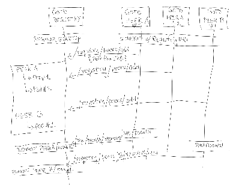

#
# goto

## What is it?
An HTTP server+client testing tool in one. 

## Why?
It's hard to find some of these features together in a single tool

## How to use it?
It's available as a docker image: https://hub.docker.com/repository/docker/uk0000/goto.
Or build it locally on your machine
```
go build -o goto .
```

## Show me the money!
Keep reading...


<br/>

---

# Flow Diagrams

Check these flow diagrams to get a visual overview of `Goto` behavior and usage.

### Flow: [Use client APIs to register and invoke traffic to targets ](docs/goto-client-targets.md) <a href="docs/goto-client-targets.md"></a>

### Flow: [Configuring Server Listeners](docs/goto-listeners.md) <a href="docs/goto-listeners.md"></a>

### Flow: [<small>`Goto`</small> Registry - Peer interactions](docs/goto-registry-peers-interactions.md) <a href="docs/goto-registry-peers-interactions.md"></a>

### Overview: [Goto Lockers](docs/goto-lockers.md) <a href="docs/goto-lockers.md"></a>


<br/>

---
# Scenarios

Before we look into detailed features and APIs exposed by the tool, let's look at how this tool can be used in a few scenarios to understand it better.

## Basic Scenarios
#
### Scenario: [Use HTTP client to send requests and track results](docs/scenarios-basic.md#basic-client-usage)

### Scenario: [Use HTTP server to respond to any arbitrary client HTTP requests](docs/scenarios-basic.md#basic-server-usage)

### Scenario: [HTTPS traffic with certificate validation](docs/scenarios-basic.md#basic-https-usage)

### Scenario: [Count number of requests received at each server instance for certain headers](docs/scenarios-basic.md#basic-header-tracking)


## K8S Scenarios

### Scenario: [Run dynamic traffic from K8s pods at startup](docs/scenarios-k8s.md#k8s-traffic-at-startup)

### Scenario: [Deal with transient pods](docs/scenarios-k8s.md#k8s-transient-pods)

### Scenario: [Capture results from pods that may terminate anytime](docs/scenarios-k8s.md#k8s-capture-transient-pod-results)


## Resiliency Scenarios

### Scenario: [Test a client's behavior upon service failure](docs/scenarios-resiliency.md#scenario-test-a-clients-behavior-upon-service-failure)


### Scenario: [Track client hang-ups on server via request/connection timeouts](docs/scenarios-resiliency.md#server-resiliency-client-hangups)

<br/>

  <span style="color:red">
  TODO: There are many more possible scenarios to describe here, to show how this tool can be used for various kinds of chaos testing and investigations.
  </span>

<br/>

#
# Features

It's an HTTP client and server built into a single application. 

As a server, it can act as an HTTP proxy that lets you intercept HTTP requests and get some insights (e.g. based on headers) before forwarding it to its destination. But it can also respond to requests as a server all by itself, while still capturing interesting stats and counters that can be used to correlate information against the client.

As a client, it allows sending requests to various destinations and tracking responses by headers and response status code.

The application exposes both client and server features via various management REST APIs as described below. Additionally, it can respond to all undefined URIs with a configurable status code.

## Features TOC

### [Startup](#startup)

### Client Features
* [Targets and Traffic](#client-http-traffic)

### Server Features
* [Server Logging](#server-logging)
* [Server Listeners](#server-listeners)
* [Server Listener Label](#server-listener-label)
* [TCP Server](#server-tcp)
* [Request Headers Tracking](#server-request-headers-tracking)
* [Request Timeout](#server-request-timeout)
* [URIs](#server-uris)
* [Probes](#server-probes)
* [URIs Bypass](#server-uris-bypass)
* [Ignore URIs](#server-uris-ignore)
* [Response Delay](#server-response-delay)
* [Response Headers](#server-response-headers)
* [Response Payload](#server-response-payload)
* [Ad-hoc Payload](#server-ad-hoc-payload)
* [Stream (Chunked) Payload](#server-stream-payload)
* [Response Status](#server-response-status)
* [Status API](#server-status)
* [Delay API](#server-delay)
* [Echo API](#server-echo)
* [Catch All](#server-catch-all)

### Proxy
* [Proxy Features](#proxy-features)

### Trigger
* [Trigger Features](#trigger-features)

### Jobs
* [Jobs Features](#jobs-features)

### Registry
* [Registry Features](#registry-features)

<br/>

# <a name="startup"></a>
# Startup Command Arguments
First things first, run the application:
```
go run main.go --port 8080
```
Or, build and run
```
go build -o goto .
./goto
```

The application accepts the following command arguments:

<table>
    <thead>
        <tr>
            <th>Argument</th>
            <th>Description</th>
            <th>Default Value</th>
        </tr>
    </thead>
    <tbody>
        <tr>
          <td rowspan="2"><pre>--port {port}</pre></td>
          <td>Initial port the server listens on. </td>
          <td rowspan="2">8080</td>
        </tr>
        <tr>
          <td>* Additional ports can be opened by making listener API calls on this port. See <a href="#server-listeners">Listeners</a> feature for more details.</td>
        </tr>
        <tr>
          <td rowspan="2"><pre>--label {label}</pre></td>
          <td>Label this server instance will use to identify itself. </td>
          <td rowspan="2">Goto-`IPAddress` </td>
        </tr>
        <tr>
          <td>* This is used both for setting `Goto`'s default response headers as well as when registering with registry.</td>
        </tr>
        <tr>
          <td rowspan="1"><pre>--startupDelay {delay}</pre></td>
          <td>Delay the startup by this duration. </td>
          <td rowspan="1">1s</td>
        </tr>
        <tr>
          <td rowspan="1"><pre>--shutdownDelay {delay}</pre></td>
          <td>Delay the shutdown by this duration after receiving SIGTERM. </td>
          <td rowspan="1">5s</td>
        </tr>
        <tr>
          <td rowspan="2"><pre>--registry {url}</pre></td>
          <td>URL of the Goto Registry instance that this instance should connect to. </td>
          <td rowspan="2"> "" </td>
        </tr>
        <tr>
          <td>* This is used to getting initial configs and optionally report results to registry. See <a href="#registry-features">Registry</a> feature for more details.</td>
        </tr>
        <tr>
          <td rowspan="2"><pre>--locker={true|false}</pre></td>
          <td> Whether this instance should report its results back to the Goto Registry instance. </td>
          <td rowspan="2"> false </td>
        </tr>
        <tr>
          <td>* An instance can be asked to report its results to registry in case the  instance is transient, e.g. pods.</td>
        </tr>
        <tr>
          <td rowspan="1"><pre>--reminderLogs={true|false}</pre></td>
          <td>Enable/Disable reminder logs received from various peer instances (applicable to goto instance acting as registry). </td>
          <td rowspan="1">true</td>
        </tr>
        <tr>
          <td rowspan="1"><pre>--probeLogs={true|false}</pre></td>
          <td>Enable/Disable logging of requests received for URIs configured as liveness and readiness probes. See <a href="#server-probes">Probes</a> for more details. </td>
          <td rowspan="1">true</td>
        </tr>
        <tr>
          <td rowspan="2"><pre>--certs {path}</pre></td>
          <td> Directory path from where to load TLS root certificates. </td>
          <td rowspan="2"> "/etc/certs" </td>
        </tr>
        <tr>
          <td>* The loaded root certificates are used if available, otherwise system default root certs are used.</td>
        </tr>
    </tbody>
</table>

Once the server is up and running, rest of the interactions and configurations are done purely via REST APIs.

<br/>


# <a name="client-features"></a>
# Client Features

## <a name="client-http-traffic"></a> Targets and Traffic
As a client tool, `goto` offers the feature to configure multiple targets and send http traffic:
- Allows targets to be configured and invoked via REST APIs
- Configure targets to be invoked ahead of time before invocation, as well as auto-invoke targets upon configuration
- Invoke selective targets or all configured targets in batches
- Control various parameters for a target: number of concurrent, total number of requests, minimum wait time after each replica set invocation per target, various timeouts, etc
- Headers can be set to track results for target invocations, and APIs make those results available for consumption as JSON output.
- Retry requests for specific response codes, and option to use a fallback URL for retries
- Make simultaneous calls to two URLs to perform an A-B comparison of responses. In AB mode, the same request ID (enabled via sendID flag) are used for both A and B calls, but with a suffix `-B` used for B calls. This allows tracking the A and B calls in logs.

The invocation results get accumulated across multiple invocations until cleared explicitly. Various results APIs can be used to read the accumulated results. Clearing of all results resets the invocation counter too, causing the next invocation to start at counter 1 again.

In addition to keeping the results in the `goto` client instance, those are also stored in locker on registry instance if enabled. (See `--locker` command arg)


#### APIs
|METHOD|URI|Description|
|---|---|---|
| POST      | /client/targets/add                   | Add a target for invocation. [See `Client Target JSON Schema` for Payload](#client-target-json-schema) |
| POST      |	/client/targets/{targets}/remove      | Remove given targets |
| POST      | /client/targets/{targets}/invoke      | Invoke given targets |
| POST      |	/client/targets/invoke/all            | Invoke all targets |
| POST      | /client/targets/{targets}/stop        | Stops a running target |
| POST      | /client/targets/stop/all              | Stops all running targets |
| GET       |	/client/targets/list                  | Get list of currently configured targets |
| GET       |	/client/targets                       | Get list of currently configured targets |
| POST      |	/client/targets/clear                 | Remove all targets |
| GET       |	/client/targets/active                | Get list of currently active (running) targets |
| POST      |	/client/targets/cacert/add            | Store CA cert to use for all target invocations |
| POST      |	/client/targets/cacert/remove         | Remove stored CA cert |
| PUT, POST |	/client/track/headers/add/{headers}   | Add headers for tracking response counts per target |
| PUT, POST |	/client/track/headers/remove/{header}| Remove header (single) from tracking set |
| POST      | /client/track/headers/clear           | Remove all tracked headers |
| GET       |	/client/track/headers/list            | Get list of tracked headers |
| GET       |	/client/track/headers                 | Get list of tracked headers |
| GET       |	/client/results                       | Get combined results for all invocations since last time results were cleared. See [`Results Schema`](#client-results-schema) |
| GET       |	/client/results/invocations           | Get invocation results broken down for each invocation that was triggered since last time results were cleared |
| POST      | /client/results/clear                 | Clear previously accumulated invocation results |
| POST      | /client/results/clear                 | Clear previously accumulated invocation results |
| POST      | /client/results/all/{enable}          | Enable/disable collection of cumulative results across all targets. This gives high level overview of all traffic, but at a performance overhead. Disabled by default. |
| POST      | /client/results/invocations/{enable}          | Enable/disable collection of results by invocations. This gives more detailed visibility into results per invocation but has performance overhead. Disabled by default. |


#### Client Target JSON Schema
|Field|Data Type|Default Value|Description|
|---|---|---|---|
| name         | string         || Name for this target |
| method       | string         || HTTP method to use for this target |
| url          | string         || URL for this target   |
| burls        | []string       || Secondary URLs to use for `fallback` or `AB Mode` (see below)   |
| verifyTLS    | bool           |false| Whether the TLS certificate presented by the target is verified. (Also see `--certs` command arg) |
| headers      | [][]string     || Headers to be sent to this target |
| body         | string         || Request body to use for this target|
| autoPayload  | string         || Auto-generate payload of this size when making calls to this target. This field supports numeric sizes (e.g. `1000`) as well as byte size suffixes `K`, `KB`, `M` and `MB` (e.g. `1K`). If auto payload is specified, `body` field is ignored. |
| protocol     | string         |`HTTP/1.1`| Request Protocol to use. Supports `HTTP/1.1` (default) and `HTTP/2.0`.|
| autoUpgrade  | bool           |false| Whether client should negotiate auto-upgrade from http/1.1 to http/2. |
| replicas     | int            |1| Number of parallel invocations to be done for this target. |
| requestCount | int            |1| Number of requests to be made per replicas for this target. The final request count becomes replicas * requestCount   |
| initialDelay | duration       || Minimum delay to wait before starting traffic to a target. Actual delay will be the max of all the targets being invoked in a given round of invocation. |
| delay        | duration       |10ms| Minimum delay to be added per request. The actual added delay will be the max of all the targets being invoked in a given round of invocation, but guaranteed to be greater than this delay |
| retries      | int            |0| Number of retries to perform for requests to this target for connection errors or for `retriableStatusCodes`.|
| retryDelay   | duration       |1s| Time to wait between retries.|
| retriableStatusCodes| []int|| HTTP response status codes for which requests should be retried |
| sendID       | bool           |false| Whether or not a unique ID be sent with each client request. If this flag is set, a query param `x-request-id` will be added to each request, which can help with tracing requests on the target servers |
| connTimeout  | duration       |10s| Timeout for opening target connection |
| connIdleTimeout | duration    |5m| Idle Timeout for target connection |
| requestTimeout | duration     |30s| Timeout for HTTP requests to the target |
| autoInvoke   | bool           |false| Whether this target should be invoked as soon as it's added |
| fallback     | bool           |false| If enabled, retry attempts will use secondary urls (`burls`) instead of the primary url. The query param `x-request-id` will carry suffixes of `-<counter>` for each retry attempt. |
| abMode       | bool           |false| If enabled, each request will simultaneously be sent to all secondary urls (`burls`) in addition to the primary url. The query param `x-request-id` will carry suffixes of `-B-<index>` for each secondary URL. |


#### Client Results Schema (output of API /client/results)
The results are keyed by targets, with an empty key "" used to capture all results (across all targets) if "capturing of all results" is enabled (via API `/client/results/all/{enable}`).
The schema below describes fields per target.

|Field|Data Type|Description|
|---|---|---|
| target            | string | Target for which these results are captured |
| invocationCounts      | int                 | Total requests sent to this target |
| firstResponse        | time                | Time of first response received from the target |
| lastResponse         | time                | Time of last response received from the target |
| retriedInvocationCounts | int | Total requests to this target that were retried at least once |
| countsByStatus       | string->int   | Response counts by HTTP Status |
| countsByStatusCodes  | string->int   | Response counts by HTTP Status Code |
| countsByURIs         | string->int   | Response counts by URIs |
| countsByHeaders      | string->HeaderCounts   | Response counts by header, with detailed info captured in `HeaderCounts` object described below |


#### HeaderCounts schema
The schema below describes fields per target.

|Field|Data Type|Description|
|---|---|---|
| target            | string | Target for which these results are captured |
| count       | CountInfo   | request counts info for this header |
| countsByValues | string->CountInfo   | request counts info per header value for this header |
| countsByStatusCodes | int->CountInfo   | request counts info per status code for this header |
| countsByValuesStatusCodes | string->int->CountInfo   | request counts info per status code per header value for this header |
| crossHeaders | string->HeaderCounts   | HeaderCounts for each cross-header for this header |
| crossHeadersByValues | string->string->HeaderCounts   | HeaderCounts for each cross-header per header value for this header |
| firstResponse        | time | Time of first response received for this header |
| lastResponse         | time | Time of last response received for this header |


#### CountInfo schema
The schema below describes fields per target.

|Field|Data Type|Description|
|---|---|---|
| value       | int | number of responses in this set  |
| retries     | int | number of requests that were retried in this set |
| firstResponse | time | Time of first response in this set  |
| lastResponse  | time | Time of last response received in this set |


#### Invocation Results Schema (output of API /client/results/invocations)
* Reports results for all invocations since last clearing of results, as an Object with invocation counter as key and invocation's results as value. The results for each invocation have same schema as `Client Results Schema`, with an additional bool flag `finished` to indicate whether the invocation is still running or has finished. See example below.

#### Active Targets Schema (output of API /client/targets/active)
* Reports set of targets for which traffic is running at the time of API invocation. Result is an object with invocation counter as key, and value as object that has status for all active targets in that invocation. For each active target, the following data is reported. Also see example below.
  
|Field|Data Type|Description|
|---|---|---|
| target                | Client Target       | Target details as described in `Client Target JSON Schema`  |
| completedRequestCount | int                 | Number of requests completed for this target in this invocation |
| stopRequested         | bool                | Whether `stop` has been requested for this target |
| stopped               | bool                | Whether the target has already stopped. Quite likely this will not show up as true, because the target gets removed from active set soon after it's stopped |


#### Client API Examples
<details>
<summary>API Examples</summary>

```
#Add target
curl localhost:8080/client/targets/add --data '
{
  "name": "t1",
  "method":	"POST",
  "url": "http://somewhere:8080/foo",
  "protocol":"HTTP/2.0",
  "headers":[["x", "x1"],["y", "y1"]],
  "body": "{\"test\":\"this\"}",
  "replicas": 2, 
  "requestCount": 2,
  "initialDelay": "1s",
  "delay": "200ms", 
  "sendID": true,
  "autoInvoke": true
}'

curl -s localhost:8080/client/targets/add --data '
{
  "name": "ab",
  "method": "POST",
  "url": "http://localhost:8081/foo",
  "burls": ["http://localhost:8080/b1", "http://localhost:8080/b2", "http://localhost:8080/b3"],
  "body": "some body",
  "abMode": true,
  "replicas": 2,
  "requestCount": 2,
  "sendID": true
}'

curl -s localhost:8080/client/targets/add --data '
{
  "name": "ab",
  "method": "POST",
  "url": "http://localhost:8081/foo",
  "burls": ["http://localhost:8080/bar"]
  "body": "some body",
  "fallback": true,
  "replicas": 2,
  "requestCount": 2,
  "sendID": true
}'


#List targets
curl localhost:8080/client/targets

#Remove select target
curl -X POST localhost:8080/client/target/t1,t2/remove

#Clear all configured targets
curl -X POST localhost:8080/client/targets/clear

#Invoke select targets
curl -X POST localhost:8080/client/targets/t2,t3/invoke

#Invoke all targets
curl -X POST localhost:8080/client/targets/invoke/all

#Stop select targets across all running batches
curl -X POST localhost:8080/client/targets/t2,t3/stop

#Stop all targets across all running batches
curl -X POST localhost:8080/client/targets/stop/all

#Set blocking mode
curl -X POST localhost:8080/client/blocking/set/n

#Get blocking mode
curl localhost:8080/client/blocking

#Clear tracked headers
curl -X POST localhost:8080/client/track/headers/clear

#Add headers to track
curl -X PUT localhost:8080/client/track/headers/add/Request-From-Goto|Goto-Host,Via-Goto,x|y|z,foo

#Remove headers from tracking
curl -X PUT localhost:8080/client/track/headers/remove/foo

#Get list of tracked headers
curl localhost:8080/client/track/headers/list

#Clear results
curl -X POST localhost:8080/client/results/clear

#Remove results for specific targets
curl -X POST localhost:8080/client/results/t1,t2/clear

#Get results per invocation
curl localhost:8080/client/results/invocations

#Get results
curl localhost:8080/client/results
```
</details>

#### Sample Client Results

<details>
<summary>Result Example</summary>
<p>

```json

{
  "": {
    "target": "",
    "invocationCounts": 0,
    "firstResponse": "0001-01-01T00:00:00Z",
    "lastResponse": "0001-01-01T00:00:00Z",
    "retriedInvocationCounts": 0,
    "countsByStatus": {},
    "countsByStatusCodes": {},
    "countsByHeaders": {},
    "countsByURIs": {}
  },
  "t1": {
    "target": "t1",
    "invocationCounts": 20,
    "firstResponse": "2020-08-20T14:29:36.969395-07:00",
    "lastResponse": "2020-08-20T14:36:28.740753-07:00",
    "retriedInvocationCounts": 3,
    "countsByStatus": {
      "200 OK": 2,
      "400 Bad Request": 1,
      "418 I'm a teapot": 15,
      "502 Bad Gateway": 2
    },
    "countsByStatusCodes": {
      "200": 2,
      "400": 1,
      "418": 15,
      "502": 2
    },
    "countsByHeaders": {
      "goto-host": {
        "header": "goto-host",
        "count": {
          "count": 20,
          "retries": 4,
          "firstResponse": "2020-08-20T14:29:36.969404-07:00",
          "lastResponse": "2020-08-20T14:36:28.740769-07:00"
        },
        "countsByValues": {
          "pod.local@1.0.0.1:8082": {
            "count": 12,
            "retries": 2,
            "firstResponse": "2020-08-20T14:30:32.028521-07:00",
            "lastResponse": "2020-08-20T14:36:28.74077-07:00"
          },
          "pod.local@1.0.0.1:9092": {
            "count": 8,
            "retries": 2,
            "firstResponse": "2020-08-20T14:29:36.969405-07:00",
            "lastResponse": "2020-08-20T14:30:16.801438-07:00"
          }
        },
        "countsByStatusCodes": {
          "200": {
            "count": 2,
            "retries": 0,
            "firstResponse": "2020-08-20T14:30:15.795679-07:00",
            "lastResponse": "2020-08-20T14:30:16.801438-07:00"
          },
          "400": {
            "count": 1,
            "retries": 0,
            "firstResponse": "2020-08-20T14:30:02.32723-07:00",
            "lastResponse": "2020-08-20T14:30:02.32723-07:00"
          },
          "418": {
            "count": 15,
            "retries": 4,
            "firstResponse": "2020-08-20T14:29:36.969404-07:00",
            "lastResponse": "2020-08-20T14:36:28.740769-07:00"
          },
          "502": {
            "count": 2,
            "retries": 0,
            "firstResponse": "2020-08-20T14:31:04.066585-07:00",
            "lastResponse": "2020-08-20T14:36:14.802755-07:00"
          }
        },
        "countsByValuesStatusCodes": {
          "pod.local@1.0.0.1:8082": {
            "418": {
              "count": 10,
              "retries": 2,
              "firstResponse": "2020-08-20T14:30:32.028522-07:00",
              "lastResponse": "2020-08-20T14:36:28.740771-07:00"
            },
            "502": {
              "count": 2,
              "retries": 0,
              "firstResponse": "2020-08-20T14:31:04.066586-07:00",
              "lastResponse": "2020-08-20T14:36:14.802756-07:00"
            }
          },
          "pod.local@1.0.0.1:9092": {
            "200": {
              "count": 2,
              "retries": 0,
              "firstResponse": "2020-08-20T14:30:15.79568-07:00",
              "lastResponse": "2020-08-20T14:30:16.801439-07:00"
            },
            "400": {
              "count": 1,
              "retries": 0,
              "firstResponse": "2020-08-20T14:30:02.32723-07:00",
              "lastResponse": "2020-08-20T14:30:02.32723-07:00"
            },
            "418": {
              "count": 5,
              "retries": 2,
              "firstResponse": "2020-08-20T14:29:36.969405-07:00",
              "lastResponse": "2020-08-20T14:30:03.332312-07:00"
            }
          }
        },
        "crossHeaders": {
          "request-from-goto-host": {
            "header": "request-from-goto-host",
            "count": {
              "count": 20,
              "retries": 4,
              "firstResponse": "2020-08-20T14:29:36.969409-07:00",
              "lastResponse": "2020-08-20T14:36:28.740773-07:00"
            },
            "countsByValues": {
              "pod.local@1.0.0.1:8081": {
                "count": 20,
                "retries": 4,
                "firstResponse": "2020-08-20T14:29:36.96941-07:00",
                "lastResponse": "2020-08-20T14:36:28.740774-07:00"
              }
            },
            "countsByStatusCodes": {
              "200": {
                "count": 2,
                "retries": 0,
                "firstResponse": "2020-08-20T14:30:15.795682-07:00",
                "lastResponse": "2020-08-20T14:30:16.80144-07:00"
              },
              "400": {
                "count": 1,
                "retries": 0,
                "firstResponse": "2020-08-20T14:30:02.327239-07:00",
                "lastResponse": "2020-08-20T14:30:02.327239-07:00"
              },
              "418": {
                "count": 15,
                "retries": 4,
                "firstResponse": "2020-08-20T14:29:36.969409-07:00",
                "lastResponse": "2020-08-20T14:36:28.740773-07:00"
              },
              "502": {
                "count": 2,
                "retries": 0,
                "firstResponse": "2020-08-20T14:31:04.066594-07:00",
                "lastResponse": "2020-08-20T14:36:14.802766-07:00"
              }
            },
            "countsByValuesStatusCodes": {
              "pod.local@1.0.0.1:8081": {
                "200": {
                  "count": 2,
                  "retries": 0,
                  "firstResponse": "2020-08-20T14:30:15.795683-07:00",
                  "lastResponse": "2020-08-20T14:30:16.801441-07:00"
                },
                "400": {
                  "count": 1,
                  "retries": 0,
                  "firstResponse": "2020-08-20T14:30:02.32724-07:00",
                  "lastResponse": "2020-08-20T14:30:02.32724-07:00"
                },
                "418": {
                  "count": 15,
                  "retries": 4,
                  "firstResponse": "2020-08-20T14:29:36.96941-07:00",
                  "lastResponse": "2020-08-20T14:36:28.740774-07:00"
                },
                "502": {
                  "count": 2,
                  "retries": 0,
                  "firstResponse": "2020-08-20T14:31:04.066595-07:00",
                  "lastResponse": "2020-08-20T14:36:14.802767-07:00"
                }
              }
            },
            "crossHeaders": {},
            "crossHeadersByValues": {},
            "firstResponse": "2020-08-20T14:29:36.969409-07:00",
            "lastResponse": "2020-08-20T14:36:28.740772-07:00"
          }
        },
        "crossHeadersByValues": {
          "pod.local@1.0.0.1:8082": {
            "request-from-goto-host": {
              "header": "request-from-goto-host",
              "count": {
                "count": 12,
                "retries": 2,
                "firstResponse": "2020-08-20T14:30:32.028526-07:00",
                "lastResponse": "2020-08-20T14:36:28.740776-07:00"
              },
              "countsByValues": {
                "pod.local@1.0.0.1:8081": {
                  "count": 12,
                  "retries": 2,
                  "firstResponse": "2020-08-20T14:30:32.028527-07:00",
                  "lastResponse": "2020-08-20T14:36:28.740777-07:00"
                }
              },
              "countsByStatusCodes": {
                "418": {
                  "count": 10,
                  "retries": 2,
                  "firstResponse": "2020-08-20T14:30:32.028527-07:00",
                  "lastResponse": "2020-08-20T14:36:28.740776-07:00"
                },
                "502": {
                  "count": 2,
                  "retries": 0,
                  "firstResponse": "2020-08-20T14:31:04.066596-07:00",
                  "lastResponse": "2020-08-20T14:36:14.802769-07:00"
                }
              },
              "countsByValuesStatusCodes": {
                "pod.local@1.0.0.1:8081": {
                  "418": {
                    "count": 10,
                    "retries": 2,
                    "firstResponse": "2020-08-20T14:30:32.028528-07:00",
                    "lastResponse": "2020-08-20T14:36:28.740777-07:00"
                  },
                  "502": {
                    "count": 2,
                    "retries": 0,
                    "firstResponse": "2020-08-20T14:31:04.066597-07:00",
                    "lastResponse": "2020-08-20T14:36:14.802769-07:00"
                  }
                }
              },
              "crossHeaders": {},
              "crossHeadersByValues": {},
              "firstResponse": "2020-08-20T14:30:32.028526-07:00",
              "lastResponse": "2020-08-20T14:36:28.740775-07:00"
            }
          },
          "pod.local@1.0.0.1:9092": {
            "request-from-goto-host": {
              "header": "request-from-goto-host",
              "count": {
                "count": 8,
                "retries": 2,
                "firstResponse": "2020-08-20T14:29:36.969411-07:00",
                "lastResponse": "2020-08-20T14:30:16.801442-07:00"
              },
              "countsByValues": {
                "pod.local@1.0.0.1:8081": {
                  "count": 8,
                  "retries": 2,
                  "firstResponse": "2020-08-20T14:29:36.969412-07:00",
                  "lastResponse": "2020-08-20T14:30:16.801444-07:00"
                }
              },
              "countsByStatusCodes": {
                "200": {
                  "count": 2,
                  "retries": 0,
                  "firstResponse": "2020-08-20T14:30:15.795684-07:00",
                  "lastResponse": "2020-08-20T14:30:16.801444-07:00"
                },
                "400": {
                  "count": 1,
                  "retries": 0,
                  "firstResponse": "2020-08-20T14:30:02.327241-07:00",
                  "lastResponse": "2020-08-20T14:30:02.327241-07:00"
                },
                "418": {
                  "count": 5,
                  "retries": 2,
                  "firstResponse": "2020-08-20T14:29:36.969412-07:00",
                  "lastResponse": "2020-08-20T14:30:03.332315-07:00"
                }
              },
              "countsByValuesStatusCodes": {
                "pod.local@1.0.0.1:8081": {
                  "200": {
                    "count": 2,
                    "retries": 0,
                    "firstResponse": "2020-08-20T14:30:15.795685-07:00",
                    "lastResponse": "2020-08-20T14:30:16.801445-07:00"
                  },
                  "400": {
                    "count": 1,
                    "retries": 0,
                    "firstResponse": "2020-08-20T14:30:02.327242-07:00",
                    "lastResponse": "2020-08-20T14:30:02.327242-07:00"
                  },
                  "418": {
                    "count": 5,
                    "retries": 2,
                    "firstResponse": "2020-08-20T14:29:36.969412-07:00",
                    "lastResponse": "2020-08-20T14:30:03.332315-07:00"
                  }
                }
              },
              "crossHeaders": {},
              "crossHeadersByValues": {},
              "firstResponse": "2020-08-20T14:29:36.969411-07:00",
              "lastResponse": "2020-08-20T14:30:16.801441-07:00"
            }
          }
        },
        "firstResponse": "2020-08-20T14:29:36.969404-07:00",
        "lastResponse": "2020-08-20T14:36:28.740768-07:00"
      },
      "request-from-goto-host": {
        "header": "request-from-goto-host",
        "count": {
          "count": 20,
          "retries": 4,
          "firstResponse": "2020-08-20T14:29:36.969414-07:00",
          "lastResponse": "2020-08-20T14:36:28.74078-07:00"
        },
        "countsByValues": {
          "pod.local@1.0.0.1:8081": {
            "count": 20,
            "retries": 4,
            "firstResponse": "2020-08-20T14:29:36.969414-07:00",
            "lastResponse": "2020-08-20T14:36:28.740782-07:00"
          }
        },
        "countsByStatusCodes": {
          "200": {
            "count": 2,
            "retries": 0,
            "firstResponse": "2020-08-20T14:30:15.795686-07:00",
            "lastResponse": "2020-08-20T14:30:16.801447-07:00"
          },
          "400": {
            "count": 1,
            "retries": 0,
            "firstResponse": "2020-08-20T14:30:02.327243-07:00",
            "lastResponse": "2020-08-20T14:30:02.327243-07:00"
          },
          "418": {
            "count": 15,
            "retries": 4,
            "firstResponse": "2020-08-20T14:29:36.969414-07:00",
            "lastResponse": "2020-08-20T14:36:28.740781-07:00"
          },
          "502": {
            "count": 2,
            "retries": 0,
            "firstResponse": "2020-08-20T14:31:04.066599-07:00",
            "lastResponse": "2020-08-20T14:36:14.802771-07:00"
          }
        },
        "countsByValuesStatusCodes": {
          "pod.local@1.0.0.1:8081": {
            "200": {
              "count": 2,
              "retries": 0,
              "firstResponse": "2020-08-20T14:30:15.795687-07:00",
              "lastResponse": "2020-08-20T14:30:16.801448-07:00"
            },
            "400": {
              "count": 1,
              "retries": 0,
              "firstResponse": "2020-08-20T14:30:02.327244-07:00",
              "lastResponse": "2020-08-20T14:30:02.327244-07:00"
            },
            "418": {
              "count": 15,
              "retries": 4,
              "firstResponse": "2020-08-20T14:29:36.969415-07:00",
              "lastResponse": "2020-08-20T14:36:28.740783-07:00"
            },
            "502": {
              "count": 2,
              "retries": 0,
              "firstResponse": "2020-08-20T14:31:04.0666-07:00",
              "lastResponse": "2020-08-20T14:36:14.802772-07:00"
            }
          }
        },
        "crossHeaders": {
          "goto-host": {
            "header": "goto-host",
            "count": {
              "count": 20,
              "retries": 4,
              "firstResponse": "2020-08-20T14:29:36.969416-07:00",
              "lastResponse": "2020-08-20T14:36:28.740784-07:00"
            },
            "countsByValues": {
              "pod.local@1.0.0.1:8082": {
                "count": 12,
                "retries": 2,
                "firstResponse": "2020-08-20T14:30:32.028532-07:00",
                "lastResponse": "2020-08-20T14:36:28.740785-07:00"
              },
              "pod.local@1.0.0.1:9092": {
                "count": 8,
                "retries": 2,
                "firstResponse": "2020-08-20T14:29:36.969417-07:00",
                "lastResponse": "2020-08-20T14:30:16.801449-07:00"
              }
            },
            "countsByStatusCodes": {
              "200": {
                "count": 2,
                "retries": 0,
                "firstResponse": "2020-08-20T14:30:15.795687-07:00",
                "lastResponse": "2020-08-20T14:30:16.801449-07:00"
              },
              "400": {
                "count": 1,
                "retries": 0,
                "firstResponse": "2020-08-20T14:30:02.327245-07:00",
                "lastResponse": "2020-08-20T14:30:02.327245-07:00"
              },
              "418": {
                "count": 15,
                "retries": 4,
                "firstResponse": "2020-08-20T14:29:36.969417-07:00",
                "lastResponse": "2020-08-20T14:36:28.740784-07:00"
              },
              "502": {
                "count": 2,
                "retries": 0,
                "firstResponse": "2020-08-20T14:31:04.066601-07:00",
                "lastResponse": "2020-08-20T14:36:14.802773-07:00"
              }
            },
            "countsByValuesStatusCodes": {
              "pod.local@1.0.0.1:8082": {
                "418": {
                  "count": 10,
                  "retries": 2,
                  "firstResponse": "2020-08-20T14:30:32.028533-07:00",
                  "lastResponse": "2020-08-20T14:36:28.740785-07:00"
                },
                "502": {
                  "count": 2,
                  "retries": 0,
                  "firstResponse": "2020-08-20T14:31:04.066602-07:00",
                  "lastResponse": "2020-08-20T14:36:14.802774-07:00"
                }
              },
              "pod.local@1.0.0.1:9092": {
                "200": {
                  "count": 2,
                  "retries": 0,
                  "firstResponse": "2020-08-20T14:30:15.795688-07:00",
                  "lastResponse": "2020-08-20T14:30:16.801449-07:00"
                },
                "400": {
                  "count": 1,
                  "retries": 0,
                  "firstResponse": "2020-08-20T14:30:02.327245-07:00",
                  "lastResponse": "2020-08-20T14:30:02.327245-07:00"
                },
                "418": {
                  "count": 5,
                  "retries": 2,
                  "firstResponse": "2020-08-20T14:29:36.969417-07:00",
                  "lastResponse": "2020-08-20T14:30:03.332319-07:00"
                }
              }
            },
            "crossHeaders": {},
            "crossHeadersByValues": {},
            "firstResponse": "2020-08-20T14:29:36.969416-07:00",
            "lastResponse": "2020-08-20T14:36:28.740784-07:00"
          }
        },
        "crossHeadersByValues": {
          "pod.local@1.0.0.1:8081": {
            "goto-host": {
              "header": "goto-host",
              "count": {
                "count": 20,
                "retries": 4,
                "firstResponse": "2020-08-20T14:29:36.969418-07:00",
                "lastResponse": "2020-08-20T14:36:28.740786-07:00"
              },
              "countsByValues": {
                "pod.local@1.0.0.1:8082": {
                  "count": 12,
                  "retries": 2,
                  "firstResponse": "2020-08-20T14:30:32.028534-07:00",
                  "lastResponse": "2020-08-20T14:36:28.740787-07:00"
                },
                "pod.local@1.0.0.1:9092": {
                  "count": 8,
                  "retries": 2,
                  "firstResponse": "2020-08-20T14:29:36.969418-07:00",
                  "lastResponse": "2020-08-20T14:30:16.80145-07:00"
                }
              },
              "countsByStatusCodes": {
                "200": {
                  "count": 2,
                  "retries": 0,
                  "firstResponse": "2020-08-20T14:30:15.795689-07:00",
                  "lastResponse": "2020-08-20T14:30:16.80145-07:00"
                },
                "400": {
                  "count": 1,
                  "retries": 0,
                  "firstResponse": "2020-08-20T14:30:02.327246-07:00",
                  "lastResponse": "2020-08-20T14:30:02.327246-07:00"
                },
                "418": {
                  "count": 15,
                  "retries": 4,
                  "firstResponse": "2020-08-20T14:29:36.969418-07:00",
                  "lastResponse": "2020-08-20T14:36:28.740787-07:00"
                },
                "502": {
                  "count": 2,
                  "retries": 0,
                  "firstResponse": "2020-08-20T14:31:04.066603-07:00",
                  "lastResponse": "2020-08-20T14:36:14.802774-07:00"
                }
              },
              "countsByValuesStatusCodes": {
                "pod.local@1.0.0.1:8082": {
                  "418": {
                    "count": 10,
                    "retries": 2,
                    "firstResponse": "2020-08-20T14:30:32.028535-07:00",
                    "lastResponse": "2020-08-20T14:36:28.740788-07:00"
                  },
                  "502": {
                    "count": 2,
                    "retries": 0,
                    "firstResponse": "2020-08-20T14:31:04.066603-07:00",
                    "lastResponse": "2020-08-20T14:36:14.802775-07:00"
                  }
                },
                "pod.local@1.0.0.1:9092": {
                  "200": {
                    "count": 2,
                    "retries": 0,
                    "firstResponse": "2020-08-20T14:30:15.795689-07:00",
                    "lastResponse": "2020-08-20T14:30:16.80145-07:00"
                  },
                  "400": {
                    "count": 1,
                    "retries": 0,
                    "firstResponse": "2020-08-20T14:30:02.327246-07:00",
                    "lastResponse": "2020-08-20T14:30:02.327246-07:00"
                  },
                  "418": {
                    "count": 5,
                    "retries": 2,
                    "firstResponse": "2020-08-20T14:29:36.969419-07:00",
                    "lastResponse": "2020-08-20T14:30:03.33232-07:00"
                  }
                }
              },
              "crossHeaders": {},
              "crossHeadersByValues": {},
              "firstResponse": "2020-08-20T14:29:36.969418-07:00",
              "lastResponse": "2020-08-20T14:36:28.740786-07:00"
            }
          }
        },
        "firstResponse": "2020-08-20T14:29:36.969414-07:00",
        "lastResponse": "2020-08-20T14:36:28.74078-07:00"
      },
    },
    "countsByURIs": {
      "": 2,
      "/status/418": 18
    }
  },
  "t2": {}
}

```
</p>
</details>


#### Sample Invocation Result

<details>
<summary>Result Example</summary>
<p>

```json
{
  "1": {
    "invocationIndex": 1,
    "target": {
      "name": "peer1_to_peer4",
      "method": "GET",
      "url": "http://1.0.0.4/echo",
      "headers": [
        [
          "Goto-Client",
          "peer1"
        ]
      ],
      "body": "",
      "replicas": 2,
      "requestCount": 20,
      "initialDelay": "2s",
      "delay": "1s",
      "keepOpen": "",
      "sendID": false,
      "connTimeout": "",
      "connIdleTimeout": "",
      "requestTimeout": "",
      "verifyTLS": false,
      "collectResponse": false,
      "autoInvoke": true
    },
    "status": {
      "completedRequestCount": 13,
      "stopRequested": true,
      "stopped": true,
      "closed": true
    },
    "results": {
      "target": "",
      "invocationCounts": 13,
      "firstResponses": "2020-06-23T13:52:33.546148-07:00",
      "lastResponses": "2020-06-23T13:52:45.561606-07:00",
      "countsByStatus": {
        "200 OK": 13
      },
      "countsByStatusCodes": {
        "200": 13
      },
      "countsByHeaders": {
        "goto-host": 13,
        "via-goto": 13
      },
      "countsByHeaderValues": {
        "goto-host": {
          "1.0.0.4": 13
        },
        "via-goto": {
          "peer4": 13
        }
      },
      "countsByURIs": {
        "/echo": 13
      }
    },
    "finished": true
  },
  "2": {
    "invocationIndex": 2,
    "target": {
      "name": "peer1_to_peer3",
      "method": "GET",
      "url": "http://1.0.0.3/echo",
      "headers": [
        [
          "Goto-Client",
          "peer1"
        ]
      ],
      "body": "",
      "replicas": 2,
      "requestCount": 20,
      "initialDelay": "2s",
      "delay": "1s",
      "keepOpen": "",
      "sendID": false,
      "connTimeout": "",
      "connIdleTimeout": "",
      "requestTimeout": "",
      "verifyTLS": false,
      "collectResponse": false,
      "autoInvoke": true
    },
    "status": {
      "completedRequestCount": 13,
      "stopRequested": true,
      "stopped": true,
      "closed": true
    },
    "results": {
      "target": "",
      "invocationCounts": 13,
      "firstResponses": "2020-06-23T13:52:33.546295-07:00",
      "lastResponses": "2020-06-23T13:52:45.562684-07:00",
      "countsByStatus": {
        "200 OK": 13
      },
      "countsByStatusCodes": {
        "200": 13
      },
      "countsByHeaders": {
        "goto-host": 13,
        "via-goto": 13
      },
      "countsByHeaderValues": {
        "goto-host": {
          "1.0.0.3": 13
        },
        "via-goto": {
          "peer3": 13
        }
      },
      "countsByURIs": {
        "/echo": 13
      }
    },
    "finished": true
  }
}
```
</p>
</details>


#### Sample Active Targets Result

<details>
<summary>Result Example</summary>
<p>

```json
{
  "activeCount": 4,
  "activeInvocations": {
    "peer1_to_peer2": {
      "1": {
        "completedRequestCount": 4,
        "stopRequested": false,
        "stopped": false,
        "closed": false
      }
    },
    "peer1_to_peer3": {
      "2": {
        "completedRequestCount": 6,
        "stopRequested": false,
        "stopped": false,
        "closed": false
      }
    },
    "peer1_to_peer4": {
      "3": {
        "completedRequestCount": 5,
        "stopRequested": false,
        "stopped": false,
        "closed": false
      }
    },
    "peer1_to_peer5": {
      "4": {
        "completedRequestCount": 4,
        "stopRequested": false,
        "stopped": false,
        "closed": false
      }
    }
  }
}

```

<br/>
</p>
</details>

# <a name="server-features"></a>
# Server Features
The server is useful to be run as a test server for testing some client application, proxy/sidecar, gateway, etc. Or, the server can also be used as a proxy to be put in between a client and a target server application, so that traffic flows through this server where headers can be inspected/tracked before proxying the requests further. The server can add headers, replace request URI with some other URI, add artificial delays to the response, respond with a specific status, monitor request/connection timeouts, etc. The server tracks all the configured parameters, applying those to runtime traffic and building metrics, which can be viewed via various APIs.

<br/>

### <a name="server-logging"></a> Server Logging
`goto` server logs are generated with a useful pattern to help figuring out the steps `goto` took for a request. Each log line tells the complete story about request details, how the request was processed, and response sent. Each log line contains the following segments separated by `-->`:
- Request Timestamp, Host Id (host where the request was processed), and Server label (assigned via --label startup arg)
- Local and Remote addresses (if available)
- Request Headers, including Host
- Request URI, Protocol and Method
- Request Body (first 100 bytes)
- Action(s) taken by `goto` (e.g. delaying a request)
- Final Response code determination
- Response Headers

Sample log line:
```
2020/11/09 16:59:54 [localhost@1.2.3.4:8080] [Registry] --> LocalAddr: [::1]:8080, RemoteAddr: [::1]:64342 --> Request Headers: {"Content-Length":["80"],"From-Goto":["peer1"],"From-Goto-Host":["localhost@1.2.3.4:8081"],"Host":["localhost:8080"],"Protocol":["HTTP/1.1"],"Targetid":["ab[1][1]"],"User-Agent":["Go-http-client/1.1"]} --> Request URI: [/bar?x-request-id=466c822c-231c-4ea5-aab6-125b73da1612-B], Protocol: [HTTP/1.1], Method: [POST] --> Request Body: [thisisaverylongbody] --> Delaying for 2s --> Echoing back --> Reporting status: [200] --> {"ResponseHeaders": {"Content-Type":["application/json"],"Goto-Host":["localhost@1.2.3.4:8080"],"Request-From-Goto":["peer1"],"Request-From-Goto-Host":["localhost@1.2.3.4:8080"],"Request-Host":["localhost:8080"],"Request-Protocol":["HTTP/1.1"],"Request-Targetid":["ab[1][1]"],"Request-User-Agent":["Go-http-client/1.1"],"Via-Goto":["Registry"]}}
```

<br/>

#
## <a name="server-listeners"></a>  > Listeners


The server starts with a single http listener on the bootstrap port (given as a command line arg, defaults to 8080). It exposes listener APIs to let you add/manage additional HTTP/TCP listeners. The ability to launch and shutdown listeners lets you do some chaos testing. All listener ports respond to the same set of API calls, so any of the HTTP APIs described below as well as runtime traffic proxying can be done via any active HTTP listener, and any TCP operation can be performed on any active TCP listener.

Adding TLS cert and key for a listener using `/cert` and `/key` API will configure the listener for serving HTTPS traffic when it's opened/reopened. An already opened listener can be reopened as a TLS listener by configuring TLS certs for it and calling `/reopen`.

#### See TCP Listeners section later for details of TCP features

#### APIs
|METHOD|URI|Description|
|---|---|---|
| POST       | /listeners/add           | Add a listener. [See Payload JSON Schema](#listener-json-schema)|
| POST       | /listeners/update        | Update an existing listener.|
| POST, PUT  | /listeners/{port}/cert/add   | Add/update certificate for a listener. Presence of both cert and key results in the port serving HTTPS traffic when opened/reopened. |
| POST, PUT  | /listeners/{port}/key/add   | Add/update private key for a listener. Presence of both cert and key results in the port serving HTTPS traffic when opened/reopened. |
| POST, PUT  | /listeners/{port}/cert/remove   | Remove certificate and key for a listener and reopen it to serve HTTP traffic instead of HTTPS. |
| POST, PUT  | /listeners/{port}/remove | Remove a listener|
| POST, PUT  | /listeners/{port}/open   | Open an added listener to accept traffic|
| POST, PUT  | /listeners/{port}/reopen | Close and reopen an existing listener if already opened, otherwise open it |
| POST, PUT  | /listeners/{port}/close  | Close an added listener|
| GET        | /listeners               | Get a list of listeners |

#### Listener JSON Schema
|Field|Data Type|Description|
|---|---|---|
| listenerID    | string | Read-only field identifying the listener's port and current generation. |
| label    | string | Label to be applied to the listener. This can also be set/changed via REST API later. |
| port     | int    | Port on which the new listener will listen on. |
| protocol | string | `http` or `tcp`|
| open | bool | Controls whether the listener should be opened as soon as it's added. Also reflects listener's current status when queried. |
| tls | bool | Reports whether the listener has been configured for TLS. This flag is read-only, the value of which is determined based on whether TLS cert and key have been added for the listener using the APIs. |
| tcp | TCPConfig | Supplemental TCP config for a TCP listener. See TCP Config JSON schema under `TCP Server` section. |


#### Listener API Examples:
<details>
<summary>API Examples</summary>

```
curl localhost:8080/listeners/add --data '{"port":8081, "protocol":"http", "label":"Server-8081"}'

curl -s localhost:8080/listeners/add --data '{"label":"tcp-9000", "port":9000, "protocol":"tcp", "open":true, "tcp": {"readTimeout":"15s","writeTimeout":"15s","connectTimeout":"15s","connIdleTimeout":"20s","responseDelay":"1s", "connectionLife":"20s"}}'

curl -X POST localhost:8080/listeners/8081/remove

curl -X PUT localhost:8080/listeners/9000/open

curl -X PUT localhost:8080/listeners/9000/close

curl -X PUT localhost:8080/listeners/9000/reopen

curl localhost:8080/listeners

```
</details>

#### Listener Output Example

<details>
<summary>Example</summary>
<p>

```
$ curl -s localhost:8080/listeners

{
  "8081": {
    "listenerID": "8081-1",
    "label": "http-8081",
    "port": 8081,
    "protocol": "http",
    "open": true,
    "tls": false
  },
  "8082": {
    "listenerID": "",
    "label": "http-8082",
    "port": 8082,
    "protocol": "http",
    "open": false,
    "tls": true
  },
  "9000": {
    "listenerID": "9000-1",
    "label": "tcp-9000",
    "port": 9000,
    "protocol": "tcp",
    "open": true,
    "tls": false,
    "tcp": {
      "readTimeout": "1m",
      "writeTimeout": "1m",
      "connectTimeout": "15s",
      "connIdleTimeout": "1m",
      "connectionLife": "2m",
      "stream": false,
      "echo": false,
      "conversation": false,
      "silentLife": false,
      "closeAtFirstByte": false,
      "validatePayloadLength": true,
      "validatePayloadContent": true,
      "expectedPayloadLength": 13,
      "echoResponseSize": 10,
      "echoResponseDelay": "1s",
      "streamPayloadSize": "",
      "streamChunkSize": "0",
      "streamChunkCount": 0,
      "streamChunkDelay": "0s",
      "streamDuration": "0s"
    }
  }
}
```
</p>
</details>


<br/>

# <a name="server-listener-label"></a>
## > Listener Label

By default, each listener adds a header `Via-Goto: <port>` to each response it sends, where `<port>` is the port on which the listener is running (default being 8080). A custom label can be added to a listener using the label APIs described below. In addition to `Via-Goto`, each listener also adds another header `Goto-Host` that carries the pod/host name, pod namespace (or `local` if not running as a K8s pod), and pod/host IP address to identify where the response came from.

#### APIs
|METHOD|URI|Description|
|---|---|---|
| POST, PUT | /label/set/{label}  | Set label for this port |
| PUT       | /label/clear        | Remove label for this port |
| GET       | /label              | Get current label of this port |

#### Listener Label API Examples:
<details>
<summary>API Examples</summary>

```
curl -X PUT localhost:8080/label/set/Server-8080

curl -X PUT localhost:8080/label/clear

curl localhost:8080/label
```

</details>


<br/>

#
## <a name="server-tcp"></a>  > TCP Server

`Goto` providers features for testing server-side TCP behavior via TCP listeners (client side TCP features are described under client section).

The primary HTTP port that `goto` starts with exposes listeners REST APIs that can be used to open additional ports on the `goto` instance. These additional ports can be either `HTTP` or `TCP`. For TCP listeners, additional configs can be provided using listener's `tcp` schema, which allows for configuring various timeouts, connection lifetime, packet sizes, etc. The TCP configurations of a TCP listener can be supplied at the time of listener creation, and it can also be reconfigured at anytime via the `/tcp/{port}/configure` API. 

A TCP listener can operate in the following modes to faciliate different kinds of testing:

1. By default, a TCP listener executes in one of the two `silent` mode. 
   a) If the listener is configured with a `connectionLife` that limits its lifetime, the listener operates in `SilentLife` mode where it waits for the configured lifetime and closes the client connection. In this mode, the listener receives and counts the bytes received, but never responds. 
   b) If the listener's `connectionLife` is set to zero, the listener operates in `CloseAtFirstByte` mode where it waits for the first byte to arrive and then closes the client connection.
2. If `Echo` mode is enabled on a TCP listener, the listener echoes back the bytes received from the client. The `echoResponseSize` configures the echo buffer size, which is the number of bytes that the listener will need to receive from the client before echoing back. If more data is received than the `echoResponseSize`, it'll echo multiple chunks each of `echoResponseSize` size. The config `echoResponseDelay` configures the delay server should apply before sending each echo response packets. In `echo` mode, the connection enforces `readTimeout` and `connIdleTimeout` based on the activity: any new bytes recevied reset the read/idle timeouts. It applies `writeTimeout` when sending the echo response to the client. If `connectionLife` is set, it controls the overall lifetime of the connection and the connection will close upon reaching the max life regardless of the activity.
3. If `Stream` mode is enabled, the connection starts streaming TCP bytes per the given configuration as soon as a client connects. None of the timeouts or max life applies in streaming mode, and the client connection closes automatically once the streaming completes. The stream behavior is controlled via the following configs: `streamPayloadSize`, `streamChunkSize`, `streamChunkCount`, `streamChunkDelay`, `streamDuration`. Not all of these configs are required, and a combination of some may lead to ambiguity that the server resolves by picking the most sensible combinations of these config params.
4. In `payload validation` mode, client should first set the payload expectation by calling either `/listeners/{port}/expect/payload/{length}` or `/listeners/{port}/expect/payload/{length}`, depending on whether server should just validate payload length or the payload content. The server then waits for the duration of the connection lifetime (if not set explicitly for the listener, this feature defaults to `30s` of total connection life), and buffers bytes received from client. If at any point during the connection life the number of received bytes exceed the expected payload length, the server responds with error and closes connection. If at the end of the connection life, the number of bytes match the payload expectations (either length or both length and content), then the server responds with success message. The messages returned by the server are one of the following:
   - `[SUCCESS]: Received pyload matches expected payload of length [l] on port [p]`
   - `[ERROR:EXCEEDED] - Payload length [l] exceeded expected length [e] on port [p]`
   - `[ERROR:CONTENT] - Payload content of length [l] didn't match expected payload of length [e] on port [p]`
   - `[ERROR:TIMEOUT] - Timed out before receiving payload of expected length [l] on port [p]`
5. In `conversation` mode, the server waits for the client to send a TCP payload with text `HELLO` to which server also responds back with `HELLO`. All subsequent packets from client should follow the format `BEGIN/{text}/END`, and server echoes the received text back in the format of `ACK/{text}/END`. Client can initiate connection closure by sending text `GOODBYE`, or else the connection can close based on various timeouts and connection lifetime config.
6. In all cases, client may close the connection proactively causing the ongoing operation to abort.


#### APIs
|METHOD|URI|Description|
|---|---|---|
| POST, PUT  | /tcp/{port}/configure   | Reconfigure details of a TCP listener without having to close and restart. Accepts TCP Config JSON as payload. |
| POST, PUT  | /tcp/{port}/timeout/read/{duration}  | Set TCP read timeout for the port (applies to TCP echo mode) |
| POST, PUT  | /tcp/{port}/timeout/write/{duration}  | Set TCP write timeout for the port (applies to TCP echo mode) |
| POST, PUT  | /tcp/{port}/timeout/idle/{duration}  | Set TCP connection idle timeout for the port (applies to TCP echo mode) |
| POST, PUT  | /tcp/{port}/connection/life/{duration}  | Set TCP connection lifetime duration for the port (applies to all TCP connection modes except streaming) |
| POST, PUT  | /tcp/{port}/echo<br/>/response/delay/{duration}  | Set response delay for TCP echo mode for the listener |
| POST, PUT  | /tcp/{port}/stream<br/>/size/{payloadSize}<br/>/duration/{duration}<br/>/delay/{delay}  | Set TCP connection to stream data as soon as a client connects, with the given total payload size delivered over the given duration with the given delay per chunk |
| POST, PUT  | /tcp/{port}/stream<br/>/chunk/{chunkSize}<br/>/duration/{duration}<br/>/delay/{delay}  | Set TCP connection to stream data as soon as a client connects, with chunks of the given chunk size delivered over the given duration with the given delay per chunk |
| POST, PUT  | /tcp/{port}/stream<br/>/chunk/{chunkSize}<br/>/count/{chunkCount}<br/>/delay/{delay}  | Set TCP connection to stream data as soon as a client connects, with total chunks matching the given chunk count of the given chunk size delivered with the given delay per chunk |
| POST, PUT  | /tcp/{port}/expect/payload/{length}  | Set expected payload length for payload verification mode (to only validate payload length, not content) |
| POST, PUT  | /tcp/{port}/expect/payload  | Set expected payload for payload verification mode, to validate both payload length and content. Expected payload must be sent as request body. |
| POST, PUT  | /tcp/{port}/validate/payload/{enable} | Enable/disable payload validation mode on a port to support payload length/content validation over connection lifetime (see overview for details) |
| POST, PUT  | /tcp/{port}/stream/{enable}  | Enable or disable streaming on a port without having to restart the listener (useful to disable streaming while retaining the stream congiuration) |
| POST, PUT  | /tcp/{port}/echo/{enable} | Enable/disable echo mode on a port to let the port be tested in silent mode (see overview for details) |
| POST, PUT  | /tcp/{port}/conversation/{enable} | Enable/disable conversation mode on a port to support multiple packets verification (see overview for details) |
| POST, PUT  | /tcp/{port}/silentlife/{enable} | Enable/disable silent life mode on a port (see overview for details) |
| POST, PUT  | /tcp/{port}/closeatfirst/{enable} | Enable/disable `close at first byte` mode on a port (see overview for details) |
| GET  | /tcp/{port}/active | Get a list of active client connections for a TCP listener port |
| GET  | /tcp/active | Get a list of active client connections for all TCP listener ports |
| GET  | /tcp/{port}/history/{mode} | Get history list of client connections for a TCP listener port for the given mode (one of the supported modes given as text: `SilentLife`, `CloseAtFirstByte`, `Echo`, `Stream`, `Conversation`, `PayloadValidation`) |
| GET  | /tcp/{port}/history | Get history list of client connections for a TCP listener port |
| GET  | /tcp/history/{mode} | Get history list of client connections for all TCP listener ports for the given mode (see above) |
| GET  | /tcp/history | Get history list of client connections for all TCP listener ports |
| POST  | /tcp/{port}/history/clear | Clear history of client connections for a TCP listener port |
| POST  | /tcp/history/clear | Clear history of client connections for all TCP listener ports |


#### TCP Config JSON Schema
|Field|Data Type|Description|
|---|---|---|
| readTimeout | duration | Read timeout to apply when reading data sent by client. |
| writeTimeout | duration | Write timeout to apply when sending data to the client. |
| connectTimeout | duration | Max period that the server will wait during connection handshake. |
| connIdleTimeout | duration | Max period of inactivity (no bytes traveled) on the connection that would trigger closure of the client connection. |
| connectionLife | duration | Max lifetime after which the client connection will be terminated proactively by the server. |
| stream | bool | Controls whether the listener should operate in `Stream` mode. |
| echo | bool | Controls whether the listener should operate in `Echo` mode. |
| conversation | bool | Controls whether the listener should operate in `Conversation` mode. |
| silentLife | bool | Controls whether the listener should operate in `SilentLife` mode. |
| closeAtFirstByte | bool | Controls whether the listener should operate in `CloseAtFirstByte` mode. |
| validatePayloadLength | bool | Controls whether the listener should operate in `Payload Validation` mode for length. |
| validatePayloadContent | bool | Controls whether the listener should operate in `Payload Validation` mode for both content and length. |
| expectedPayloadLength | int | Set the expected payload length explicitly for length verification. Also used to auto-store the expected payload content length when validating content. See API for providing expected payload content. |
| echoResponseSize | int | Configures the size of payload to be echoed back to client. Server will only echo back when it has these many bytes received from the client. |
| echoResponseDelay | duration | Delay to apply when sending response back to the client in echo mode. |
| streamPayloadSize | int | Configures the total payload size to be stream via chunks if streaming is enabled for the listener. |
| streamChunkSize | int | Configures the size of each chunk of data to stream if streaming is enabled for the listener. |
| streamChunkCount | int | Configures the total number of chunks to stream if streaming is enabled for the listener. |
| streamChunkDelay | duration | Configures the delay to be added before sending each chunk back if streaming is enabled for the listener. |
| streamDuration | duration | Configures the total duration of stream if streaming is enabled for the listener. |


#### TCP API Examples:
<details>
<summary>API Examples</summary>

```
curl -s localhost:8080/tcp/9000/configure --data '{"readTimeout":"1m","writeTimeout":"1m","connectTimeout":"15s","connIdleTimeout":"1m", "connectionLife":"2m", "echo":true, "echoResponseSize":10, "echoResponseDelay": "1s"}'

curl -s localhost:8080/tcp/9000/configure --data '{"stream": true, "streamDuration":"5s", "streamChunkDelay":"1s", "streamPayloadSize": "2K", "streamChunkSize":"250", "streamChunkCount":15}'

curl -X PUT localhost:8080/tcp/9000/echo/n

curl -X PUT localhost:8080/tcp/9000/stream/y

curl -X POST localhost:8080/tcp/9000/stream/size/1K/duration/30s/delay/1s

curl -X PUT localhost:8080/tcp/9000/expect/payload/10

curl -X PUT localhost:8080/tcp/9000/expect/payload --data 'SomePayload'
```
</details>

#### TCP Status APIs Output Example

<details>
<summary>Example</summary>
<p>

```
curl -s localhost:8080/tcp/history | jq
{
  "9000": {
    "1": {
      "config": {
        "readTimeout": "",
        "writeTimeout": "",
        "connectTimeout": "",
        "connIdleTimeout": "",
        "connectionLife": "",
        "stream": false,
        "echo": false,
        "conversation": false,
        "silentLife": false,
        "closeAtFirstByte": false,
        "validatePayloadLength": true,
        "validatePayloadContent": false,
        "expectedPayloadLength": 10,
        "echoResponseSize": 100,
        "echoResponseDelay": "",
        "streamPayloadSize": "",
        "streamChunkSize": "0",
        "streamChunkCount": 0,
        "streamChunkDelay": "0s",
        "streamDuration": "0s"
      },
      "status": {
        "port": 9000,
        "listenerID": "9000-1",
        "requestID": 1,
        "connStartTime": "2020-12-05T15:05:50.748382-08:00",
        "connCloseTime": "2020-12-05T15:06:20.754224-08:00",
        "firstByteInAt": "2020-12-05T15:05:56.078853-08:00",
        "lastByteInAt": "2020-12-05T15:05:56.078853-08:00",
        "firstByteOutAt": "2020-12-05T15:06:20.754152-08:00",
        "lastByteOutAt": "2020-12-05T15:06:20.754152-08:00",
        "totalBytesRead": 10,
        "totalBytesSent": 81,
        "totalReads": 2,
        "totalWrites": 1,
        "closed": true,
        "clientClosed": false,
        "serverClosed": true,
        "errorClosed": false,
        "readTimeout": false,
        "idleTimeout": false,
        "lifeTimeout": true,
        "writeErrors": 0
      }
    },
    "2": {
      "config": {
        "readTimeout": "1m",
        "writeTimeout": "1m",
        "connectTimeout": "15s",
        "connIdleTimeout": "1m",
        "connectionLife": "1m",
        "stream": false,
        "echo": false,
        "conversation": true,
        "silentLife": false,
        "closeAtFirstByte": false,
        "validatePayloadLength": false,
        "validatePayloadContent": false,
        "expectedPayloadLength": 0,
        "echoResponseSize": 100,
        "echoResponseDelay": "",
        "streamPayloadSize": "",
        "streamChunkSize": "0",
        "streamChunkCount": 0,
        "streamChunkDelay": "0s",
        "streamDuration": "0s"
      },
      "status": {
        "port": 9000,
        "listenerID": "9000-1",
        "requestID": 2,
        "connStartTime": "2020-12-05T15:06:14.669709-08:00",
        "connCloseTime": "2020-12-05T15:06:19.247841-08:00",
        "firstByteInAt": "2020-12-05T15:06:16.51267-08:00",
        "lastByteInAt": "2020-12-05T15:06:19.247753-08:00",
        "firstByteOutAt": "2020-12-05T15:06:16.512726-08:00",
        "lastByteOutAt": "2020-12-05T15:06:19.247801-08:00",
        "totalBytesRead": 12,
        "totalBytesSent": 12,
        "totalReads": 2,
        "totalWrites": 2,
        "closed": true,
        "clientClosed": false,
        "serverClosed": false,
        "errorClosed": false,
        "readTimeout": false,
        "idleTimeout": false,
        "lifeTimeout": false,
        "writeErrors": 0
      }
    }
  }
}
```
</p>
</details>

<br/>

# <a name="server-request-headers-tracking"></a>
## > Request Headers Tracking
This feature allows tracking request counts by headers.

#### APIs
|METHOD|URI|Description|
|---|---|---|
|POST     | /request/headers/track/clear									| Remove all tracked headers |
|PUT, POST| /request/headers/track/add/{headers}					| Add headers to track |
|PUT, POST|	/request/headers/track/{headers}/remove				| Remove given headers from tracking |
|GET      | /request/headers/track/{header}/counts				| Get counts for a tracked header |
|PUT, POST| /request/headers/track/counts/clear/{headers}	| Clear counts for given tracked headers |
|POST     | /request/headers/track/counts/clear						| Clear counts for all tracked headers |
|GET      | /request/headers/track/counts									| Get counts for all tracked headers |
|GET      | /request/headers/track/list									  | Get list of tracked headers |
|GET      | /request/headers/track									      | Get list of tracked headers |

#### Request Headers Tracking API Examples:
<details>
<summary>API Examples</summary>

```
curl -X POST localhost:8080/request/headers/track/clear

curl -X PUT localhost:8080/request/headers/track/add/x,y

curl -X PUT localhost:8080/request/headers/track/remove/x

curl -X POST localhost:8080/request/headers/track/counts/clear/x

curl -X POST localhost:8080/request/headers/track/counts/clear

curl -X POST localhost:8080/request/headers/track/counts/clear

curl localhost:8080/request/headers/track/list
```
</details>

#### Request Header Tracking Results Example
<details>
<summary>Example</summary>
<p>


```
$ curl localhost:8080/request/headers/track/counts

{
  "x": {
    "requestCountsByHeaderValue": {
      "x1": 20
    },
    "requestCountsByHeaderValueAndRequestedStatus": {
      "x1": {
        "418": 20
      }
    },
    "requestCountsByHeaderValueAndResponseStatus": {
      "x1": {
        "418": 20
      }
    }
  },
  "y": {
    "requestCountsByHeaderValue": {
      "y1": 20
    },
    "requestCountsByHeaderValueAndRequestedStatus": {
      "y1": {
        "418": 20
      }
    },
    "requestCountsByHeaderValueAndResponseStatus": {
      "y1": {
        "418": 20
      }
    }
  }
}
```

</p>
</details>

<br/>

# <a name="server-request-timeout"></a>
## > Request Timeout
This feature allows tracking request timeouts by headers.

#### APIs
|METHOD|URI|Description|
|---|---|---|
|PUT, POST| /request/timeout/<br/>track/headers/{headers}  | Add one or more headers. Requests carrying these headers will be tracked for timeouts and reported |
|PUT, POST| /request/timeout/track/all                | Enable request timeout tracking for all requests |
|POST     |	/request/timeout/track/clear              | Clear timeout tracking configs |
|GET      |	/request/timeout/status                   | Get a report of tracked request timeouts so far |


#### Request Timeout API Examples
<details>
<summary>API Examples</summary>

```
curl -X POST localhost:8080/request/timeout/track/headers/x,y

curl -X POST localhost:8080/request/timeout/track/headers/all

curl -X POST localhost:8080/request/timeout/track/clear

curl localhost:8080/request/timeout/status
```

</details>

#### Request Timeout Status Result Example
<details>
<summary>Example</summary>
<p>

```
{
  "all": {
    "connectionClosed": 1,
    "requestCompleted": 0
  },
  "headers": {
    "x": {
      "x1": {
        "connectionClosed": 1,
        "requestCompleted": 5
      },
      "x2": {
        "connectionClosed": 1,
        "requestCompleted": 4
      }
    },
    "y": {
      "y1": {
        "connectionClosed": 0,
        "requestCompleted": 2
      },
      "y2": {
        "connectionClosed": 1,
        "requestCompleted": 4
      }
    }
  }
}
```
</p>
</details>

<br/>

# <a name="server-uris"></a>
## > URIs
This feature allows responding with custom status code and delays for specific URIs, and tracking request counts for calls made to specific URIs (ignoring query parameters).
Note: To configure server to respond with custom/random response payloads for specific URIs, see [`Response Payload`](#server-response-payload) feature.

#### APIs
|METHOD|URI|Description|
|---|---|---|
|POST     |	/request/uri/status/set?uri={uri}&status={status:count} | Set forced response status to respond with for a URI, either for all subsequent calls until cleared, or for specific number of subsequent calls |
|POST     |	/request/uri/delay/set?uri={uri}&delay={delay:count} | Set forced delay for a URI, either for all subsequent calls until cleared, or for specific number of subsequent calls |
|GET      |	/request/uri/counts                     | Get request counts for all URIs |
|POST     |	/request/uri/counts/enable              | Enable tracking request counts for all URIs |
|POST     |	/request/uri/counts/disable             | Disable tracking request counts for all URIs |
|POST     |	/request/uri/counts/clear               | Clear request counts for all URIs |


#### URI API Examples
<details>
<summary>API Examples</summary>

```
curl -X POST localhost:8080/request/uri/status/set?uri=/foo&status=418:2

curl localhost:8080/request/uri/counts

curl -X POST localhost:8080/request/uri/counts/enable

curl -X POST localhost:8080/request/uri/counts/disable

curl -X POST localhost:8080/request/uri/counts/clear
```

</details>

#### URI Counts Result Example
<details>
<summary>Example</summary>
<p>

```
{
  "/debug": 18,
  "/echo": 5,
  "/foo": 4,
  "/foo/3/bar/4": 10,
  "/foo/4/bar/5": 10
}
```
</p>
</details>


<br/>

# <a name="server-probes"></a>
## > Probes
This feature allows setting readiness and liveness probe URIs, statuses to be returned for those probes, and tracking counts for how many times the probes have been called. `Goto` also tracks when the probe call counts overflow, keeping separate overflow counts. A `goto` instance can be queried for its probe details via `/probe` API.

The probe URIs response includes the request headers echoed back with `Readiness-Request-` or `Liveness-Request-` prefixes, and include the following additional headers:
- `Readiness-Request-Count` and `Readiness-Overflow-Count` for `readiness` probe calls
- `Liveness-Request-Count` and `Liveness-Overflow-Count` for `liveness` probe calls

By default, liveness probe URI is set to `/live` and readiness probe URI is set to `/ready`.

When the server starts shutting down, it waits for a configured grace period (default 5s) to serve existing traffic. During this period, the server will return 404 for the readiness probe if one is configured.

#### APIs
|METHOD|URI|Description|
|---|---|---|
|PUT, POST| /probe/readiness/set?uri={uri} | Set readiness probe URI. Also clears its counts. If not explicitly set, the readiness URI is set to `/ready`.  |
|PUT, POST| /probe/liveness/set?uri={uri} | Set liveness probe URI. Also clears its counts If not explicitly set, the liveness URI is set to `/live`. |
|PUT, POST| /probe/readiness/status/set/{status} | Set HTTP response status to be returned for readiness URI calls. Default 200. |
|PUT, POST| /probe/liveness/status/set/{status} | Set HTTP response status to be returned for liveness URI calls. Default 200. |
|POST| /probe/counts/clear               | Clear probe counts URIs |
|GET      |	/probe                     | Get current config and counts for both probes |


#### Probes API Examples
<details>
<summary>API Examples</summary>

```
curl -X POST localhost:8080/probe/readiness/set?uri=/ready

curl -X POST localhost:8080/probe/liveness/set?uri=/live

curl -X PUT localhost:8080/probe/readiness/status/set/404

curl -X PUT localhost:8080/probe/liveness/status/set/200

curl -X POST localhost:8080/probe/counts/clear

curl localhost:8080/probe
```
</details>

<br/>

# <a name="server-uris-bypass"></a>
## > URIs Bypass
This feature allows adding bypass URIs that will not be subject to other configurations, e.g. forced status codes. Request counts are tracked for bypass URIs, and specific status can be configured to respond for bypass URI requests.

#### APIs
|METHOD|URI|Description|
|---|---|---|
|PUT, POST| /request/uri/bypass/add?uri={uri}       | Add a bypass URI |
|PUT, POST| /request/uri/bypass/remove?uri={uri}    | Remove a bypass URI |
|PUT, POST| /request/uri/bypass/clear               | Remove all bypass URIs |
|PUT, POST| /request/uri/bypass<br/>/status/set/{status:count} | Set status code to be returned for bypass URI requests, either for all subsequent calls until cleared, or for specific number of subsequent calls |
|GET      |	/request/uri/bypass/list                | Get list of bypass URIs |
|GET      |	/request/uri/bypass                     | Get list of bypass URIs |
|GET      |	/request/uri/bypass/status              | Get current bypass URI status code |
|GET      |	/request/uri/bypass/counts?uri={uri}    | Get request counts for a given bypass URI |


#### URI Bypass API Examples
<details>
<summary>API Examples</summary>

```
curl -X POST localhost:8080/request/uri/bypass/clear

curl -X PUT localhost:8080/request/uri/bypass/add\?uri=/foo

curl -X PUT localhost:8081/request/uri/bypass/remove\?uri=/bar

curl -X PUT localhost:8080/request/uri/bypass/status/set/418:2

curl localhost:8081/request/uri/bypass/list

curl localhost:8080/request/uri/bypass

curl localhost:8080/request/uri/bypass/status

curl localhost:8080/request/uri/bypass/counts\?uri=/foo
```
</details>

#### URI Bypass Status Result Example
<details>
<summary>Example</summary>
<p>

```
{
  "uris": {
    "/foo": 3,
    "/health": 6
  },
  "bypassStatus": 200
}
```
</p>
</details>

<br/>

# <a name="server-uris-ignore"></a>
## > Ignore URIs
This feature allows marking some URIs as `ignored` so that those don't generate any logs. Ignored URIs are different from `bypass` URIs in that while `bypass` URIs get logs but are not subject to additional processing, `ignored` URIs are subject to all other processing but don't get logged. Request counts are tracked for ignored URIs, and specific status can be configured to respond for ignored URI requests.

#### APIs
|METHOD|URI|Description|
|---|---|---|
|PUT, POST| /request/uri/ignore/add?uri={uri}       | Add a ignored URI |
|PUT, POST| /request/uri/ignore/remove?uri={uri}    | Remove a ignored URI |
|PUT, POST| /request/uri/ignore/clear               | Remove all ignored URIs |
|PUT, POST| /request/uri/ignore<br/>/status/set/{status:count} | Set status code to be returned for ignored URI requests, either for all subsequent calls until cleared, or for specific number of subsequent calls |
|GET      |	/request/uri/ignore                     | Get list of ignored URIs |
|GET      |	/request/uri/ignore/status              | Get current ignored URI status code |
|GET      |	/request/uri/ignore/counts?uri={uri}    | Get request counts for a given ignored URI |


#### Ignore URI API Examples
<details>
<summary>API Examples</summary>

```
curl -X POST localhost:8080/request/uri/ignore/clear

curl -X PUT localhost:8080/request/uri/ignore/add\?uri=/foo

curl -X PUT localhost:8081/request/uri/ignore/remove\?uri=/bar

curl -X PUT localhost:8080/request/uri/ignore/status/set/418:2

curl localhost:8080/request/uri/ignore

curl localhost:8080/request/uri/ignore/status

curl localhost:8080/request/uri/ignore/counts\?uri=/foo
```
</details>

#### Ignore URI Status Result Example
<details>
<summary>Example</summary>
<p>

```
{
  "uris": {
    "/foo": 3,
    "/health": 6
  },
  "ignoreStatus": 200
}
```
</p>
</details>


<br/>

# <a name="server-response-delay"></a>
## > Response Delay
This feature allows adding a delay to all requests except bypass URIs and proxy requests. Delay is specified as duration, e.g. 1s. 

Delay is not applied to the following requests:
- `Goto` admin calls and
- Delay API `/delay`

When a delay is applied to a request, the response carries a header `Response-Delay` with the value of the applied delay.

#### APIs
|METHOD|URI|Description|
|---|---|---|
| PUT, POST | /response/delay/set/{delay} | Set a delay for non-management requests (i.e. runtime traffic) |
| PUT, POST | /response/delay/clear       | Remove currently set delay |
| GET       |	/response/delay             | Get currently set delay |

#### Response Delay API Examples
<details>
<summary>API Examples</summary>

```
curl -X POST localhost:8080/response/delay/clear

curl -X PUT localhost:8080/response/delay/set/2s

curl localhost:8080/response/delay
```
</details>

<br/>

# <a name="server-response-headers"></a>
## > Response Headers
This feature allows adding custom response headers to all responses sent by the server.

#### APIs
|METHOD|URI|Description|
|---|---|---|
| PUT, POST | /response/headers/add/{header}/{value}  | Add a custom header to be sent with all responses |
| PUT, POST | /response/headers/remove/{header}       | Remove a previously added custom response header |
| POST      |	/response/headers/clear                 | Remove all configured custom response headers |
| GET       |	/response/headers/list                  | Get list of configured custom response headers |
| GET       |	/response/headers                       | Get list of configured custom response headers |

#### Response Headers API Examples
<details>
<summary>API Examples</summary>

```
curl -X POST localhost:8080/response/headers/clear

curl -X POST localhost:8080/response/headers/add/x/x1

curl localhost:8080/response/headers/list

curl -X POST localhost:8080/response/headers/remove/x

curl localhost:8080/response/headers
```
</details>


<br/>

# <a name="server-response-payload"></a>
## > Response Payload
This feature allows setting either a specfic custom payload to be delivered based on request match criteria, or otherwise configure serve to send random auto-generated response payloads.

A payload configuration can also `capture` values from the URI/Header/Query that it matches, as described in a section below.

### Custom payload based on request matching
Custom response payload can be set for any of the following request categories:
1. All requests (`default` payload), 
2. Requests matching certain URI patterns, 
3. Requests matching certain headers (keys, and optionally values).
4. Requests matching certain query params (names, and optionally values)
5. Requests matching URI + header combinations
6. Requests matching URI + query combinations
7. Requests matching URI + one or more keywords in request body
   
If a request matches more than one configured responses, a response is picked based on the following priority order:
1. URI + headers combination match 
2. URI + query combination match
3. URI + body keywords combination match
4. URI match
5. Headers match
6. Query match
7. If no other match found and a default payload is configured, the default payload is served
8. If no match found and no default payload is configured, the request proceeds for eventual catch-all response.

### Auto-generated random response payload
Random payload generation can be configured for the `default` payload that applies to all URIs that don't have a custom payload defined. Random payload generation is configured by specifying a payload size using URI `/response/payload/set/default/{size}` and not setting any payload. If a custom default payload is set as well as the size is configured, the custom payload will be adjusted to match the set size by either trimming the custom payload or appending more characters to the custom payload. Payload size can be a numeric value or use common byte size conventions: `K`, `KB`, `M`, `MB`. There is no limit on the payload size as such, it's only limited by the memory available to the `goto` process.

If no custom payload is configured, the request continues with its normal processing. When response payload is configured, the following requests are not matched against payload rules and never receive the configured payload:
- `Goto` admin requests
- Probe URIs (`readiness` and `liveness`)
- Bypass URIs

When a request is matched with a configured payload (custom or default), the request is not processed further except:
- assigning the configured or requested response status code (either requested via `/status/{status}` call or configured via `/response/status/set/{status}`)
- applying response delay, either requested via `/delay` call or configured via `/response/delay/set/{delay}` API.


### Capturing values from the request to use in the response payload

 To capture a value from URI/Header/Query, use the `{var}` syntax in the match criteria as well as in the payload. The occurrences of `{var}` in the response payload will be replaced with the value of that var as captured from the URI/Header/Query. Additionally, `{var}` allows for URIs to be specified such that some ports of the URI can vary.

 For example, for a configured response payload that matches on request URI:
 ```
 /response/payload/set/uri?uri=/foo/{f}/bar{b} 
  --data '{"result": "uri had foo={f}, bar={b}"}'
 ```
when a request comes for URI `/foo/hi/bar123`, the response payload will be `{"result": "uri had foo=hi, bar=123"}`

Similarly, for a configured response payload that matches on request header:
```
/response/payload/set/header/foo/{x} --data '{"result": "header was foo with value {x}"}'
```
when a request comes with header `foo:123`, the response payload will be `{"result": "header was foo with value 123"}`

Same kind of capture can be done on query params, e.g.:
```
/response/payload/set/query/qq/{v} --data '{"test": "query qq was set to {v}"}'
```


#### APIs
|METHOD|URI|Description|
|---|---|---|
| POST | /response/payload<br/>/set/default  | Add a custom payload to be used for ALL URI responses except those explicitly configured with another payload |
| POST | /response/payload<br/>/set/default/{size}  | Respond with a random generated payload of the given size for all URIs except those explicitly configured with another payload. Size can be a numeric value or use common byte size conventions: K, KB, M, MB |
| POST | /response/payload<br/>/set/uri?uri={uri}  | Add a custom payload to be sent for requests matching the given URI. URI can contain variable placeholders. |
| POST | /response/payload<br/>/set/header/{header}  | Add a custom payload to be sent for requests matching the given header name |
| POST | /response/payload<br/>/set/header/{header}?uri={uri}  | Add a custom payload to be sent for requests matching the given header name and the given URI |
| POST | /response/payload<br/>/set/header/{header}/{value}  | Add a custom payload to be sent for requests matching the given header name and value |
| POST | /response/payload<br/>/set/header/{header}/{value}?uri={uri}  | Add a custom payload to be sent for requests matching the given header name and value along with the given URI. |
| POST | /response/payload<br/>/set/query/{q}  | Add a custom payload to be sent for requests matching the given query param name |
| POST | /response/payload<br/>/set/query/{q}?uri={uri}  | Add a custom payload to be sent for requests matching the given query param name and the given URI |
| POST | /response/payload<br/>/set/query/{q}/{value}  | Add a custom payload to be sent for requests matching the given query param name and value |
| POST | /response/payload<br/>/set/query/{q}/{value}<br/>?uri={uri}  | Add a custom payload to be sent for requests matching the given query param name and value along with the given URI. |
| POST | /response/payload<br/>/set/body/contains<br/>/{keywords}?uri={uri}  | Add a custom payload to be sent for requests matching the given URI where the body contains the given keywords (comma-separated list) in the given order (second keyword in the list must appear after the first, and so on) |
| POST | /response/payload/clear  | Clear all configured custom response payloads |
| GET  |	/response/payload                      | Get configured custom payloads |

#### Response Payload API Examples
<details>
<summary>API Examples</summary>

```
curl -X POST localhost:8080/response/payload/set/default --data '{"test": "default payload"}'

curl -X POST localhost:8080/response/payload/set/default/10K

curl -X POST localhost:8080/response/payload/set/uri?uri=/foo/{f}/bar{b} --data '{"test": "uri was /foo/{}/bar/{}"}'

curl -X POST localhost:8080/response/payload/set/header/foo --data '{"test": "header was foo"}'

curl -X POST localhost:8080/response/payload/set/header/foo/value/bar --data '{"test": "header was foo with value bar"}'

curl -g -X POST localhost:8080/response/payload/set/body/contains/AA,BB,CC?uri=/foo --data '{"test": "body contains AA,BB,CC"}' -HContent-Type:application/json

curl -X POST localhost:8080/response/payload/clear

curl localhost:8080/response/payload
```
</details>

#### Response Payload Status Result Example
<details>
<summary>Example</summary>
<p>

```
{
  "responseContentType": "application/x-www-form-urlencoded",
  "defaultResponsePayload": "{\"test\": \"default payload\"}n",
  "responsePayloadByURIs": {
    "/foo/f/barb": "{\"test\": \"uri was /foo/{}/bar/{}\"}n"
  },
  "responsePayloadByHeaders": {
    "foo": {
      "": "{\"test\": \"header was foo\"}",
      "bar": "{\"test\": \"header was foo with value bar\"}"
    }
  }
}
```
</p>
</details>

<br/>

# <a name="server-ad-hoc-payload"></a>
## > Ad-hoc Payload
This URI responds with a random-generated payload of the requested size. Payload size can be a numeric value or use common byte size conventions: `K`, `KB`, `M`, `MB`. Payload size is only limited by the memory available to the `goto` process. The response carries an additional header `Goto-Payload-Length` in addition to the standard header `Content-Length` to identify the size of the response payload.

#### API
|METHOD|URI|Description|
|---|---|---|
| GET, PUT, POST  |	/payload/{size} | Respond with a payload of given size |

#### Ad-hoc Payload API Example
<details>
<summary>API Examples</summary>

```
curl -v localhost:8080/payload/10K

curl -v localhost:8080/payload/100

```
</details>

<br/>

# <a name="server-stream-payload"></a>
## > Stream (Chunked) Payload
This URI responds with either pre-configured or random-generated payload where response behavior is controlled by the parameters passed to the API. The feature allows requesting a custom payload size, custom response duration over which to stream the payload, custom chunk size to be used for splitting the payload into chunks, and custom delay to be used in-between chunked responses. Combination of these parameters define the total payload size and the total duration of the response. 

Stream responses carry following headers:
- `Goto-Stream-Length: <total payload size>`
- `Goto-Stream-Duration: <total response duration>`
- `Goto-Chunk-Count: <total number of chunks>`
- `Goto-Chunk-Length: <per-chunk size>`
- `Goto-Chunk-Delay: <per-chunk delay>`
- `X-Content-Type-Options: nosniff`
- `Transfer-Encoding: chunked`

#### API
|METHOD|URI|Description|
|---|---|---|
| GET, PUT, POST  |	/stream/size/{size}<br/>/duration/{duration}/delay/{delay} | Respond with a payload of given size delivered over the given duration with given delay per chunk |
| GET, PUT, POST  |	/stream/chunk/{chunk}<br/>/duration/{duration}/delay/{delay} | Respond with either pre-configured default payload or generated random payload split into chunks of given chunk size, delivered over the given duration with given delay per chunk |
| GET, PUT, POST  |	/stream/chunk/{chunk}<br/>/count/{count}/delay/{delay} | Respond with either pre-configured default payload or generated random payload split into chunks of given chunk size, delivered the given count of times with given delay per chunk|
| GET, PUT, POST  |	/stream/duration/{duration}/delay/{delay} | Respond with pre-configured default payload split into enough chunks to spread out over the given duration with given delay per chunk. This URI requires a default payload to be set via payload API. |
| GET, PUT, POST  |	/stream/count/{count}/delay/{delay} | Respond with pre-configured default payload split into given count of chunks with given delay per chunk. This URI requires a default payload to be set via payload API. |

#### Stream Response API Example
<details>
<summary>API Examples</summary>

```
curl -v localhost:8080/stream/size/10K/duration/15s/delay/1s

curl -v localhost:8080/stream/chunk/100/duration/5s/delay/500ms

curl -v localhost:8080/stream/chunk/100/count/5/delay/200ms

curl -v localhost:8080/stream/duration/5s/delay/100ms

curl -v localhost:8080/stream/count/10/delay/300ms
```
</details>

<br/>

# <a name="server-response-status"></a>
## > Response Status
This feature allows setting a forced response status for all requests except bypass URIs. Server also tracks number of status requests received (via /status URI) and number of responses send per status code.

#### APIs
|METHOD|URI|Description|
|---|---|---|
| PUT, POST | /response/status/set/{status}     | Set a forced response status that all non-proxied and non-management requests will be responded with |
| PUT, POST |	/response/status/clear            | Remove currently configured forced response status, so that all subsequent calls will receive their original deemed response |
| PUT, POST | /response/status/counts/clear     | Clear counts tracked for response statuses |
| GET       |	/response/status/counts/{status}  | Get request counts for a given status |
| GET       |	/response/status/counts           | Get request counts for all response statuses so far |
| GET       |	/response/status                  | Get the currently configured forced response status |

#### Response Status API Examples
<details>
<summary>API Examples</summary>

```
curl -X POST localhost:8080/response/status/counts/clear

curl -X POST localhost:8080/response/status/clear

curl -X PUT localhost:8080/response/status/set/502

curl -X PUT localhost:8080/response/status/set/0

curl -X POST localhost:8080/response/status/counts/clear

curl localhost:8080/response/status/counts

curl localhost:8080/response/status/counts/502
```
</details>

#### Response Status Tracking Result Example
<details>
<summary>Example</summary>
<p>

```
{
  "countsByRequestedStatus": {
    "418": 20
  },
  "countsByReportedStatus": {
    "200": 15,
    "202": 4,
    "208": 5,
    "418": 20
  }
}
```
</p>
</details>

<br/>

# <a name="server-status"></a>
## > Status API
The URI `/status/{status}` allows client to ask for a specific status as response code. The given status is reported back, except when forced status is configured in which case the forced status is sent as response.

#### API
|METHOD|URI|Description|
|---|---|---|
| GET       |	/status/{status}                  | This call either receives the given status, or the forced response status if one is set |

#### Status API Example
```
curl -I  localhost:8080/status/418
```

<br/>

# <a name="server-delay"></a>
## > Delay API
The URI `/delay/{delay}` allows client to ask for a specific delay to be applied to the current request. The delay API is not subject to the response delay that may be configured for all responses. Calling the URI as `/delay` responds with no delay, and so does the call as `/delay/0`, `/delay/0s`, etc.
When a delay is passed to this API, the response carries a header `Response-Delay` with the value of the applied delay.

#### API
|METHOD|URI|Description|
|---|---|---|
| GET, POST, PUT, OPTIONS, HEAD |	/delay/{delay} | Responds after the given delay |

#### Delay API Example
```
curl -I  localhost:8080/delay/2s
```

<br/>

# <a name="server-echo"></a>
## > Echo API
This URI echoes back the headers and payload sent by client. The response is also subject to any forced response status and will carry custom headers if any are configured.

#### API
|METHOD|URI|Description|
|---|---|---|
| GET       |	/echo                  | Sends response back with request headers and body, with added custom response headers and forced status |

#### Echo API Example
```
curl -I  localhost:8080/echo
```

<br/>

# <a name="server-catch-all"></a>
## > Catch All

Any request that doesn't match any of the defined management APIs, and also doesn't match any proxy targets, gets treated by a catch-all response that sends HTTP 200 response by default (unless an override response code is set)


<br/>
<br/>

# <a name="proxy-features"></a>
# Proxy Features

`Goto` proxy feature allows targets to be configured that are triggered based on matching criteria against requests. The targets can also be invoked manually for testing the configuration. However, the real fun happens when the proxy targets are matched with runtime traffic based on the match criteria specified in a proxy target's spec (based on headers, URIs, and query parameters), and one or more matching targets get invoked for a given request.

#### APIs
|METHOD|URI|Description|
|---|---|---|
|POST     |	/request/proxy/targets/add              | Add target for proxying requests [see `Proxy Target JSON Schema`](#proxy-target-json-schema) |
|PUT, POST| /request/proxy/targets/{target}/remove  | Remove a proxy target |
|PUT, POST| /request/proxy/targets/{target}/enable  | Enable a proxy target |
|PUT, POST| /request/proxy/targets/{target}/disable | Disable a proxy target |
|POST     |	/request/proxy/targets/{targets}/invoke | Invoke proxy targets by name |
|POST     |	/request/proxy/targets/invoke/{targets} | Invoke proxy targets by name |
|POST     |	/request/proxy/targets/clear            | Remove all proxy targets |
|GET 	    |	/request/proxy/targets                  | List all proxy targets |
|GET      |	/request/proxy/counts                   | Get proxy match/invocation counts, by uri, header and query params |
|POST     |	/request/proxy/counts/clear             | Clear proxy match/invocation counts |


#### Proxy Target JSON Schema
|Field|Data Type|Description|
|---|---|---|
| name          | string                                | Name for this target |
| url           | string                                | URL for the target. Request's URI or Override URI gets added to the URL for each proxied request. |
| sendID        | bool           | Whether or not a unique ID be sent with each request. If this flag is set, a query param `x-request-id` will be added to each request, which can help with tracing requests on the target servers |
| replaceURI    | string                                | URI to be used in place of the original request URI.|
| addHeaders    | `[][]string`                            | Additional headers to add to the request before proxying |
| removeHeaders | `[]string `                             | Headers to remove from the original request before proxying |
| addQuery      | `[][]string`                            | Additional query parameters to add to the request before proxying |
| removeQuery   | `[]string`                              | Query parameters to remove from the original request before proxying |
| matchAny        | JSON     | Match criteria based on which runtime traffic gets proxied to this target. See [JSON Schema](#proxy-target-match-criteria-json-schema) and [detailed explanation](#proxy-target-match-criteria) below |
| matchAll        | JSON     | Match criteria based on which runtime traffic gets proxied to this target. See [JSON Schema](#proxy-target-match-criteria-json-schema) and [detailed explanation](#proxy-target-match-criteria) below |
| replicas     | int      | Number of parallel replicated calls to be made to this target for each matched request. This allows each request to result in multiple calls to be made to a target if needed for some test scenarios |
| enabled       | bool     | Whether or not the proxy target is currently active |

#### Proxy Target Match Criteria JSON Schema
|Field|Data Type|Description|
|---|---|---|
| headers | `[][]string`  | Headers names and optional values to match against request headers |
| uris    | `[]string`    | URIs with optional {placeholders} to match against request URI |
| query   | `[][]string`  | Query parameters with optional values to match against request query |


#### Proxy Target Match Criteria
Proxy target match criteria specify the URIs, headers and query parameters, matching either of which will cause the request to be proxied to the target.

- URIs: specified as a list of URIs, with `{foo}` to be used for variable portion of a URI. E.g., `/foo/{f}/bar/{b}` will match URIs like `/foo/123/bar/abc`, `/foo/something/bar/otherthing`, etc. The variables are captured under the given labels (f and b in previous example). If the target is configured with `replaceURI` to proxy the request to a different URI than the original request, the `replaceURI` can refer to those capturing variables using the syntax described in this example:
  
  ```
  curl http://goto:8080/request/proxy/targets/add --data \
  '{"name": "target1", "url":"http://somewhere", \
  "match":{"uris":["/foo/{x}/bar/{y}"]}, \
  "replaceURI":"/abc/{y:.*}/def/{x:.*}", \
  "enabled":true, "sendID": true}'
  ```
  
  This target will be triggered for requests with the pattern `/foo/<somex>/bar/<somey>` and the request will be forwarded to the target as `http://somewhere/abc/somey/def/somex`, where the values `somex` and `somey` are extracted from the original request and injected into the replacement URI.

  URI match `/` has the special behavior of matching all traffic.

<br/>

- Headers: specified as a list of key-value pairs, with the ability to capture values in named variables and reference those variables in the `addHeaders` list. A target is triggered if any of the headers in the match list are present in the request (headers are matched using OR instead of AND). The variable to capture header value is specified as `{foo}` and can be referenced in the `addHeaders` list again as `{foo}`. This example will make it clear:

  ```
  curl http://goto:8080/request/proxy/targets/add --data \
  '{"name": "target2", "url":"http://somewhere", \
  "match":{"headers":[["foo", "{x}"], ["bar", "{y}"]]}, \
  "addHeaders":[["abc","{x}"], ["def","{y}"]], "removeHeaders":["foo"], \
  "enabled":true, "sendID": true}'
  ```

  This target will be triggered for requests carrying headers `foo` or `bar`. On the proxied request, additional headers will be set: `abc` with value copied from `foo`, an `def` with value copied from `bar`. Also, header `foo` will be removed from the proxied request.

<br/>

- Query: specified as a list of key-value pairs, with the ability to capture values in named variables and reference those variables in the `addQuery` list. A target is triggered if any of the query parameters in the match list are present in the request (matched using OR instead of AND). The variable to capture query parameter value is specified as `{foo}` and can be referenced in the `addQuery` list again as `{foo}`. Example:

    ```
  curl http://goto:8080/request/proxy/targets/add --data \
  '{"name": "target3", "url":"http://somewhere", \
  "match":{"query":[["foo", "{x}"], ["bar", "{y}"]]}, \
  "addQuery":[["abc","{x}"], ["def","{y}"]], "removeQuery":["foo"], \
  "enabled":true, "sendID": true}'
  ```

  This target will be triggered for requests with carrying query params `foo` or `bar`. On the proxied request, query param `foo` will be removed, and additional query params will be set: `abc` with value copied from `foo`, an `def` with value copied from `bar`. For incoming request `http://goto:8080?foo=123&bar=456` gets proxied as `http://somewhere?abc=123&def=456&bar=456`. 

<br/>

#### Request Proxying API Examples:
<details>
<summary>API Examples</summary>

```
curl -X POST localhost:8080/request/proxy/targets/clear

curl localhost:8081/request/proxy/targets/add --data '{"name": "t1", \
"match":{"uris":["/x/{x}/y/{y}"], "query":[["foo", "{f}"]]}, \
"url":"http://localhost:8083", \
"replaceURI":"/abc/{y:.*}/def/{x:.*}", \
"addHeaders":[["z","z1"]], \
"addQuery":[["bar","{f}"]], \
"removeQuery":["foo"], \
"replicas":1, "enabled":true, "sendID": true}'

curl localhost:8081/request/proxy/targets/add --data '{"name": "t2", \
"match":{"headers":[["foo"]]}, \
"url":"http://localhost:8083", \
"replaceURI":"/echo", \
"addHeaders":[["z","z2"]], \
"replicas":1, "enabled":true, "sendID": false}'

curl localhost:8082/request/proxy/targets/add --data '{"name": "t3", \
"match":{"headers":[["x", "{x}"], ["y", "{y}"]], "uris":["/foo"]}, \
"url":"http://localhost:8083", \
"replaceURI":"/echo", \
"addHeaders":[["z","{x}"], ["z","{y}"]], \
"removeHeaders":["x", "y"], \
"replicas":1, "enabled":true, "sendID": true}'

curl -X PUT localhost:8080/request/proxy/targets/t1/remove

curl -X PUT localhost:8080/request/proxy/targets/t2/disable

curl -X PUT localhost:8080/request/proxy/targets/t2/enable

curl -v -X POST localhost:8080/request/proxy/targets/t1/invoke

curl localhost:8080/request/proxy/targets

curl localhost:8080/request/proxy/counts

```
</details>

#### Proxy Target Counts Result Example

<details>
<summary>Example</summary>
<p>

```
{
  "countsByTargets": {
    "t1": 4,
    "t2": 3,
    "t3": 3
  },
  "countsByHeaders": {
    "foo": 2,
    "x": 1,
    "y": 1
  },
  "countsByHeaderValues": {},
  "countsByHeaderTargets": {
    "foo": {
      "t1": 2
    },
    "x": {
      "t2": 1
    },
    "y": {
      "t3": 1
    }
  },
  "countsByHeaderValueTargets": {},
  "countsByUris": {
    "/debug": 1,
    "/foo": 2,
    "/x/22/y/33": 1,
    "/x/22/y/33?foo=123&bar=456": 1
  },
  "countsByUriTargets": {
    "/debug": {
      "pt4": 1
    },
    "/foo": {
      "pt3": 2
    },
    "/x/22/y/33": {
      "t1": 1
    },
    "/x/22/y/33?foo=123&bar=456": {
      "t1": 1
    }
  },
  "countsByQuery": {
    "foo": 4
  },
  "countsByQueryValues": {},
  "countsByQueryTargets": {
    "foo": {
      "pt1": 1,
      "pt5": 3
    }
  },
  "countsByQueryValueTargets": {}
}
```

</p>
</details>


<br/>


# <a name="trigger-features"></a>
# Trigger Features

`Goto` allow targets to be configured that are triggered based on response status. The triggers can be invoked manually for testing, but their real value is when they get triggered based on response status. Even more valuable when the request was proxied to another upstream service, in which case the trigger is based on the response status of the upstream service.

#### APIs
|METHOD|URI|Description|
|---|---|---|
|POST     |	/response/trigger/add              | Add a trigger target. See [Trigger Target JSON Schema](#trigger-target-json-schema) |
|PUT, POST| /response/trigger/{target}/remove  | Remove a trigger target |
|PUT, POST| /response/trigger/{target}/enable  | Enable a trigger target |
|PUT, POST| /response/trigger/{target}/disable | Disable a trigger target |
|POST     |	/response/trigger/{targets}/invoke | Invoke trigger targets by name for manual testing |
|POST     |	/response/trigger/clear            | Remove all trigger targets |
|GET 	    |	/response/trigger/list             | List all trigger targets |
|GET 	    |	/response/trigger/counts             | List all trigger targets |


#### Trigger Target JSON Schema
|Field|Data Type|Description|
|---|---|---|
| name          | string                                | Name for this target |
| method        | string                                | HTTP method to use for this target |
| url           | string                                | URL for the target. |
| headers       | `[][]string`                          | request headers to send with this trigger request |
| body          | `string`                              | request body to send with this trigger request |
| sendID        | bool           | Whether or not a unique ID be sent with each request. If this flag is set, a query param `x-request-id` will be added to each request, which can help with tracing requests on the target servers |
| enabled       | bool     | Whether or not the trigger is currently active |
| triggerOnResponseStatuses | []int     | List of response statuses for which this target will be triggered |


<br/>

#### Trigger API Examples:
<details>
<summary>API Examples</summary>

```
curl -X POST localhost:8080/response/trigger/clear

curl localhost:8080/response/trigger/add --data '{
	"name": "t1", 
	"method":"POST", 
	"url":"http://localhost:8082/response/status/clear", 
	"headers":[["foo", "bar"],["x", "x1"],["y", "y1"]], 
	"body": "{\"test\":\"this\"}", 
	"sendId": true, 
	"enabled": true, 
	"triggerOnResponseStatuses": [502, 503]
}'

curl -X POST localhost:8080/response/trigger/t1/remove

curl -X POST localhost:8080/response/trigger/t1/enable

curl -X POST localhost:8080/response/trigger/t1/disable

curl -X POST localhost:8080/response/trigger/t1/invoke

curl localhost:8080/response/trigger/counts

curl localhost:8080/response/trigger/list

```
</details>

#### Trigger Counts Result Example
<details>
<summary>Example</summary>
<p>

```
{
  "t1": {
    "202": 2
  },
  "t3": {
    "200": 3
  }
}
```
</p>
</details>


# <a name="jobs-features"></a>
# Jobs Features

`Goto` allow jobs to be configured that can be run manually or auto-start upon addition. Two kinds of jobs are supported:
- HTTP requests to be made to some target URL
- Command execution on local OS
The job results can be retrieved via API from the `goto` instance, and also stored in locker on registry instance if enabled. (See `--locker` command arg)

Jobs can also trigger another job for each line of output produced, as well as upon completion. For command jobs, the output produced is split by newline, and each line of output can be used as input to trigger another command job. A job can specify markers for output fields (split using specified separator), and these markers can be referenced by successor jobs. The markers from a job's output are carried over to all its successor jobs, so a job can use output from a parent job that might be several generations in the past. The triggered job's command args specifies marker references as `{foo}`, which gets replaced by the value extracted from any predecessor job's output with that marker key. This feature can be used to trigger complex chains of jobs, where each job uses output of the previous job to do something else.

#### Jobs APIs
|METHOD|URI|Description|
|---|---|---|
| POST  |	/jobs/add           | Add a job. See [Job JSON Schema](#job-json-schema) |
| POST  | /jobs/{jobs}/remove | Remove given jobs by name |
| POST  | /jobs/clear         | Remove all jobs |
| POST  | /jobs/{jobs}/run    | Run given jobs |
| POST  | /jobs/run/all       | Run all configured jobs |
| POST  | /jobs/{jobs}/stop   | Stop given jobs if running |
| POST  | /jobs/stop/all      | Stop all running jobs |
| GET   | /jobs/{job}/results | Get results for the given job's runs |
| GET   | /jobs/results       | Get results for all jobs |
| GET   | /jobs/              | Get a list of all configured jobs |


#### Job JSON Schema
|Field|Data Type|Description|
|---|---|---|
| id            | string        | ID for this job |
| task          | JSON          | Task to be executed for this job. Can be an [HTTP Task](#job-http-task-json-schema) or [Command Task](#job-command-task-json-schema) |
| auto          | bool          | Whether the job should be started automatically as soon as it's posted. |
| delay         | duration      | Minimum delay at start of each iteration of the job. Actual effective delay may be higher than this. |
| initialDelay  | duration       | Minimum delay to wait before starting a job. Actual effective delay may be higher than this. |
| count         | int           | Number of times this job should be executed during a single invocation |
| maxResults    | int           | Number of max results to be received from the job, after which the job is stopped |
| keepResults   | int           | Number of results to be retained from an invocation of the job |
| keepFirst     | bool          | Indicates whether the first invocation result should be retained, reducing the slots for capturing remaining results by (maxResults-1) |
| timeout       | duration      | Duration after which the job is forcefully stopped if not finished |
| outputTrigger | string        | ID of another job to trigger for each output produced by this job. For command jobs, words from this job's output can be injected into the command of the next job using positional references (described above) |
| finishTrigger | string        | ID of another job to trigger upon completion of this job |


#### Job HTTP Task JSON Schema
|Field|Data Type|Description|
|---|---|---|
| name         | string         | Name for this target |
| method       | string         | HTTP method to use for this target |
| url          | string         | URL for this target   |
| verifyTLS    | bool           | Whether the TLS certificate presented by the target is verified. (Also see `--certs` command arg) |
| headers      | [][]string     | Headers to be sent to this target |
| body         | string         | Request body to use for this target|
| replicas     | int            | Number of parallel invocations to be done for this target |
| requestCount | int            | Number of requests to be made per replicas for this target. The final request count becomes replicas * requestCount  |
| delay        | duration       | Minimum delay to be added per request. The actual added delay will be the max of all the targets being invoked in a given round of invocation, but guaranteed to be greater than this delay |
| sendId       | bool           | Whether or not a unique ID be sent with each client request. If this flag is set, a query param `x-request-id` will be added to each request, which can help with tracing requests on the target servers |
| parseJSON    | bool           | Indicates whether the response payload is expected to be JSON and hence not to treat it as text (to avoid escaping quotes in JSON) |


#### Job Command Task JSON Schema
|Field|Data Type|Description|
|---|---|---|
| cmd             | string         | Command to be executed on the OS. Use `sh` as command if shell features are to be used (e.g. pipe) |
| args            | []string       | Arguments to be passed to the OS command |
| outputMarkers   | map[int]string | Specifies marker keys to use to reference the output fields from each line of output. Output is split using the specified separator to extract its keys. Positioning starts at 1 for first piece of split output. |
| outputSeparator | string         | Text to be used as separator to split each line of output of this command to extract its fields, which are then used by markers |


#### Job Result JSON Schema
|Field|Data Type|Description|
|---|---|---|
| index     | string     | index uniquely identifies a result item within a job run, using format `<JobRunCounter>.<JobIteration>.<ResultCount>`.  |
| finished  | bool       | whether the job run has finished at the time of producing this result |
| stopped   | bool       | whether the job was stopped at the time of producing this result |
| last      | bool       | whether this result is an output of the last iteration of this job run |
| time      | time       | time when this result was produced |
| data      | string     | Result data |

<br/>

#### Job APIs Examples:
<details>
<summary>API Examples</summary>

```
curl -X POST http://localhost:8080/jobs/clear

curl localhost:8080/jobs/add --data '
{ 
"id": "job1",
"task": {
	"name": "job1",
	"method":	"POST",
	"url": "http://localhost:8081/echo",
	"headers":[["x", "x1"],["y", "y1"]],
	"body": "{\"test\":\"this\"}",
	"replicas": 1, "requestCount": 1, 
	"delay": "200ms",
	"parseJSON": true
	},
"auto": false,
"count": 10,
"keepFirst": true,
"maxResults": 5,
"delay": "1s"
}'

curl -s localhost:8080/jobs/add --data '
{ 
"id": "job2",
"task": {
	"cmd": "sh", 
	"args": ["-c", "printf `date +%s`; echo \" Say Hello\"; sleep 1; printf `date +%s`; echo \" Say Hi\""],
	"outputMarkers": {"1":"date","3":"msg"}
},
"auto": false,
"count": 1,
"keepFirst": true,
"maxResults": 5,
"initialDelay": "1s",
"delay": "1s",
"outputTrigger": "job3"
}'


curl -s localhost:8080/jobs/add --data '
{ 
"id": "job3",
"task": {
	"cmd": "sh", 
	"args": ["-c", "printf `date +%s`; printf \" Output {date} {msg} Processed\"; sleep 1;"]
},
"auto": false,
"count": 1,
"keepFirst": true,
"maxResults": 10,
"delay": "1s"
}'

curl -X POST http://localhost:8080/jobs/job1,job2/remove

curl http://localhost:8080/jobs

curl -X POST http://localhost:8080/jobs/job1,job2/run

curl -X POST http://localhost:8080/jobs/run/all

curl -X POST http://localhost:8080/jobs/job1,job2/stop

curl -X POST http://localhost:8080/jobs/stop/all

curl http://localhost:8080/jobs/job1/results

curl http://localhost:8080/jobs/results
```
</details>

#### Job Result Example

<details>
<summary>Example</summary>
<p>

```
$ curl http://localhost:8080/jobs/job1/results
{
  "1": [
    {
      "index": "1.1.1",
      "finished": false,
      "stopped": false,
      "last": true,
      "time": "2020-06-13T22:04:28.995178-07:00",
      "data": "1592111068 Say Hello"
    },
    {
      "index": "1.1.2",
      "finished": false,
      "stopped": false,
      "last": true,
      "time": "2020-06-13T22:04:30.006885-07:00",
      "data": "1592111070 Say Hi"
    },
    {
      "index": "1.1.3",
      "finished": true,
      "stopped": false,
      "last": true,
      "time": "2020-06-13T22:04:30.007281-07:00",
      "data": ""
    }
  ],
  "2": [
    {
      "index": "2.1.1",
      "finished": false,
      "stopped": false,
      "last": true,
      "time": "2020-06-13T22:04:35.600331-07:00",
      "data": "1592111075 Say Hello"
    },
    {
      "index": "2.1.2",
      "finished": false,
      "stopped": false,
      "last": true,
      "time": "2020-06-13T22:04:36.610472-07:00",
      "data": "1592111076 Say Hi"
    },
    {
      "index": "2.1.3",
      "finished": true,
      "stopped": false,
      "last": true,
      "time": "2020-06-13T22:04:36.610759-07:00",
      "data": ""
    }
  ]
}
```
</p>
</details>

<br/>


# <a name="registry-features"></a>
# Registry Features

Any `goto` instance can act as a registry of other `goto` instances, and other worker `goto` instances can be configured to register themselves with the registry. You can pick any instance as registry and pass its URL to other instances as a command line argument, which tells other instances to register themselves with the given registry at startup.

A `goto` instance can be passed command line arguments '`--registry <url>`' to point it to the `goto` instance acting as a registry. When a `goto` instance receives this command line argument, it invokes the registration API on the registry instance passing its `label` and `IP:Port` to the registry server. The `label` a `goto` instance uses can also be passed to it as a command line argument '`--label <label>`'. Multiple worker `goto` instances can register using the same label but different IP addresses, which would be the case for pods of the same deployment in K8s. The worker instances that register with a registry instance at startup, also deregister themselves with the registry upon shutdown.

By registering a worker instance to a registry instance, we get a few benefits:
1. You can pre-register a list of invocation targets and jobs at the registry instance that should be handed out to the worker instances. These targets/jobs are registered by labels, and the worker instances receive the matching targets+jobs for the labels they register with.
2. The targets and jobs registered at the registry can also be marked for `auto-invocation`. When a worker instance receives a target/job from registry at startup that's marked for auto-invocation, it immediately invokes that target/job at startup. Additionally, the target/job is retained in the worker instance for later invocation via API as well.
3. In addition to sending targets/jobs to worker instances at the time of registration, the registry instance also pushes targets/jobs to the worker instances as and when more targets/jobs get added to the registry. This has the added benefit of just using the registry instance as the single point of configuration, where you add targets/jobs and those get pushed to all worker instances. Removal of targets/jobs from the registry also gets pushed, so the targets/jobs get removed from the corresponding worker instances. Even targets/jobs that are pushed later can be marked for `auto-invocation`, and the worker instances that receive the target/job will invoke it immediately upon receipt.
4. Registry provides `labeled lockers` as a flexible in-memory data store for capturing any kind of data for debugging purposes. Registry starts with a locker labeled `default`. A new locker can be opened using the `/open` API, and lockers can be closed (discarded) using the `/close` API. The most recently opened locker becomes current and captures data reported from peer instances, whereas other named lockers stay around and can be interacted with using `/store`, `/remove` and `/get` APIs. The `/find` API can find a given search phrase across all keys across all available lockers.
5. When peer instances connect to the registry, they store their client invocation results into `peer instance` lockers under the current named locker in the registry. 
6. Peer instances periodically re-register themselves with registry in case registry was restarted and lost all peers info. Re-registering is different from startup registration in that peers don't receive targets and jobs from registry when they remind registry about themselves, and hence no auto-invocation happens.
7. A registry instance can be asked to clone data from another registry instance using the `/cloneFrom` API. This allows for quick bootstrapping of a new registry instance based on configuration from an existing registry instance, whether for data analysis purpose or for performing further operations. The pods cloned from the other registry are not used by this registry for any operations. Any new pods connecting to this registry using the same labels cloned from the other registry will be able to use the existing configs.

#### <a name="registry-apis"></a> Registry APIs
|METHOD|URI|Description|
|---|---|---|
|<a name="registry-peers-apis"></a>| ** Peer APIs ** ||
| POST      | /registry/peers/add     | Register a worker instance (referred to as peer). See [Peer JSON Schema](#peer-json-schema)|
| POST      | /registry/peers/{peer}/remember | Re-register a peer. Accepts same request payload as /peers/add API but doesn't respond back with targets and jobs. |
| POST, PUT | /registry/peers/{peer}/remove/{address} | Deregister a peer by its label and IP address |
| GET       | /registry/peers/{peer}/health/{address} | Check and report health of a specific peer instance based on label and IP address |
| GET       | /registry/peers/{peer}/health | Check and report health of all instances of a peer |
| GET       | /registry/peers/health | Check and report health of all instances of all peers |
| POST      | /registry/peers/{peer}/health/cleanup | Check health of all instances of the given peer label and remove IP addresses that are unresponsive |
| POST      | /registry/peers/health/cleanup | Check health of all instances of all peers and remove IP addresses that are unresponsive |
| POST      | /registry/peers/clear/epochs   | Remove epochs for disconnected peers|
| POST      | /registry/peers/clear   | Remove all registered peers|
| POST      | /registry/peers/copyToLocker   | Copy current set of `Peers JSON` data (output of `/registry/peers` API) to current locker under a pre-defined key named `peers` |
| GET       | /registry/peers         | Get all registered peers. See [Peers JSON Schema](#peers-json-schema) |
||||
|<a name="registry-lockers-apis"></a>| ** Locker APIs ** ||
||||
| POST      | /registry/lockers/open/{label} | Setup a locker with the given label and make it the current locker where peer results get stored.  |
| POST      | /registry/lockers/close/{label} | Remove the locker for the given label.  |
| POST      | /registry/lockers/{label}/close | Remove the locker for the given label.  |
| POST      | /registry/lockers/close | Remove all labeled lockers and empty the default locker.  |
| POST      | /registry/lockers/{label}/clear | Clear the contents of the locker for the given label but keep the locker.  |
| POST      | /registry/lockers/clear | Remove all labeled lockers and empty the default locker.  |
| GET       | /registry/lockers/labels | Get a list of all existing locker labels, regardless of whether or not it has data.  |
| POST      | /registry/lockers/{label}/store/{path} | Store payload (body) as data in the given labeled locker at the leaf of the given key path. `path` can be a single key or a comma-separated list of subkeys, in which case data gets stored in the tree under the given path. |
| POST      | /registry/lockers/{label}/remove/{path} | Remove stored data, if any, from the given key path in the given labeled locker. `path` can be a single key or a comma-separated list of subkeys, in which case data gets removed from the leaf of the given path. |
| GET      | /registry/lockers/{label}/get/{path} | Read stored data, if any, at the given key path in the given labeled locker. `path` can be a single key or a comma-separated list of subkeys, in which case data is read from the leaf of the given path. |
| GET      | /registry/lockers/current/get/{path} | Read stored data, if any, at the given key path in the current locker. `path` can be a single key or a comma-separated list of subkeys, in which case data is read from the leaf of the given path. |
| GET      | /registry/lockers/{label}/data/keys| Get a list of keys where some data is stored, from the given locker.  |
| GET      | /registry/lockers/{label}/data/paths| Get a list of key paths (URIs) where some data is stored, from the given locker. The returned URIs are valid for invocation against the base URL of the registry. |
| GET      | /registry/lockers/current/data/keys| Get a list of keys where some data is stored, from the current locker.  |
| GET      | /registry/lockers/current/data/paths| Get a list of key paths (URIs) where some data is stored, from the current locker. The returned URIs are valid for invocation against the base URL of the registry. |
| GET      | /registry/lockers/data/keys| Get a list of keys where some data is stored, from all lockers.  |
| GET      | /registry/lockers/data/paths| Get a list of key paths (URIs) where some data is stored, from all lockers. The returned URIs are valid for invocation against the base URL of the registry. |
| GET      | /registry/lockers/{label}/find/{text} | Get a list of all valid URI paths where the given text exists in the given locker. The returned URIs are valid for invocation against the base URL of the registry. |
| GET      | /registry/lockers/find/{text} | Get a list of all valid URI paths (containing the locker label and keys) where the given text exists, across all lockers. The returned URIs are valid for invocation against the base URL of the registry. |
| GET       | /registry/lockers/current | Get currently active locker with stored keys, but without stored data |
| GET       | /registry/lockers/current?data=y | Get currently active locker with stored data |
| GET       | /registry/lockers/{label} | Get given label's locker with stored keys, but without stored data |
| GET       | /registry/lockers/{label}?data=y | Get given label's locker with stored data |
| GET       | /registry/lockers | Get all lockers with stored keys but without stored data |
| GET       | /registry/lockers?data=y | Get all lockers with stored data |
| POST      | /registry/peers/{peer}/{address}<br/>/locker/store/{path} | Store any arbitrary value for the given `path` in the locker of the peer instance under currently active labeled locker. `path` can be a single key or a comma-separated list of subkeys, in which case data is read from the leaf of the given path. |
| POST      | /registry/peers/{peer}/{address}<br/>/locker/remove/{path} | Remove stored data for the given `path` from the locker of the peer instance under currently active labeled locker. `path` can be a comma-separated list of subkeys, in which case the leaf key in the path gets removed. |
| POST      | /registry/peers/{peer}<br/>/locker/store/{path} | Store any arbitrary value for the given key in the peer locker without associating data to a peer instance under currently active labeled locker. `path` can be a comma-separated list of subkeys, in which case data gets stored in the tree under the given complete path. |
| POST      | /registry/peers/{peer}<br/>/locker/remove/{path} | Remove stored data for the given key from the peer locker under currently active labeled locker. `path` can be a comma-separated list of subkeys, in which case the leaf key in the path gets removed. |
| POST      | /registry/peers/{peer}/{address}<br/>/locker/clear | Clear the locker for the peer instance under currently active labeled locker |
| POST      | /registry/peers/{peer}/locker/clear | Clear the locker for all instances of the given peer under currently active labeled locker |
| POST      | /registry/peers/lockers/clear | Clear all peer lockers under currently active labeled locker |
| GET       | /registry/lockers/{label}<br/>/peers/{peer}/{address}/locker/get/{path} | Get the data stored at the given path under the peer instance's locker under the given labeled locker. Using label `current` fetches data from the current labeled locker. |
| GET       | /registry/peers/{peer}<br/>/{address}/locker/get/{path} | Get the data stored at the given path under the peer instance's locker under the current labeled locker |
| GET       | /registry/lockers/{label}<br/>/peers/{peer}/{address} | Get the peer instance's locker under the given labeled locker, using `...` placeholder for stored data to reduce the download size (to just fetch locker metadata). |
| GET       | /registry/lockers/{label}<br/>/peers/{peer}/{address}?data=y | Get the peer instance's locker under the given labeled locker with all stored data included. |
| GET       | /registry/peers/{peer}/{address}/locker | Get the peer instance's locker under the current active labeled locker, using `...` placeholder for stored data to just fetch locker metadata |
| GET       | /registry/peers/{peer}/{address}/locker?data=y | Get the peer instance's locker under the current active labeled locker with all stored data included. |
| GET       | /registry/lockers/{label}/peers/{peer} | Get the lockers of all instances of the given peer under the given labeled locker, using `...` placeholder for stored data to just fetch locker metadata. |
| GET       | /registry/lockers/{label}/peers/{peer}?data=y | Get the lockers of all instances of the given peer under the given labeled locker with all stored data included. |
| GET       | /registry/peers/{peer}/locker | Get locker's data for all instances of the peer from currently active labeled locker, using `...` placeholder for stored data to just fetch locker metadata |
| GET       | /registry/peers/{peer}/locker?data=y | Get locker's data for all instances of the peer from currently active labeled locker with all stored data included |
| GET       | /registry/lockers/{label}/peers | Get the lockers of all peers under the given labeled locker, using `...` placeholder for stored data to just fetch locker metadata. |
| GET       | /registry/lockers/{label}/peers?data=y | Get the lockers of all peers under the given labeled locker with all stored data included. |
| GET       | /registry/peers/lockers | Get the lockers of all peers from currently active labeled locker, using `...` placeholder for stored data to just fetch locker metadata. |
| GET       | /registry/peers/lockers?data=y | Get the lockers of all peers from currently active labeled locker with all stored data included. |
| GET       | /registry/lockers/{label}<br/>/peers/targets/results | Get target invocation summary results for all client peer instances from the given labeled locker |
| GET       | /registry/peers/lockers/targets/results | Get target invocation summary results for all client peer instances from currently active labeled locker |
| GET       | /registry/lockers/{label}<br/>/peers/targets/results?detailed=Y | Get invocation results broken down by targets for all client peer instances from the given labeled locker |
| GET       | /registry/peers/lockers<br/>/targets/results?detailed=Y | Get invocation results broken down by targets for all client peer instances from currently active labeled locker |
||||
|<a name="registry-peers-targets-apis"></a>| ** Peer Targets APIs ** ||
||||
| GET       | /registry/peers/targets | Get all registered targets for all peers |
| POST      | /registry/peers/{peer}/targets/add | Add a target to be sent to a peer. See [Peer Target JSON Schema](#peer-target-json-schema). Pushed immediately as well as upon start of a new peer instance. |
| POST, PUT | /registry/peers/{peer}<br/>/targets/{targets}/remove | Remove given targets for a peer |
| POST      | /registry/peers/{peer}/targets/clear   | Remove all targets for a peer|
| GET       | /registry/peers/{peer}/targets   | Get all targets of a peer |
| POST, PUT | /registry/peers/{peer}<br/>/targets/{targets}/invoke | Invoke given targets on the given peer |
| POST, PUT | /registry/peers/{peer}<br/>/targets/invoke/all | Invoke all targets on the given peer |
| POST, PUT | /registry/peers/targets/invoke/all | Invoke all targets on the given peer |
| POST, PUT | /registry/peers/{peer}<br/>/targets/{targets}/stop | Stop given targets on the given peer |
| POST, PUT | /registry/peers/{peer}<br/>/targets/stop/all | Stop all targets on the given peer |
| POST, PUT | /registry/peers/targets/stop/all | Stop all targets on the given peer |
| POST, PUT | /registry/peers/targets<br/>/results/all/{enable}  | Controls whether results should be summarized across all targets. Disabling this when not needed can improve performance. Disabled by default. |
| POST, PUT | /registry/peers/targets<br/>/results/invocations/{enable}  | Controls whether results should be captured for individual invocations. Disabling this when not needed can reduce memory usage. Disabled by default. |
| POST      | /registry/peers/targets/clear   | Remove all targets from all peers |
||||
|<a name="registry-peers-jobs-apis"></a>| ** Peer Jobs APIs ** ||
||||
| GET       | /registry/peers/jobs | Get all registered jobs for all peers |
| POST      | /registry/peers/{peer}/jobs/add | Add a job to be sent to a peer. See [Peer Job JSON Schema](#peer-job-json-schema). Pushed immediately as well as upon start of a new peer instance. |
| POST, PUT | /registry/peers/{peer}<br/>/jobs/{jobs}/remove | Remove given jobs for a peer. |
| POST      | /registry/peers/{peer}/jobs/clear   | Remove all jobs for a peer.|
| GET       | /registry/peers/{peer}/jobs   | Get all jobs of a peer |
| POST, PUT | /registry/peers/{peer}/jobs/{jobs}/run | Run given jobs on the given peer |
| POST, PUT | /registry/peers/{peer}/jobs/run/all | Run all jobs on the given peer |
| POST, PUT | /registry/peers/{peer}<br/>/jobs/{jobs}/stop | Stop given jobs on the given peer |
| POST, PUT | /registry/peers/{peer}<br/>/jobs/stop/all | Stop all jobs on the given peer |
| POST      | /registry/peers/jobs/clear   | Remove all jobs from all peers. |
||||
|<a name="registry-peers-trackheaders-apis"></a>| ** Peer Track Headers APIs *** ||
||||
| POST, PUT | /registry/peers<br/>/track/headers/{headers} | Configure headers to be tracked by client invocations on peers. Pushed immediately as well as upon start of a new peer instance. |
| GET | /registry/peers/track/headers | Get a list of headers configured for tracking by the above `POST` API. |
||||
|<a name="registry-peers-probes-apis"></a>| ** Peer Probes APIs ** ||
||||
| POST, PUT | /registry/peers/probe<br/>/readiness/set?uri={uri} | Configure readiness probe URI for peers. Pushed immediately as well as upon start of a new peer instance. |
| POST, PUT | /registry/peers/probe<br/>/liveness/set?uri={uri} | Configure liveness probe URI for peers. Pushed immediately as well as upon start of a new peer instance. |
| POST, PUT | /registry/peers/probe<br/>/readiness/status/set/{status} | Configure readiness probe status for peers. Pushed immediately as well as upon start of a new peer instance. |
| POST, PUT | /registry/peers/probe<br/>/liveness/status/set/{status} | Configure readiness probe status for peers. Pushed immediately as well as upon start of a new peer instance. |
| GET | /registry/peers/probes | Get probe configuration given to registry via any of the above 4 probe APIs. |
||||
|<a name="registry-peers-call-apis"></a>| ** APIs to call any API on Peers ** ||
||||
| GET, POST, PUT | /registry/peers/{peer}/call?uri={uri} | Invoke the given `URI` on the given `peer`, using the HTTP method and payload from this request |
| GET, POST, PUT | /registry/peers/call?uri={uri} | Invoke the given `URI` on all `peers`, using the HTTP method and payload from this request |
||||
|<a name="registry-dump-apis"></a>| ** Registry clone, dump and load APIs ** ||
||||
| POST | /registry/cloneFrom?url={url} | Clone data from another registry instance at the given URL. The current goto instance will download `peers`, `lockers`, `targets`, `jobs`, `tracking headers` and `probes`. The peer pods downloaded from other registry are not used for any invocation by this registry, it just becomes available locally for information purpose. Any new pods connecting to this registry using the same peer labels will use the downloaded targets, jobs, etc. |
| GET | /lockers/{label}/dump/{path} | Dump data stored at the given key path in the given labeled locker. |
| GET | /lockers/current/dump/{path} | Dump data stored at the given key path from the current labeled locker. |
| GET | /lockers/{label}/dump | Dump contents of the given labeled locker. |
| GET | /lockers/current/dump | Dump contents of the current labeled locker. |
| GET | /lockers/all/dump | Dump contents of all labeled lockers. |
| GET | /registry/dump | Dump current registry configs and locker data in json format. |
| POST | /registry/load | Load registry configs and locker data from json dump produced via `/dump` API. |

<br/>

#### Peer JSON Schema 
(to register a peer via /registry/peers/add)

|Field|Data Type|Description|
|---|---|---|
| name      | string | Name/Label of a peer |
| namespace | string | Namespace of the peer instance (if available, else `local`) |
| pod       | string | Pod/Hostname of the peer instance |
| address   | string | IP address of the peer instance |
| node      | string | Host node where the peer is located |
| cluster   | string | Cluster/DC ID where the peer is located |

#### Peers JSON Schema 
Map of peer labels to peer details, where each peer details include the following info
(output of /registry/peers)

|Field|Data Type|Description|
|---|---|---|
| name      | string | Name/Label of a peer |
| namespace | string | Namespace of the peer instance (if available, else `local`) |
| pods      | map string->PodDetails | Map of Pod Addresses to Pod Details. See [Pod Details JSON Schema] below(#pod-details-json-schema) |
| podEpochs | map string->[]PodEpoch   | Past lives of this pod since last cleanup. |


#### Pod Details JSON Schema 

|Field|Data Type|Description|
|---|---|---|
| name      | string | Pod/Host Name |
| address   | string | Pod Address |
| node      | string | Host node where the peer is located |
| cluster   | string | Cluster/DC ID where the peer is located |
| url       | string | URL where this peer is reachable |
| healthy   | bool   | Whether the pod was found to be healthy at last interaction |
| offline   | bool   | Whether the pod is determined to be offline. Cloned and dump-loaded pods are marked as offline until they reconnect to the registry |
| currentEpoch | PodEpoch   | Current lifetime details of this pod |
| pastEpochs | []PodEpoch   | Past lives of this pod since last cleanup. |


#### Pod Epoch JSON Schema 

|Field|Data Type|Description|
|---|---|---|
| epoch      | int | Epoch count of this pod |
| name      | string | Pod/Host Name |
| address   | string | Pod Address |
| node      | string | Host node where the peer is located |
| cluster   | string | Cluster/DC ID where the peer is located |
| firstContact   | time | First time this pod connected (at registration) |
| lastContact   | time | Last time this pod sent its reminder |

#### Peer Target JSON Schema
** Same as [Client Target JSON Schema](#client-target-json-schema)

#### Peer Job JSON Schema
** Same as [Jobs JSON Schema](#job-json-schema)

<br/>

#### Registry APIs Examples:
<details>
<summary>API Examples</summary>

```
curl -X POST http://localhost:8080/registry/peers/clear

curl localhost:8080/registry/peers/add --data '
{ 
"name": "peer1",
"namespace": "test",
"pod": "podXYZ",
"address":	"1.1.1.1:8081"
}'
curl -X POST http://localhost:8080/registry/peers/peer1/remove/1.1.1.1:8081

curl http://localhost:8080/registry/peers/peer1/health/1.1.1.1:8081

curl -X POST http://localhost:8080/registry/peers/peer1/health/cleanup

curl -X POST http://localhost:8080/registry/peers/health/cleanup

curl localhost:8080/registry/peers

curl -X POST http://localhost:8080/registry/peers/peer1/targets/clear

curl localhost:8080/registry/peers/peer1/targets/add --data '
{ 
"name": "t1",
"method":	"POST",
"url": "http://somewhere/foo",
"headers":[["x", "x1"],["y", "y1"]],
"body": "{\"test\":\"this\"}",
"replicas": 2, 
"requestCount": 2, 
"delay": "200ms", 
"sendID": true,
"autoInvoke": true
}'

curl -X POST http://localhost:8080/registry/peers/peer1/targets/t1,t2/remove

curl http://localhost:8080/registry/peers/peer1/targets

curl -X POST http://localhost:8080/registry/peers/peer1/targets/t1,t2/invoke

curl -X POST http://localhost:8080/registry/peers/peer1/targets/invoke/all

curl -X POST http://localhost:8080/registry/peers/peer1/jobs/clear

curl localhost:8080/registry/peers/peer1/jobs/add --data '
{ 
"id": "job1",
"task": {
	"name": "job1",
	"method":	"POST",
	"url": "http://somewhere/echo",
	"headers":[["x", "x1"],["y", "y1"]],
	"body": "{\"test\":\"this\"}",
	"replicas": 1, 
  "requestCount": 1, 
	"delay": "200ms",
	"parseJSON": true
},
"auto": true,
"count": 10,
"keepFirst": true,
"maxResults": 5,
"delay": "1s"
}'

curl localhost:8080/registry/peers/peer1/jobs/add --data '
{ 
"id": "job2",
"task": {"cmd": "sh", "args": ["-c", "date +%s; echo Hello; sleep 1;"]},
"auto": true,
"count": 10,
"keepFirst": true,
"maxResults": 5,
"delay": "1s"
}'

curl -X POST http://localhost:8080/registry/peers/peer1/jobs/job1,job2/remove

curl http://localhost:8080/registry/peers/jobs

curl http://localhost:8080/registry/peers/peer1/jobs

curl -X POST http://localhost:8080/registry/peers/peer1/jobs/job1,job2/invoke

curl -X POST http://localhost:8080/registry/peers/peer1/jobs/invoke/all

#store data in the peer1 locker under subkeys A->B->C
curl -X POST http://localhost:8080/registry/peers/peer1/locker/store/A,B,C --data '{"some":"data"}'

#call URI `/request/headers/track/add/x` on all instances of peer1
curl -X POST http://localhost:8080/registry/peers/peer1/call?uri=/request/headers/track/add/x

curl -s http://localhost:8080/registry/peers/call?uri=/request/headers/track

#store data in the `current` locker under path `A->B->C`
curl -X POST http://localhost:8080/registry/lockers/current/store/A,B,C --data '{"some":"data"}'

#store data in a locker named `lockerA` under path `A->B->C`
curl -X POST http://localhost:8080/registry/lockers/lockerA/store/A,B,C --data '{"some":"data"}'

#see paths where data is stored in all lockers
curl -s localhost:8080/registry/lockers/data/paths

#find all paths where text `foo` appears
curl -s localhost:8080/registry/lockers/find/foo

#get data from lockerA at path A->B->C
curl -v localhost:8080/registry/lockers/lockerA/get/XX,1,2

#dump all contents of lockerA
curl -s localhost:8080/registry/lockers/lockerA/dump

#dump all contents of all lockers
curl -s localhost:8080/registry/lockers/all/dump

#generate a dump of registry
curl -s localhost:8080/registry/dump

#Load registry data from a previously generated dump
curl -X POST http://localhost:8080/registry/load --data-binary @registry.dump

```
</details>

#### Registry Peers List Example
<details>
<summary>Example</summary>
<p>

```json
$ curl -s localhost:8080/registry/peers | jq
{
  "peer1": {
    "name": "peer1",
    "namespace": "local",
    "pods": {
      "1.0.0.1:8081": {
        "name": "peer1",
        "address": "1.0.0.1:8081",
        "node": "vm-1",
        "cluster": "cluster-1",
        "url": "http://1.0.0.1:8081",
        "healthy": true,
        "offline": false,
        "currentEpoch": {
          "epoch": 2,
          "name": "peer1",
          "address": "1.0.0.1:8081",
          "node": "vm-1",
          "cluster": "cluster-1",
          "firstContact": "2020-07-08T12:29:03.076479-07:00",
          "lastContact": "2020-07-08T12:29:03.076479-07:00"
        },
        "pastEpochs": [
          {
            "epoch": 0,
            "name": "peer1",
            "address": "1.0.0.1:8081",
            "node": "vm-1",
            "cluster": "cluster-1",
            "firstContact": "2020-07-08T12:28:06.986875-07:00",
            "lastContact": "2020-07-08T12:28:06.986875-07:00"
          },
          {
            "epoch": 1,
            "name": "peer1",
            "address": "1.0.0.1:8081",
            "node": "vm-1",
            "cluster": "cluster-1",
            "firstContact": "2020-07-08T12:28:45.276196-07:00",
            "lastContact": "2020-07-08T12:28:45.276196-07:00"
          }
        ]
      },
      "1.0.0.2:8081": {
        "name": "peer1",
        "address": "1.0.0.2:8081",
        "node": "vm-1",
        "cluster": "cluster-1",
        "url": "http://1.0.0.2:8081",
        "healthy": true,
        "offline": false,
        "currentEpoch": {
          "epoch": 0,
          "name": "peer1",
          "address": "1.0.0.2:8081",
          "node": "vm-1",
          "cluster": "cluster-1",
          "firstContact": "2020-07-08T12:29:00.066019-07:00",
          "lastContact": "2020-07-08T12:29:00.066019-07:00"
        },
        "pastEpochs": null
      }
    }
  },
  "peer2": {
    "name": "peer2",
    "namespace": "local",
    "pods": {
      "2.2.2.2:8082": {
        "name": "peer2",
        "address": "2.2.2.2:8082",
        "node": "vm-2",
        "cluster": "cluster-2",
        "url": "http://2.2.2.2:8082",
        "healthy": true,
        "offline": false,
        "currentEpoch": {
          "epoch": 1,
          "name": "peer2",
          "address": "2.2.2.2:8082",
          "node": "vm-2",
          "cluster": "cluster-2",
          "firstContact": "2020-07-08T12:29:00.066019-07:00",
          "lastContact": "2020-07-08T12:29:00.066019-07:00"
        },
        "pastEpochs": [
          {
            "epoch": 0,
            "name": "peer2",
            "address": "2.2.2.2:8082",
            "node": "vm-2",
            "cluster": "cluster-2",
            "firstContact": "2020-07-08T12:28:06.986736-07:00",
            "lastContact": "2020-07-08T12:28:36.993819-07:00"
          }
        ]
      }
    }
  }
}
```
</p>
</details>


#### Registry Locker Example

<details>
<summary>Example</summary>
<p>

```json
$ curl -s localhost:8080/registry/peers/lockers

{
  "default": {
    "label": "default",
    "peerLockers": {
      "peer1": {
        "instanceLockers": {
          "1.0.0.1:8081": {
            "locker": {
              "client": {
                "data": "",
                "subKeys": {
                  "peer1_to_peer2": {
                    "data": "...",
                    "subKeys": {},
                    "firstReported": "2020-11-20T23:34:58.059154-08:00",
                    "lastReported": "2020-11-20T23:35:02.299239-08:00"
                  },
                  "peer1_to_peer3": {
                    "data": "...",
                    "subKeys": {},
                    "firstReported": "2020-11-20T23:34:58.057888-08:00",
                    "lastReported": "2020-11-20T23:35:02.297347-08:00"
                  }
                },
                "firstReported": "2020-11-20T23:34:58.052197-08:00",
                "lastReported": "0001-01-01T00:00:00Z"
              }
            },
            "active": true
          },
          "1.0.0.1:9091": {
            "locker": {
              "client": {
                "data": "",
                "subKeys": {
                  "peer1_to_peer2": {
                    "data": "...",
                    "subKeys": {},
                    "firstReported": "2020-11-20T23:34:58.057506-08:00",
                    "lastReported": "2020-11-20T23:35:02.281845-08:00"
                  },
                  "peer1_to_peer4": {
                    "data": "...",
                    "subKeys": {},
                    "firstReported": "2020-11-20T23:34:58.053469-08:00",
                    "lastReported": "2020-11-20T23:35:02.276481-08:00"
                  }
                },
                "firstReported": "2020-11-20T23:34:58.053469-08:00",
                "lastReported": "0001-01-01T00:00:00Z"
              }
            },
            "active": true
          }
        },
        "locker": {
          "locker": {},
          "active": true
        }
      },
      "peer2": {
        "instanceLockers": {
          "1.0.0.1:8082": {
            "locker": {
              "client": {
                "data": "",
                "subKeys": {
                  "peer2_to_peer1": {
                    "data": "...",
                    "subKeys": {},
                    "firstReported": "2020-11-20T23:34:58.068331-08:00",
                    "lastReported": "2020-11-20T23:35:02.301491-08:00"
                  },
                  "peer2_to_peer5": {
                    "data": "...",
                    "subKeys": {},
                    "firstReported": "2020-11-20T23:34:58.055716-08:00",
                    "lastReported": "2020-11-20T23:35:02.27662-08:00"
                  }
                },
                "firstReported": "2020-11-20T23:34:58.052091-08:00",
                "lastReported": "0001-01-01T00:00:00Z"
              }
            },
            "active": true
          },
        },
        "locker": {
          "locker": {},
          "active": true
        }
      }
    },
    "dataLocker": {
      "locker": {},
      "active": true
    },
    "current": true
  },
  "lockerA": {
    "label": "lockerA",
    "peerLockers": {},
    "dataLocker": {
      "locker": {
        "AA": {
          "data": "",
          "subKeys": {
            "B": {
              "data": "...",
              "subKeys": {},
              "firstReported": "2020-11-20T23:47:17.564845-08:00",
              "lastReported": "2020-11-20T23:47:17.564845-08:00"
            }
          },
          "firstReported": "2020-11-20T23:47:17.564845-08:00",
          "lastReported": "0001-01-01T00:00:00Z"
        }
      },
      "active": true
    },
    "current": false
  },
  "lockerB": {
    "label": "lockerB",
    "peerLockers": {},
    "dataLocker": {
      "locker": {
        "XX": {
          "data": "",
          "subKeys": {
            "XY": {
              "data": "...",
              "subKeys": {},
              "firstReported": "2020-11-20T23:46:52.861559-08:00",
              "lastReported": "0001-01-01T00:00:00Z"
            }
          },
          "firstReported": "2020-11-20T23:46:52.861559-08:00",
          "lastReported": "0001-01-01T00:00:00Z"
        }
      },
      "active": true
    },
    "current": false
  }
}

```
</p>
</details>


#### Targets Summary Results Example

<details>
<summary>Example</summary>
<p>

```json
$ curl -s localhost:8080/registry/peers/lockers/targets/results

{
  "peer1": {
    "targetInvocationCounts": {
      "t1": 14,
      "t2": 14
    },
    "targetFirstResponses": {
      "t1": "2020-08-20T14:29:36.969395-07:00",
      "t2": "2020-08-20T14:29:36.987895-07:00"
    },
    "targetLastResponses": {
      "t1": "2020-08-20T14:31:05.068302-07:00",
      "t2": "2020-08-20T14:31:05.08426-07:00"
    },
    "countsByStatusCodes": {
      "200": 12,
      "400": 2,
      "418": 10,
      "502": 2,
      "503": 2
    },
    "countsByHeaders": {
      "goto-host": 28,
      "request-from-goto": 28,
      "request-from-goto-host": 28,
      "via-goto": 28
    },
    "countsByHeaderValues": {
      "goto-host": {
        "pod.local@1.0.0.1:8082": 14,
        "pod.local@1.0.0.1:9092": 14
      },
      "request-from-goto": {
        "peer1": 28
      },
      "request-from-goto-host": {
        "pod.local@1.0.0.1:8081": 28
      },
      "via-goto": {
        "peer2": 28
      }
    },
    "countsByTargetStatusCodes": {
      "t1": {
        "200": 2,
        "400": 1,
        "418": 10,
        "502": 1
      },
      "t2": {
        "200": 10,
        "400": 1,
        "502": 1,
        "503": 2
      }
    },
    "countsByTargetHeaders": {
      "t1": {
        "goto-host": 14,
        "request-from-goto": 14,
        "request-from-goto-host": 14,
        "via-goto": 14
      },
      "t2": {
        "goto-host": 14,
        "request-from-goto": 14,
        "request-from-goto-host": 14,
        "via-goto": 14
      }
    },
    "countsByTargetHeaderValues": {
      "t1": {
        "goto-host": {
          "pod.local@1.0.0.1:8082": 6,
          "pod.local@1.0.0.1:9092": 8
        },
        "request-from-goto": {
          "peer1": 14
        },
        "request-from-goto-host": {
          "pod.local@1.0.0.1:8081": 14
        },
        "via-goto": {
          "peer2": 14
        }
      },
      "t2": {
        "goto-host": {
          "pod.local@1.0.0.1:8082": 8,
          "pod.local@1.0.0.1:9092": 6
        },
        "request-from-goto": {
          "peer1": 14
        },
        "request-from-goto-host": {
          "pod.local@1.0.0.1:8081": 14
        },
        "via-goto": {
          "peer2": 14
        }
      }
    },
    "headerCounts": {
      "goto-host": {
        "Header": "goto-host",
        "count": {
          "count": 28,
          "retries": 3,
          "firstResponse": "2020-08-20T14:29:36.969404-07:00",
          "lastResponse": "2020-08-20T14:31:05.084277-07:00"
        },
        "countsByValues": {
          "pod.local@1.0.0.1:8082": {
            "count": 14,
            "retries": 1,
            "firstResponse": "2020-08-20T14:29:36.987905-07:00",
            "lastResponse": "2020-08-20T14:31:05.068314-07:00"
          },
          "pod.local@1.0.0.1:9092": {
            "count": 14,
            "retries": 2,
            "firstResponse": "2020-08-20T14:29:36.969405-07:00",
            "lastResponse": "2020-08-20T14:31:05.084278-07:00"
          }
        },
        "countsByStatusCodes": {
          "200": {
            "count": 12,
            "retries": 0,
            "firstResponse": "2020-08-20T14:29:36.987905-07:00",
            "lastResponse": "2020-08-20T14:31:05.084277-07:00"
          },
          "400": {
            "count": 2,
            "retries": 0,
            "firstResponse": "2020-08-20T14:30:02.32723-07:00",
            "lastResponse": "2020-08-20T14:31:04.083364-07:00"
          },
          "418": {
            "count": 10,
            "retries": 3,
            "firstResponse": "2020-08-20T14:29:36.969404-07:00",
            "lastResponse": "2020-08-20T14:31:05.068313-07:00"
          },
          "502": {
            "count": 2,
            "retries": 0,
            "firstResponse": "2020-08-20T14:30:02.348091-07:00",
            "lastResponse": "2020-08-20T14:31:04.066585-07:00"
          },
          "503": {
            "count": 2,
            "retries": 0,
            "firstResponse": "2020-08-20T14:29:45.858562-07:00",
            "lastResponse": "2020-08-20T14:30:49.907579-07:00"
          }
        },
        "countsByValuesStatusCodes": {
          "pod.local@1.0.0.1:8082": {
            "200": {
              "count": 6,
              "retries": 0,
              "firstResponse": "2020-08-20T14:29:36.987906-07:00",
              "lastResponse": "2020-08-20T14:30:16.81373-07:00"
            },
            "418": {
              "count": 5,
              "retries": 1,
              "firstResponse": "2020-08-20T14:30:32.028522-07:00",
              "lastResponse": "2020-08-20T14:31:05.068314-07:00"
            },
            "502": {
              "count": 2,
              "retries": 0,
              "firstResponse": "2020-08-20T14:30:02.348092-07:00",
              "lastResponse": "2020-08-20T14:31:04.066586-07:00"
            },
            "503": {
              "count": 1,
              "retries": 0,
              "firstResponse": "2020-08-20T14:29:45.858563-07:00",
              "lastResponse": "2020-08-20T14:29:45.858563-07:00"
            }
          },
          "pod.local@1.0.0.1:9092": {
            "200": {
              "count": 6,
              "retries": 0,
              "firstResponse": "2020-08-20T14:30:15.79568-07:00",
              "lastResponse": "2020-08-20T14:31:05.084278-07:00"
            },
            "400": {
              "count": 2,
              "retries": 0,
              "firstResponse": "2020-08-20T14:30:02.32723-07:00",
              "lastResponse": "2020-08-20T14:31:04.083366-07:00"
            },
            "418": {
              "count": 5,
              "retries": 2,
              "firstResponse": "2020-08-20T14:29:36.969405-07:00",
              "lastResponse": "2020-08-20T14:30:03.332312-07:00"
            },
            "503": {
              "count": 1,
              "retries": 0,
              "firstResponse": "2020-08-20T14:30:49.907581-07:00",
              "lastResponse": "2020-08-20T14:30:49.907581-07:00"
            }
          }
        },
        "crossHeaders": {
          "request-from-goto-host": {
            "Header": "request-from-goto-host",
            "count": {
              "count": 28,
              "retries": 3,
              "firstResponse": "2020-08-20T14:29:36.969409-07:00",
              "lastResponse": "2020-08-20T14:31:05.084279-07:00"
            },
            "countsByValues": {
              "pod.local@1.0.0.1:8081": {
                "count": 28,
                "retries": 3,
                "firstResponse": "2020-08-20T14:29:36.96941-07:00",
                "lastResponse": "2020-08-20T14:31:05.08428-07:00"
              }
            },
            "countsByStatusCodes": {
              "200": {
                "count": 12,
                "retries": 0,
                "firstResponse": "2020-08-20T14:29:36.987917-07:00",
                "lastResponse": "2020-08-20T14:31:05.08428-07:00"
              },
              "400": {
                "count": 2,
                "retries": 0,
                "firstResponse": "2020-08-20T14:30:02.327239-07:00",
                "lastResponse": "2020-08-20T14:31:04.083377-07:00"
              },
              "418": {
                "count": 10,
                "retries": 3,
                "firstResponse": "2020-08-20T14:29:36.969409-07:00",
                "lastResponse": "2020-08-20T14:31:05.068316-07:00"
              },
              "502": {
                "count": 2,
                "retries": 0,
                "firstResponse": "2020-08-20T14:30:02.348102-07:00",
                "lastResponse": "2020-08-20T14:31:04.066594-07:00"
              },
              "503": {
                "count": 2,
                "retries": 0,
                "firstResponse": "2020-08-20T14:29:45.858565-07:00",
                "lastResponse": "2020-08-20T14:30:49.907593-07:00"
              }
            },
            "countsByValuesStatusCodes": {
              "pod.local@1.0.0.1:8081": {
                "200": {
                  "count": 12,
                  "retries": 0,
                  "firstResponse": "2020-08-20T14:29:36.987918-07:00",
                  "lastResponse": "2020-08-20T14:31:05.08428-07:00"
                },
                "400": {
                  "count": 2,
                  "retries": 0,
                  "firstResponse": "2020-08-20T14:30:02.32724-07:00",
                  "lastResponse": "2020-08-20T14:31:04.083378-07:00"
                },
                "418": {
                  "count": 10,
                  "retries": 3,
                  "firstResponse": "2020-08-20T14:29:36.96941-07:00",
                  "lastResponse": "2020-08-20T14:31:05.068317-07:00"
                },
                "502": {
                  "count": 2,
                  "retries": 0,
                  "firstResponse": "2020-08-20T14:30:02.348102-07:00",
                  "lastResponse": "2020-08-20T14:31:04.066595-07:00"
                },
                "503": {
                  "count": 2,
                  "retries": 0,
                  "firstResponse": "2020-08-20T14:29:45.858566-07:00",
                  "lastResponse": "2020-08-20T14:30:49.907594-07:00"
                }
              }
            },
            "crossHeaders": {},
            "crossHeadersByValues": {},
            "firstResponse": "2020-08-20T14:31:06.784698-07:00",
            "lastResponse": "2020-08-20T14:31:06.785334-07:00"
          }
        },
        "crossHeadersByValues": {
          "pod.local@1.0.0.1:8082": {
            "request-from-goto-host": {
              "Header": "request-from-goto-host",
              "count": {
                "count": 14,
                "retries": 1,
                "firstResponse": "2020-08-20T14:29:36.987921-07:00",
                "lastResponse": "2020-08-20T14:31:05.068318-07:00"
              },
              "countsByValues": {
                "pod.local@1.0.0.1:8081": {
                  "count": 14,
                  "retries": 1,
                  "firstResponse": "2020-08-20T14:29:36.987922-07:00",
                  "lastResponse": "2020-08-20T14:31:05.068319-07:00"
                }
              },
              "countsByStatusCodes": {
                "200": {
                  "count": 6,
                  "retries": 0,
                  "firstResponse": "2020-08-20T14:29:36.987922-07:00",
                  "lastResponse": "2020-08-20T14:30:16.813733-07:00"
                },
                "418": {
                  "count": 5,
                  "retries": 1,
                  "firstResponse": "2020-08-20T14:30:32.028527-07:00",
                  "lastResponse": "2020-08-20T14:31:05.068319-07:00"
                },
                "502": {
                  "count": 2,
                  "retries": 0,
                  "firstResponse": "2020-08-20T14:30:02.348103-07:00",
                  "lastResponse": "2020-08-20T14:31:04.066596-07:00"
                },
                "503": {
                  "count": 1,
                  "retries": 0,
                  "firstResponse": "2020-08-20T14:29:45.858567-07:00",
                  "lastResponse": "2020-08-20T14:29:45.858567-07:00"
                }
              },
              "countsByValuesStatusCodes": {
                "pod.local@1.0.0.1:8081": {
                  "200": {
                    "count": 6,
                    "retries": 0,
                    "firstResponse": "2020-08-20T14:29:36.987922-07:00",
                    "lastResponse": "2020-08-20T14:30:16.813734-07:00"
                  },
                  "418": {
                    "count": 5,
                    "retries": 1,
                    "firstResponse": "2020-08-20T14:30:32.028528-07:00",
                    "lastResponse": "2020-08-20T14:31:05.06832-07:00"
                  },
                  "502": {
                    "count": 2,
                    "retries": 0,
                    "firstResponse": "2020-08-20T14:30:02.348104-07:00",
                    "lastResponse": "2020-08-20T14:31:04.066597-07:00"
                  },
                  "503": {
                    "count": 1,
                    "retries": 0,
                    "firstResponse": "2020-08-20T14:29:45.858568-07:00",
                    "lastResponse": "2020-08-20T14:29:45.858568-07:00"
                  }
                }
              },
              "crossHeaders": {},
              "crossHeadersByValues": {},
              "firstResponse": "2020-08-20T14:31:06.784789-07:00",
              "lastResponse": "2020-08-20T14:31:06.785385-07:00"
            }
          },
          "pod.local@1.0.0.1:9092": {
            "request-from-goto-host": {
              "Header": "request-from-goto-host",
              "count": {
                "count": 14,
                "retries": 2,
                "firstResponse": "2020-08-20T14:29:36.969411-07:00",
                "lastResponse": "2020-08-20T14:31:05.084281-07:00"
              },
              "countsByValues": {
                "pod.local@1.0.0.1:8081": {
                  "count": 14,
                  "retries": 2,
                  "firstResponse": "2020-08-20T14:29:36.969412-07:00",
                  "lastResponse": "2020-08-20T14:31:05.084281-07:00"
                }
              },
              "countsByStatusCodes": {
                "200": {
                  "count": 6,
                  "retries": 0,
                  "firstResponse": "2020-08-20T14:30:15.795684-07:00",
                  "lastResponse": "2020-08-20T14:31:05.084281-07:00"
                },
                "400": {
                  "count": 2,
                  "retries": 0,
                  "firstResponse": "2020-08-20T14:30:02.327241-07:00",
                  "lastResponse": "2020-08-20T14:31:04.08338-07:00"
                },
                "418": {
                  "count": 5,
                  "retries": 2,
                  "firstResponse": "2020-08-20T14:29:36.969412-07:00",
                  "lastResponse": "2020-08-20T14:30:03.332315-07:00"
                },
                "503": {
                  "count": 1,
                  "retries": 0,
                  "firstResponse": "2020-08-20T14:30:49.907596-07:00",
                  "lastResponse": "2020-08-20T14:30:49.907596-07:00"
                }
              },
              "countsByValuesStatusCodes": {
                "pod.local@1.0.0.1:8081": {
                  "200": {
                    "count": 6,
                    "retries": 0,
                    "firstResponse": "2020-08-20T14:30:15.795685-07:00",
                    "lastResponse": "2020-08-20T14:31:05.084282-07:00"
                  },
                  "400": {
                    "count": 2,
                    "retries": 0,
                    "firstResponse": "2020-08-20T14:30:02.327242-07:00",
                    "lastResponse": "2020-08-20T14:31:04.083381-07:00"
                  },
                  "418": {
                    "count": 5,
                    "retries": 2,
                    "firstResponse": "2020-08-20T14:29:36.969412-07:00",
                    "lastResponse": "2020-08-20T14:30:03.332315-07:00"
                  },
                  "503": {
                    "count": 1,
                    "retries": 0,
                    "firstResponse": "2020-08-20T14:30:49.907597-07:00",
                    "lastResponse": "2020-08-20T14:30:49.907597-07:00"
                  }
                }
              },
              "crossHeaders": {},
              "crossHeadersByValues": {},
              "firstResponse": "2020-08-20T14:31:06.784846-07:00",
              "lastResponse": "2020-08-20T14:31:06.785418-07:00"
            }
          }
        },
        "firstResponse": "2020-08-20T14:31:06.784664-07:00",
        "lastResponse": "2020-08-20T14:31:06.785251-07:00"
      },
      "request-from-goto": {
        "Header": "request-from-goto",
        "count": {
          "count": 28,
          "retries": 3,
          "firstResponse": "2020-08-20T14:29:36.969402-07:00",
          "lastResponse": "2020-08-20T14:31:05.084275-07:00"
        },
        "countsByValues": {
          "peer1": {
            "count": 28,
            "retries": 3,
            "firstResponse": "2020-08-20T14:29:36.969402-07:00",
            "lastResponse": "2020-08-20T14:31:05.084276-07:00"
          }
        },
        "countsByStatusCodes": {
          "200": {
            "count": 12,
            "retries": 0,
            "firstResponse": "2020-08-20T14:29:36.987902-07:00",
            "lastResponse": "2020-08-20T14:31:05.084275-07:00"
          },
          "400": {
            "count": 2,
            "retries": 0,
            "firstResponse": "2020-08-20T14:30:02.327227-07:00",
            "lastResponse": "2020-08-20T14:31:04.083361-07:00"
          },
          "418": {
            "count": 10,
            "retries": 3,
            "firstResponse": "2020-08-20T14:29:36.969402-07:00",
            "lastResponse": "2020-08-20T14:31:05.06831-07:00"
          },
          "502": {
            "count": 2,
            "retries": 0,
            "firstResponse": "2020-08-20T14:30:02.348089-07:00",
            "lastResponse": "2020-08-20T14:31:04.066582-07:00"
          },
          "503": {
            "count": 2,
            "retries": 0,
            "firstResponse": "2020-08-20T14:29:45.858559-07:00",
            "lastResponse": "2020-08-20T14:30:49.907575-07:00"
          }
        },
        "countsByValuesStatusCodes": {
          "peer1": {
            "200": {
              "count": 12,
              "retries": 0,
              "firstResponse": "2020-08-20T14:29:36.987903-07:00",
              "lastResponse": "2020-08-20T14:31:05.084276-07:00"
            },
            "400": {
              "count": 2,
              "retries": 0,
              "firstResponse": "2020-08-20T14:30:02.327228-07:00",
              "lastResponse": "2020-08-20T14:31:04.083363-07:00"
            },
            "418": {
              "count": 10,
              "retries": 3,
              "firstResponse": "2020-08-20T14:29:36.969403-07:00",
              "lastResponse": "2020-08-20T14:31:05.068311-07:00"
            },
            "502": {
              "count": 2,
              "retries": 0,
              "firstResponse": "2020-08-20T14:30:02.34809-07:00",
              "lastResponse": "2020-08-20T14:31:04.066582-07:00"
            },
            "503": {
              "count": 2,
              "retries": 0,
              "firstResponse": "2020-08-20T14:29:45.85856-07:00",
              "lastResponse": "2020-08-20T14:30:49.907577-07:00"
            }
          }
        },
        "crossHeaders": {},
        "crossHeadersByValues": {},
        "firstResponse": "2020-08-20T14:31:06.784906-07:00",
        "lastResponse": "2020-08-20T14:31:06.785524-07:00"
      },
      "request-from-goto-host": {
        "Header": "request-from-goto-host",
        "count": {
          "count": 28,
          "retries": 3,
          "firstResponse": "2020-08-20T14:29:36.969414-07:00",
          "lastResponse": "2020-08-20T14:31:05.084282-07:00"
        },
        "countsByValues": {
          "pod.local@1.0.0.1:8081": {
            "count": 28,
            "retries": 3,
            "firstResponse": "2020-08-20T14:29:36.969414-07:00",
            "lastResponse": "2020-08-20T14:31:05.084283-07:00"
          }
        },
        "countsByStatusCodes": {
          "200": {
            "count": 12,
            "retries": 0,
            "firstResponse": "2020-08-20T14:29:36.987924-07:00",
            "lastResponse": "2020-08-20T14:31:05.084283-07:00"
          },
          "400": {
            "count": 2,
            "retries": 0,
            "firstResponse": "2020-08-20T14:30:02.327243-07:00",
            "lastResponse": "2020-08-20T14:31:04.083385-07:00"
          },
          "418": {
            "count": 10,
            "retries": 3,
            "firstResponse": "2020-08-20T14:29:36.969414-07:00",
            "lastResponse": "2020-08-20T14:31:05.068388-07:00"
          },
          "502": {
            "count": 2,
            "retries": 0,
            "firstResponse": "2020-08-20T14:30:02.348106-07:00",
            "lastResponse": "2020-08-20T14:31:04.066599-07:00"
          },
          "503": {
            "count": 2,
            "retries": 0,
            "firstResponse": "2020-08-20T14:29:45.85857-07:00",
            "lastResponse": "2020-08-20T14:30:49.9076-07:00"
          }
        },
        "countsByValuesStatusCodes": {
          "pod.local@1.0.0.1:8081": {
            "200": {
              "count": 12,
              "retries": 0,
              "firstResponse": "2020-08-20T14:29:36.987925-07:00",
              "lastResponse": "2020-08-20T14:31:05.084283-07:00"
            },
            "400": {
              "count": 2,
              "retries": 0,
              "firstResponse": "2020-08-20T14:30:02.327244-07:00",
              "lastResponse": "2020-08-20T14:31:04.083386-07:00"
            },
            "418": {
              "count": 10,
              "retries": 3,
              "firstResponse": "2020-08-20T14:29:36.969415-07:00",
              "lastResponse": "2020-08-20T14:31:05.068389-07:00"
            },
            "502": {
              "count": 2,
              "retries": 0,
              "firstResponse": "2020-08-20T14:30:02.348107-07:00",
              "lastResponse": "2020-08-20T14:31:04.0666-07:00"
            },
            "503": {
              "count": 2,
              "retries": 0,
              "firstResponse": "2020-08-20T14:29:45.858571-07:00",
              "lastResponse": "2020-08-20T14:30:49.907601-07:00"
            }
          }
        },
        "crossHeaders": {
          "goto-host": {
            "Header": "goto-host",
            "count": {
              "count": 28,
              "retries": 3,
              "firstResponse": "2020-08-20T14:29:36.969416-07:00",
              "lastResponse": "2020-08-20T14:31:05.084284-07:00"
            },
            "countsByValues": {
              "pod.local@1.0.0.1:8082": {
                "count": 14,
                "retries": 1,
                "firstResponse": "2020-08-20T14:29:36.987927-07:00",
                "lastResponse": "2020-08-20T14:31:05.068391-07:00"
              },
              "pod.local@1.0.0.1:9092": {
                "count": 14,
                "retries": 2,
                "firstResponse": "2020-08-20T14:29:36.969417-07:00",
                "lastResponse": "2020-08-20T14:31:05.084284-07:00"
              }
            },
            "countsByStatusCodes": {
              "200": {
                "count": 12,
                "retries": 0,
                "firstResponse": "2020-08-20T14:29:36.987926-07:00",
                "lastResponse": "2020-08-20T14:31:05.084284-07:00"
              },
              "400": {
                "count": 2,
                "retries": 0,
                "firstResponse": "2020-08-20T14:30:02.327245-07:00",
                "lastResponse": "2020-08-20T14:31:04.083387-07:00"
              },
              "418": {
                "count": 10,
                "retries": 3,
                "firstResponse": "2020-08-20T14:29:36.969417-07:00",
                "lastResponse": "2020-08-20T14:31:05.068391-07:00"
              },
              "502": {
                "count": 2,
                "retries": 0,
                "firstResponse": "2020-08-20T14:30:02.348108-07:00",
                "lastResponse": "2020-08-20T14:31:04.066601-07:00"
              },
              "503": {
                "count": 2,
                "retries": 0,
                "firstResponse": "2020-08-20T14:29:45.858572-07:00",
                "lastResponse": "2020-08-20T14:30:49.907602-07:00"
              }
            },
            "countsByValuesStatusCodes": {
              "pod.local@1.0.0.1:8082": {
                "200": {
                  "count": 6,
                  "retries": 0,
                  "firstResponse": "2020-08-20T14:29:36.987927-07:00",
                  "lastResponse": "2020-08-20T14:30:16.813737-07:00"
                },
                "418": {
                  "count": 5,
                  "retries": 1,
                  "firstResponse": "2020-08-20T14:30:32.028533-07:00",
                  "lastResponse": "2020-08-20T14:31:05.068392-07:00"
                },
                "502": {
                  "count": 2,
                  "retries": 0,
                  "firstResponse": "2020-08-20T14:30:02.348108-07:00",
                  "lastResponse": "2020-08-20T14:31:04.066602-07:00"
                },
                "503": {
                  "count": 1,
                  "retries": 0,
                  "firstResponse": "2020-08-20T14:29:45.858573-07:00",
                  "lastResponse": "2020-08-20T14:29:45.858573-07:00"
                }
              },
              "pod.local@1.0.0.1:9092": {
                "200": {
                  "count": 6,
                  "retries": 0,
                  "firstResponse": "2020-08-20T14:30:15.795688-07:00",
                  "lastResponse": "2020-08-20T14:31:05.084284-07:00"
                },
                "400": {
                  "count": 2,
                  "retries": 0,
                  "firstResponse": "2020-08-20T14:30:02.327245-07:00",
                  "lastResponse": "2020-08-20T14:31:04.083388-07:00"
                },
                "418": {
                  "count": 5,
                  "retries": 2,
                  "firstResponse": "2020-08-20T14:29:36.969417-07:00",
                  "lastResponse": "2020-08-20T14:30:03.332319-07:00"
                },
                "503": {
                  "count": 1,
                  "retries": 0,
                  "firstResponse": "2020-08-20T14:30:49.907603-07:00",
                  "lastResponse": "2020-08-20T14:30:49.907603-07:00"
                }
              }
            },
            "crossHeaders": {},
            "crossHeadersByValues": {},
            "firstResponse": "2020-08-20T14:31:06.784568-07:00",
            "lastResponse": "2020-08-20T14:31:06.785578-07:00"
          }
        },
        "crossHeadersByValues": {
          "pod.local@1.0.0.1:8081": {
            "goto-host": {
              "Header": "goto-host",
              "count": {
                "count": 28,
                "retries": 3,
                "firstResponse": "2020-08-20T14:29:36.969418-07:00",
                "lastResponse": "2020-08-20T14:31:05.084285-07:00"
              },
              "countsByValues": {
                "pod.local@1.0.0.1:8082": {
                  "count": 14,
                  "retries": 1,
                  "firstResponse": "2020-08-20T14:29:36.987928-07:00",
                  "lastResponse": "2020-08-20T14:31:05.068393-07:00"
                },
                "pod.local@1.0.0.1:9092": {
                  "count": 14,
                  "retries": 2,
                  "firstResponse": "2020-08-20T14:29:36.969418-07:00",
                  "lastResponse": "2020-08-20T14:31:05.084285-07:00"
                }
              },
              "countsByStatusCodes": {
                "200": {
                  "count": 12,
                  "retries": 0,
                  "firstResponse": "2020-08-20T14:29:36.987928-07:00",
                  "lastResponse": "2020-08-20T14:31:05.084285-07:00"
                },
                "400": {
                  "count": 2,
                  "retries": 0,
                  "firstResponse": "2020-08-20T14:30:02.327246-07:00",
                  "lastResponse": "2020-08-20T14:31:04.083389-07:00"
                },
                "418": {
                  "count": 10,
                  "retries": 3,
                  "firstResponse": "2020-08-20T14:29:36.969418-07:00",
                  "lastResponse": "2020-08-20T14:31:05.068393-07:00"
                },
                "502": {
                  "count": 2,
                  "retries": 0,
                  "firstResponse": "2020-08-20T14:30:02.348109-07:00",
                  "lastResponse": "2020-08-20T14:31:04.066603-07:00"
                },
                "503": {
                  "count": 2,
                  "retries": 0,
                  "firstResponse": "2020-08-20T14:29:45.858574-07:00",
                  "lastResponse": "2020-08-20T14:30:49.907604-07:00"
                }
              },
              "countsByValuesStatusCodes": {
                "pod.local@1.0.0.1:8082": {
                  "200": {
                    "count": 6,
                    "retries": 0,
                    "firstResponse": "2020-08-20T14:29:36.987929-07:00",
                    "lastResponse": "2020-08-20T14:30:16.813738-07:00"
                  },
                  "418": {
                    "count": 5,
                    "retries": 1,
                    "firstResponse": "2020-08-20T14:30:32.028535-07:00",
                    "lastResponse": "2020-08-20T14:31:05.068394-07:00"
                  },
                  "502": {
                    "count": 2,
                    "retries": 0,
                    "firstResponse": "2020-08-20T14:30:02.348109-07:00",
                    "lastResponse": "2020-08-20T14:31:04.066603-07:00"
                  },
                  "503": {
                    "count": 1,
                    "retries": 0,
                    "firstResponse": "2020-08-20T14:29:45.858575-07:00",
                    "lastResponse": "2020-08-20T14:29:45.858575-07:00"
                  }
                },
                "pod.local@1.0.0.1:9092": {
                  "200": {
                    "count": 6,
                    "retries": 0,
                    "firstResponse": "2020-08-20T14:30:15.795689-07:00",
                    "lastResponse": "2020-08-20T14:31:05.084285-07:00"
                  },
                  "400": {
                    "count": 2,
                    "retries": 0,
                    "firstResponse": "2020-08-20T14:30:02.327246-07:00",
                    "lastResponse": "2020-08-20T14:31:04.083389-07:00"
                  },
                  "418": {
                    "count": 5,
                    "retries": 2,
                    "firstResponse": "2020-08-20T14:29:36.969419-07:00",
                    "lastResponse": "2020-08-20T14:30:03.33232-07:00"
                  },
                  "503": {
                    "count": 1,
                    "retries": 0,
                    "firstResponse": "2020-08-20T14:30:49.907605-07:00",
                    "lastResponse": "2020-08-20T14:30:49.907605-07:00"
                  }
                }
              },
              "crossHeaders": {},
              "crossHeadersByValues": {},
              "firstResponse": "2020-08-20T14:31:06.7846-07:00",
              "lastResponse": "2020-08-20T14:31:06.785616-07:00"
            }
          }
        },
        "firstResponse": "2020-08-20T14:31:06.784537-07:00",
        "lastResponse": "2020-08-20T14:31:06.785552-07:00"
      },
      "via-goto": {
        "Header": "via-goto",
        "count": {
          "count": 28,
          "retries": 3,
          "firstResponse": "2020-08-20T14:29:36.969398-07:00",
          "lastResponse": "2020-08-20T14:31:05.084263-07:00"
        },
        "countsByValues": {
          "peer2": {
            "count": 28,
            "retries": 3,
            "firstResponse": "2020-08-20T14:29:36.969399-07:00",
            "lastResponse": "2020-08-20T14:31:05.084263-07:00"
          }
        },
        "countsByStatusCodes": {
          "200": {
            "count": 12,
            "retries": 0,
            "firstResponse": "2020-08-20T14:29:36.987899-07:00",
            "lastResponse": "2020-08-20T14:31:05.084263-07:00"
          },
          "400": {
            "count": 2,
            "retries": 0,
            "firstResponse": "2020-08-20T14:30:02.327224-07:00",
            "lastResponse": "2020-08-20T14:31:04.083356-07:00"
          },
          "418": {
            "count": 10,
            "retries": 3,
            "firstResponse": "2020-08-20T14:29:36.969399-07:00",
            "lastResponse": "2020-08-20T14:31:05.068305-07:00"
          },
          "502": {
            "count": 2,
            "retries": 0,
            "firstResponse": "2020-08-20T14:30:02.348086-07:00",
            "lastResponse": "2020-08-20T14:31:04.066579-07:00"
          },
          "503": {
            "count": 2,
            "retries": 0,
            "firstResponse": "2020-08-20T14:29:45.858555-07:00",
            "lastResponse": "2020-08-20T14:30:49.90757-07:00"
          }
        },
        "countsByValuesStatusCodes": {
          "peer2": {
            "200": {
              "count": 12,
              "retries": 0,
              "firstResponse": "2020-08-20T14:29:36.9879-07:00",
              "lastResponse": "2020-08-20T14:31:05.084264-07:00"
            },
            "400": {
              "count": 2,
              "retries": 0,
              "firstResponse": "2020-08-20T14:30:02.327225-07:00",
              "lastResponse": "2020-08-20T14:31:04.083357-07:00"
            },
            "418": {
              "count": 10,
              "retries": 3,
              "firstResponse": "2020-08-20T14:29:36.9694-07:00",
              "lastResponse": "2020-08-20T14:31:05.068306-07:00"
            },
            "502": {
              "count": 2,
              "retries": 0,
              "firstResponse": "2020-08-20T14:30:02.348087-07:00",
              "lastResponse": "2020-08-20T14:31:04.06658-07:00"
            },
            "503": {
              "count": 2,
              "retries": 0,
              "firstResponse": "2020-08-20T14:29:45.858557-07:00",
              "lastResponse": "2020-08-20T14:30:49.907572-07:00"
            }
          }
        },
        "crossHeaders": {},
        "crossHeadersByValues": {},
        "firstResponse": "2020-08-20T14:31:06.784634-07:00",
        "lastResponse": "2020-08-20T14:31:06.785653-07:00"
      }
    },
    "targetHeaderCounts": {
      "t1": {
        "goto-host": {
          "Header": "goto-host",
          "count": {
            "count": 14,
            "retries": 3,
            "firstResponse": "2020-08-20T14:29:36.969404-07:00",
            "lastResponse": "2020-08-20T14:31:05.068313-07:00"
          },
          "countsByValues": {
            "pod.local@1.0.0.1:8082": {
              "count": 6,
              "retries": 1,
              "firstResponse": "2020-08-20T14:30:32.028521-07:00",
              "lastResponse": "2020-08-20T14:31:05.068314-07:00"
            },
            "pod.local@1.0.0.1:9092": {
              "count": 8,
              "retries": 2,
              "firstResponse": "2020-08-20T14:29:36.969405-07:00",
              "lastResponse": "2020-08-20T14:30:16.801438-07:00"
            }
          },
          "countsByStatusCodes": {
            "200": {
              "count": 2,
              "retries": 0,
              "firstResponse": "2020-08-20T14:30:15.795679-07:00",
              "lastResponse": "2020-08-20T14:30:16.801438-07:00"
            },
            "400": {
              "count": 1,
              "retries": 0,
              "firstResponse": "2020-08-20T14:30:02.32723-07:00",
              "lastResponse": "2020-08-20T14:30:02.32723-07:00"
            },
            "418": {
              "count": 10,
              "retries": 3,
              "firstResponse": "2020-08-20T14:29:36.969404-07:00",
              "lastResponse": "2020-08-20T14:31:05.068313-07:00"
            },
            "502": {
              "count": 1,
              "retries": 0,
              "firstResponse": "2020-08-20T14:31:04.066585-07:00",
              "lastResponse": "2020-08-20T14:31:04.066585-07:00"
            }
          },
          "countsByValuesStatusCodes": {
            "pod.local@1.0.0.1:8082": {
              "418": {
                "count": 5,
                "retries": 1,
                "firstResponse": "2020-08-20T14:30:32.028522-07:00",
                "lastResponse": "2020-08-20T14:31:05.068314-07:00"
              },
              "502": {
                "count": 1,
                "retries": 0,
                "firstResponse": "2020-08-20T14:31:04.066586-07:00",
                "lastResponse": "2020-08-20T14:31:04.066586-07:00"
              }
            },
            "pod.local@1.0.0.1:9092": {
              "200": {
                "count": 2,
                "retries": 0,
                "firstResponse": "2020-08-20T14:30:15.79568-07:00",
                "lastResponse": "2020-08-20T14:30:16.801439-07:00"
              },
              "400": {
                "count": 1,
                "retries": 0,
                "firstResponse": "2020-08-20T14:30:02.32723-07:00",
                "lastResponse": "2020-08-20T14:30:02.32723-07:00"
              },
              "418": {
                "count": 5,
                "retries": 2,
                "firstResponse": "2020-08-20T14:29:36.969405-07:00",
                "lastResponse": "2020-08-20T14:30:03.332312-07:00"
              }
            }
          },
          "crossHeaders": {
            "request-from-goto-host": {
              "Header": "request-from-goto-host",
              "count": {
                "count": 14,
                "retries": 3,
                "firstResponse": "2020-08-20T14:29:36.969409-07:00",
                "lastResponse": "2020-08-20T14:31:05.068316-07:00"
              },
              "countsByValues": {
                "pod.local@1.0.0.1:8081": {
                  "count": 14,
                  "retries": 3,
                  "firstResponse": "2020-08-20T14:29:36.96941-07:00",
                  "lastResponse": "2020-08-20T14:31:05.068317-07:00"
                }
              },
              "countsByStatusCodes": {
                "200": {
                  "count": 2,
                  "retries": 0,
                  "firstResponse": "2020-08-20T14:30:15.795682-07:00",
                  "lastResponse": "2020-08-20T14:30:16.80144-07:00"
                },
                "400": {
                  "count": 1,
                  "retries": 0,
                  "firstResponse": "2020-08-20T14:30:02.327239-07:00",
                  "lastResponse": "2020-08-20T14:30:02.327239-07:00"
                },
                "418": {
                  "count": 10,
                  "retries": 3,
                  "firstResponse": "2020-08-20T14:29:36.969409-07:00",
                  "lastResponse": "2020-08-20T14:31:05.068316-07:00"
                },
                "502": {
                  "count": 1,
                  "retries": 0,
                  "firstResponse": "2020-08-20T14:31:04.066594-07:00",
                  "lastResponse": "2020-08-20T14:31:04.066594-07:00"
                }
              },
              "countsByValuesStatusCodes": {
                "pod.local@1.0.0.1:8081": {
                  "200": {
                    "count": 2,
                    "retries": 0,
                    "firstResponse": "2020-08-20T14:30:15.795683-07:00",
                    "lastResponse": "2020-08-20T14:30:16.801441-07:00"
                  },
                  "400": {
                    "count": 1,
                    "retries": 0,
                    "firstResponse": "2020-08-20T14:30:02.32724-07:00",
                    "lastResponse": "2020-08-20T14:30:02.32724-07:00"
                  },
                  "418": {
                    "count": 10,
                    "retries": 3,
                    "firstResponse": "2020-08-20T14:29:36.96941-07:00",
                    "lastResponse": "2020-08-20T14:31:05.068317-07:00"
                  },
                  "502": {
                    "count": 1,
                    "retries": 0,
                    "firstResponse": "2020-08-20T14:31:04.066595-07:00",
                    "lastResponse": "2020-08-20T14:31:04.066595-07:00"
                  }
                }
              },
              "crossHeaders": {},
              "crossHeadersByValues": {},
              "firstResponse": "2020-08-20T14:31:06.784967-07:00",
              "lastResponse": "2020-08-20T14:31:06.784967-07:00"
            }
          },
          "crossHeadersByValues": {
            "pod.local@1.0.0.1:8082": {
              "request-from-goto-host": {
                "Header": "request-from-goto-host",
                "count": {
                  "count": 6,
                  "retries": 1,
                  "firstResponse": "2020-08-20T14:30:32.028526-07:00",
                  "lastResponse": "2020-08-20T14:31:05.068318-07:00"
                },
                "countsByValues": {
                  "pod.local@1.0.0.1:8081": {
                    "count": 6,
                    "retries": 1,
                    "firstResponse": "2020-08-20T14:30:32.028527-07:00",
                    "lastResponse": "2020-08-20T14:31:05.068319-07:00"
                  }
                },
                "countsByStatusCodes": {
                  "418": {
                    "count": 5,
                    "retries": 1,
                    "firstResponse": "2020-08-20T14:30:32.028527-07:00",
                    "lastResponse": "2020-08-20T14:31:05.068319-07:00"
                  },
                  "502": {
                    "count": 1,
                    "retries": 0,
                    "firstResponse": "2020-08-20T14:31:04.066596-07:00",
                    "lastResponse": "2020-08-20T14:31:04.066596-07:00"
                  }
                },
                "countsByValuesStatusCodes": {
                  "pod.local@1.0.0.1:8081": {
                    "418": {
                      "count": 5,
                      "retries": 1,
                      "firstResponse": "2020-08-20T14:30:32.028528-07:00",
                      "lastResponse": "2020-08-20T14:31:05.06832-07:00"
                    },
                    "502": {
                      "count": 1,
                      "retries": 0,
                      "firstResponse": "2020-08-20T14:31:04.066597-07:00",
                      "lastResponse": "2020-08-20T14:31:04.066597-07:00"
                    }
                  }
                },
                "crossHeaders": {},
                "crossHeadersByValues": {},
                "firstResponse": "2020-08-20T14:31:06.784996-07:00",
                "lastResponse": "2020-08-20T14:31:06.784996-07:00"
              }
            },
            "pod.local@1.0.0.1:9092": {
              "request-from-goto-host": {
                "Header": "request-from-goto-host",
                "count": {
                  "count": 8,
                  "retries": 2,
                  "firstResponse": "2020-08-20T14:29:36.969411-07:00",
                  "lastResponse": "2020-08-20T14:30:16.801442-07:00"
                },
                "countsByValues": {
                  "pod.local@1.0.0.1:8081": {
                    "count": 8,
                    "retries": 2,
                    "firstResponse": "2020-08-20T14:29:36.969412-07:00",
                    "lastResponse": "2020-08-20T14:30:16.801444-07:00"
                  }
                },
                "countsByStatusCodes": {
                  "200": {
                    "count": 2,
                    "retries": 0,
                    "firstResponse": "2020-08-20T14:30:15.795684-07:00",
                    "lastResponse": "2020-08-20T14:30:16.801444-07:00"
                  },
                  "400": {
                    "count": 1,
                    "retries": 0,
                    "firstResponse": "2020-08-20T14:30:02.327241-07:00",
                    "lastResponse": "2020-08-20T14:30:02.327241-07:00"
                  },
                  "418": {
                    "count": 5,
                    "retries": 2,
                    "firstResponse": "2020-08-20T14:29:36.969412-07:00",
                    "lastResponse": "2020-08-20T14:30:03.332315-07:00"
                  }
                },
                "countsByValuesStatusCodes": {
                  "pod.local@1.0.0.1:8081": {
                    "200": {
                      "count": 2,
                      "retries": 0,
                      "firstResponse": "2020-08-20T14:30:15.795685-07:00",
                      "lastResponse": "2020-08-20T14:30:16.801445-07:00"
                    },
                    "400": {
                      "count": 1,
                      "retries": 0,
                      "firstResponse": "2020-08-20T14:30:02.327242-07:00",
                      "lastResponse": "2020-08-20T14:30:02.327242-07:00"
                    },
                    "418": {
                      "count": 5,
                      "retries": 2,
                      "firstResponse": "2020-08-20T14:29:36.969412-07:00",
                      "lastResponse": "2020-08-20T14:30:03.332315-07:00"
                    }
                  }
                },
                "crossHeaders": {},
                "crossHeadersByValues": {},
                "firstResponse": "2020-08-20T14:31:06.785012-07:00",
                "lastResponse": "2020-08-20T14:31:06.785012-07:00"
              }
            }
          },
          "firstResponse": "2020-08-20T14:31:06.784933-07:00",
          "lastResponse": "2020-08-20T14:31:06.784933-07:00"
        },
        "request-from-goto": {
          "Header": "request-from-goto",
          "count": {
            "count": 14,
            "retries": 3,
            "firstResponse": "2020-08-20T14:29:36.969402-07:00",
            "lastResponse": "2020-08-20T14:31:05.06831-07:00"
          },
          "countsByValues": {
            "peer1": {
              "count": 14,
              "retries": 3,
              "firstResponse": "2020-08-20T14:29:36.969402-07:00",
              "lastResponse": "2020-08-20T14:31:05.06831-07:00"
            }
          },
          "countsByStatusCodes": {
            "200": {
              "count": 2,
              "retries": 0,
              "firstResponse": "2020-08-20T14:30:15.795676-07:00",
              "lastResponse": "2020-08-20T14:30:16.801426-07:00"
            },
            "400": {
              "count": 1,
              "retries": 0,
              "firstResponse": "2020-08-20T14:30:02.327227-07:00",
              "lastResponse": "2020-08-20T14:30:02.327227-07:00"
            },
            "418": {
              "count": 10,
              "retries": 3,
              "firstResponse": "2020-08-20T14:29:36.969402-07:00",
              "lastResponse": "2020-08-20T14:31:05.06831-07:00"
            },
            "502": {
              "count": 1,
              "retries": 0,
              "firstResponse": "2020-08-20T14:31:04.066582-07:00",
              "lastResponse": "2020-08-20T14:31:04.066582-07:00"
            }
          },
          "countsByValuesStatusCodes": {
            "peer1": {
              "200": {
                "count": 2,
                "retries": 0,
                "firstResponse": "2020-08-20T14:30:15.795677-07:00",
                "lastResponse": "2020-08-20T14:30:16.801436-07:00"
              },
              "400": {
                "count": 1,
                "retries": 0,
                "firstResponse": "2020-08-20T14:30:02.327228-07:00",
                "lastResponse": "2020-08-20T14:30:02.327228-07:00"
              },
              "418": {
                "count": 10,
                "retries": 3,
                "firstResponse": "2020-08-20T14:29:36.969403-07:00",
                "lastResponse": "2020-08-20T14:31:05.068311-07:00"
              },
              "502": {
                "count": 1,
                "retries": 0,
                "firstResponse": "2020-08-20T14:31:04.066582-07:00",
                "lastResponse": "2020-08-20T14:31:04.066582-07:00"
              }
            }
          },
          "crossHeaders": {},
          "crossHeadersByValues": {},
          "firstResponse": "2020-08-20T14:31:06.785034-07:00",
          "lastResponse": "2020-08-20T14:31:06.785034-07:00"
        },
        "request-from-goto-host": {
          "Header": "request-from-goto-host",
          "count": {
            "count": 14,
            "retries": 3,
            "firstResponse": "2020-08-20T14:29:36.969414-07:00",
            "lastResponse": "2020-08-20T14:31:05.068387-07:00"
          },
          "countsByValues": {
            "pod.local@1.0.0.1:8081": {
              "count": 14,
              "retries": 3,
              "firstResponse": "2020-08-20T14:29:36.969414-07:00",
              "lastResponse": "2020-08-20T14:31:05.068388-07:00"
            }
          },
          "countsByStatusCodes": {
            "200": {
              "count": 2,
              "retries": 0,
              "firstResponse": "2020-08-20T14:30:15.795686-07:00",
              "lastResponse": "2020-08-20T14:30:16.801447-07:00"
            },
            "400": {
              "count": 1,
              "retries": 0,
              "firstResponse": "2020-08-20T14:30:02.327243-07:00",
              "lastResponse": "2020-08-20T14:30:02.327243-07:00"
            },
            "418": {
              "count": 10,
              "retries": 3,
              "firstResponse": "2020-08-20T14:29:36.969414-07:00",
              "lastResponse": "2020-08-20T14:31:05.068388-07:00"
            },
            "502": {
              "count": 1,
              "retries": 0,
              "firstResponse": "2020-08-20T14:31:04.066599-07:00",
              "lastResponse": "2020-08-20T14:31:04.066599-07:00"
            }
          },
          "countsByValuesStatusCodes": {
            "pod.local@1.0.0.1:8081": {
              "200": {
                "count": 2,
                "retries": 0,
                "firstResponse": "2020-08-20T14:30:15.795687-07:00",
                "lastResponse": "2020-08-20T14:30:16.801448-07:00"
              },
              "400": {
                "count": 1,
                "retries": 0,
                "firstResponse": "2020-08-20T14:30:02.327244-07:00",
                "lastResponse": "2020-08-20T14:30:02.327244-07:00"
              },
              "418": {
                "count": 10,
                "retries": 3,
                "firstResponse": "2020-08-20T14:29:36.969415-07:00",
                "lastResponse": "2020-08-20T14:31:05.068389-07:00"
              },
              "502": {
                "count": 1,
                "retries": 0,
                "firstResponse": "2020-08-20T14:31:04.0666-07:00",
                "lastResponse": "2020-08-20T14:31:04.0666-07:00"
              }
            }
          },
          "crossHeaders": {
            "goto-host": {
              "Header": "goto-host",
              "count": {
                "count": 14,
                "retries": 3,
                "firstResponse": "2020-08-20T14:29:36.969416-07:00",
                "lastResponse": "2020-08-20T14:31:05.068391-07:00"
              },
              "countsByValues": {
                "pod.local@1.0.0.1:8082": {
                  "count": 6,
                  "retries": 1,
                  "firstResponse": "2020-08-20T14:30:32.028532-07:00",
                  "lastResponse": "2020-08-20T14:31:05.068391-07:00"
                },
                "pod.local@1.0.0.1:9092": {
                  "count": 8,
                  "retries": 2,
                  "firstResponse": "2020-08-20T14:29:36.969417-07:00",
                  "lastResponse": "2020-08-20T14:30:16.801449-07:00"
                }
              },
              "countsByStatusCodes": {
                "200": {
                  "count": 2,
                  "retries": 0,
                  "firstResponse": "2020-08-20T14:30:15.795687-07:00",
                  "lastResponse": "2020-08-20T14:30:16.801449-07:00"
                },
                "400": {
                  "count": 1,
                  "retries": 0,
                  "firstResponse": "2020-08-20T14:30:02.327245-07:00",
                  "lastResponse": "2020-08-20T14:30:02.327245-07:00"
                },
                "418": {
                  "count": 10,
                  "retries": 3,
                  "firstResponse": "2020-08-20T14:29:36.969417-07:00",
                  "lastResponse": "2020-08-20T14:31:05.068391-07:00"
                },
                "502": {
                  "count": 1,
                  "retries": 0,
                  "firstResponse": "2020-08-20T14:31:04.066601-07:00",
                  "lastResponse": "2020-08-20T14:31:04.066601-07:00"
                }
              },
              "countsByValuesStatusCodes": {
                "pod.local@1.0.0.1:8082": {
                  "418": {
                    "count": 5,
                    "retries": 1,
                    "firstResponse": "2020-08-20T14:30:32.028533-07:00",
                    "lastResponse": "2020-08-20T14:31:05.068392-07:00"
                  },
                  "502": {
                    "count": 1,
                    "retries": 0,
                    "firstResponse": "2020-08-20T14:31:04.066602-07:00",
                    "lastResponse": "2020-08-20T14:31:04.066602-07:00"
                  }
                },
                "pod.local@1.0.0.1:9092": {
                  "200": {
                    "count": 2,
                    "retries": 0,
                    "firstResponse": "2020-08-20T14:30:15.795688-07:00",
                    "lastResponse": "2020-08-20T14:30:16.801449-07:00"
                  },
                  "400": {
                    "count": 1,
                    "retries": 0,
                    "firstResponse": "2020-08-20T14:30:02.327245-07:00",
                    "lastResponse": "2020-08-20T14:30:02.327245-07:00"
                  },
                  "418": {
                    "count": 5,
                    "retries": 2,
                    "firstResponse": "2020-08-20T14:29:36.969417-07:00",
                    "lastResponse": "2020-08-20T14:30:03.332319-07:00"
                  }
                }
              },
              "crossHeaders": {},
              "crossHeadersByValues": {},
              "firstResponse": "2020-08-20T14:31:06.78509-07:00",
              "lastResponse": "2020-08-20T14:31:06.78509-07:00"
            }
          },
          "crossHeadersByValues": {
            "pod.local@1.0.0.1:8081": {
              "goto-host": {
                "Header": "goto-host",
                "count": {
                  "count": 14,
                  "retries": 3,
                  "firstResponse": "2020-08-20T14:29:36.969418-07:00",
                  "lastResponse": "2020-08-20T14:31:05.068393-07:00"
                },
                "countsByValues": {
                  "pod.local@1.0.0.1:8082": {
                    "count": 6,
                    "retries": 1,
                    "firstResponse": "2020-08-20T14:30:32.028534-07:00",
                    "lastResponse": "2020-08-20T14:31:05.068393-07:00"
                  },
                  "pod.local@1.0.0.1:9092": {
                    "count": 8,
                    "retries": 2,
                    "firstResponse": "2020-08-20T14:29:36.969418-07:00",
                    "lastResponse": "2020-08-20T14:30:16.80145-07:00"
                  }
                },
                "countsByStatusCodes": {
                  "200": {
                    "count": 2,
                    "retries": 0,
                    "firstResponse": "2020-08-20T14:30:15.795689-07:00",
                    "lastResponse": "2020-08-20T14:30:16.80145-07:00"
                  },
                  "400": {
                    "count": 1,
                    "retries": 0,
                    "firstResponse": "2020-08-20T14:30:02.327246-07:00",
                    "lastResponse": "2020-08-20T14:30:02.327246-07:00"
                  },
                  "418": {
                    "count": 10,
                    "retries": 3,
                    "firstResponse": "2020-08-20T14:29:36.969418-07:00",
                    "lastResponse": "2020-08-20T14:31:05.068393-07:00"
                  },
                  "502": {
                    "count": 1,
                    "retries": 0,
                    "firstResponse": "2020-08-20T14:31:04.066603-07:00",
                    "lastResponse": "2020-08-20T14:31:04.066603-07:00"
                  }
                },
                "countsByValuesStatusCodes": {
                  "pod.local@1.0.0.1:8082": {
                    "418": {
                      "count": 5,
                      "retries": 1,
                      "firstResponse": "2020-08-20T14:30:32.028535-07:00",
                      "lastResponse": "2020-08-20T14:31:05.068394-07:00"
                    },
                    "502": {
                      "count": 1,
                      "retries": 0,
                      "firstResponse": "2020-08-20T14:31:04.066603-07:00",
                      "lastResponse": "2020-08-20T14:31:04.066603-07:00"
                    }
                  },
                  "pod.local@1.0.0.1:9092": {
                    "200": {
                      "count": 2,
                      "retries": 0,
                      "firstResponse": "2020-08-20T14:30:15.795689-07:00",
                      "lastResponse": "2020-08-20T14:30:16.80145-07:00"
                    },
                    "400": {
                      "count": 1,
                      "retries": 0,
                      "firstResponse": "2020-08-20T14:30:02.327246-07:00",
                      "lastResponse": "2020-08-20T14:30:02.327246-07:00"
                    },
                    "418": {
                      "count": 5,
                      "retries": 2,
                      "firstResponse": "2020-08-20T14:29:36.969419-07:00",
                      "lastResponse": "2020-08-20T14:30:03.33232-07:00"
                    }
                  }
                },
                "crossHeaders": {},
                "crossHeadersByValues": {},
                "firstResponse": "2020-08-20T14:31:06.785126-07:00",
                "lastResponse": "2020-08-20T14:31:06.785126-07:00"
              }
            }
          },
          "firstResponse": "2020-08-20T14:31:06.785061-07:00",
          "lastResponse": "2020-08-20T14:31:06.785061-07:00"
        },
        "via-goto": {
          "Header": "via-goto",
          "count": {
            "count": 14,
            "retries": 3,
            "firstResponse": "2020-08-20T14:29:36.969398-07:00",
            "lastResponse": "2020-08-20T14:31:05.068305-07:00"
          },
          "countsByValues": {
            "peer2": {
              "count": 14,
              "retries": 3,
              "firstResponse": "2020-08-20T14:29:36.969399-07:00",
              "lastResponse": "2020-08-20T14:31:05.068306-07:00"
            }
          },
          "countsByStatusCodes": {
            "200": {
              "count": 2,
              "retries": 0,
              "firstResponse": "2020-08-20T14:30:15.795672-07:00",
              "lastResponse": "2020-08-20T14:30:16.801423-07:00"
            },
            "400": {
              "count": 1,
              "retries": 0,
              "firstResponse": "2020-08-20T14:30:02.327224-07:00",
              "lastResponse": "2020-08-20T14:30:02.327224-07:00"
            },
            "418": {
              "count": 10,
              "retries": 3,
              "firstResponse": "2020-08-20T14:29:36.969399-07:00",
              "lastResponse": "2020-08-20T14:31:05.068305-07:00"
            },
            "502": {
              "count": 1,
              "retries": 0,
              "firstResponse": "2020-08-20T14:31:04.066579-07:00",
              "lastResponse": "2020-08-20T14:31:04.066579-07:00"
            }
          },
          "countsByValuesStatusCodes": {
            "peer2": {
              "200": {
                "count": 2,
                "retries": 0,
                "firstResponse": "2020-08-20T14:30:15.795674-07:00",
                "lastResponse": "2020-08-20T14:30:16.801424-07:00"
              },
              "400": {
                "count": 1,
                "retries": 0,
                "firstResponse": "2020-08-20T14:30:02.327225-07:00",
                "lastResponse": "2020-08-20T14:30:02.327225-07:00"
              },
              "418": {
                "count": 10,
                "retries": 3,
                "firstResponse": "2020-08-20T14:29:36.9694-07:00",
                "lastResponse": "2020-08-20T14:31:05.068306-07:00"
              },
              "502": {
                "count": 1,
                "retries": 0,
                "firstResponse": "2020-08-20T14:31:04.06658-07:00",
                "lastResponse": "2020-08-20T14:31:04.06658-07:00"
              }
            }
          },
          "crossHeaders": {},
          "crossHeadersByValues": {},
          "firstResponse": "2020-08-20T14:31:06.785151-07:00",
          "lastResponse": "2020-08-20T14:31:06.785151-07:00"
        }
      },
      "t2": {}
    }
  },
  "peer2": {
    "targetInvocationCounts": {},
    "targetFirstResponses": {},
    "targetLastResponses": {},
    "countsByStatusCodes": {},
    "countsByHeaders": {},
    "countsByHeaderValues": {},
    "countsByTargetStatusCodes": {},
    "countsByTargetHeaders": {},
    "countsByTargetHeaderValues": {},
    "detailedHeaderCounts": {},
    "detailedTargetHeaderCounts": {}
  }
}

```
</p>
</details>


#### Targets Detailed Results Example
<details>
<summary>Example</summary>
<p>

```json
$ curl -s localhost:8080/registry/peers/lockers/targets/results?detailed=Y
{
  "peer1": {
    "t1": {
      "target": "t1",
      "invocationCounts": 40,
      "firstResponses": "2020-06-23T08:30:29.719768-07:00",
      "lastResponses": "2020-06-23T08:30:48.780715-07:00",
      "countsByStatus": {
        "200 OK": 40
      },
      "countsByStatusCodes": {
        "200": 40
      },
      "countsByHeaders": {},
      "countsByHeaderValues": {},
      "countsByURIs": {
        "/echo": 40
      }
    },
    "t2-2": {
      "target": "t2",
      "invocationCounts": 31,
      "firstResponses": "2020-06-23T08:30:44.816036-07:00",
      "lastResponses": "2020-06-23T08:30:59.868265-07:00",
      "countsByStatus": {
        "200 OK": 31
      },
      "countsByStatusCodes": {
        "200": 31
      },
      "countsByHeaders": {},
      "countsByHeaderValues": {},
      "countsByURIs": {
        "/echo": 31
      }
    }
  },
  "peer2": {
    "t1": {
      "target": "t1",
      "invocationCounts": 40,
      "firstResponses": "2020-06-23T08:30:29.719768-07:00",
      "lastResponses": "2020-06-23T08:30:48.780715-07:00",
      "countsByStatus": {
        "200 OK": 40
      },
      "countsByStatusCodes": {
        "200": 40
      },
      "countsByHeaders": {},
      "countsByHeaderValues": {},
      "countsByURIs": {
        "/echo": 40
      }
    },
    "t2-2": {
      "target": "t2",
      "invocationCounts": 31,
      "firstResponses": "2020-06-23T08:30:44.816036-07:00",
      "lastResponses": "2020-06-23T08:30:59.868265-07:00",
      "countsByStatus": {
        "200 OK": 31
      },
      "countsByStatusCodes": {
        "200": 31
      },
      "countsByHeaders": {},
      "countsByHeaderValues": {},
      "countsByURIs": {
        "/echo": 31
      }
    }
  }
}
```
</p>
</details>

