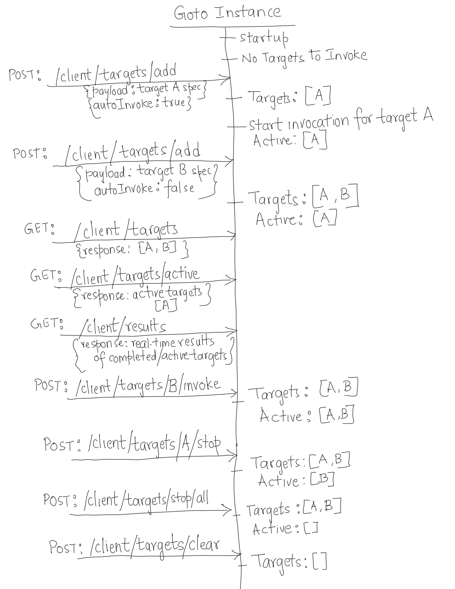

# Goto Client: Targets and Traffic Invocation
Flow showing usage of APIs to configure and invoke traffic from `goto` client instances

 

 
 

See [Targets and Traffic](../README.md#goto-client-targets-and-traffic) for more details.