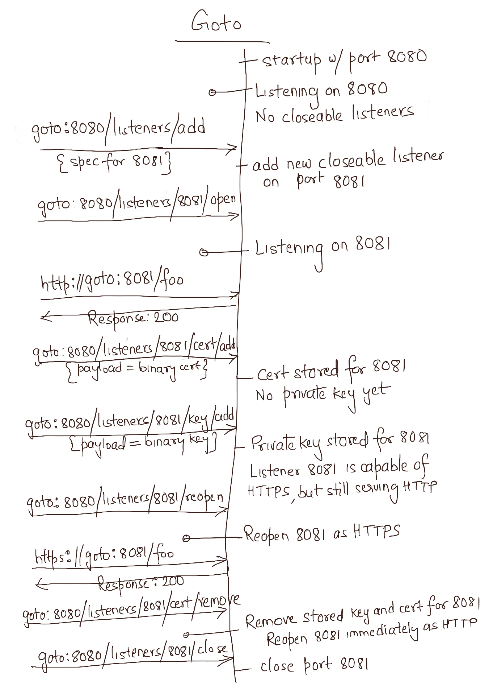

# Goto Server Listeners

A `goto` instance starts with one listener on the port given as startup argument (`--port`). Additional listeners can be opened, closed and configured on-the-fly via APIs. The flow below shows one such example.

 

 
 

See [Server Listeners](../README.md#server-listeners) for more details.