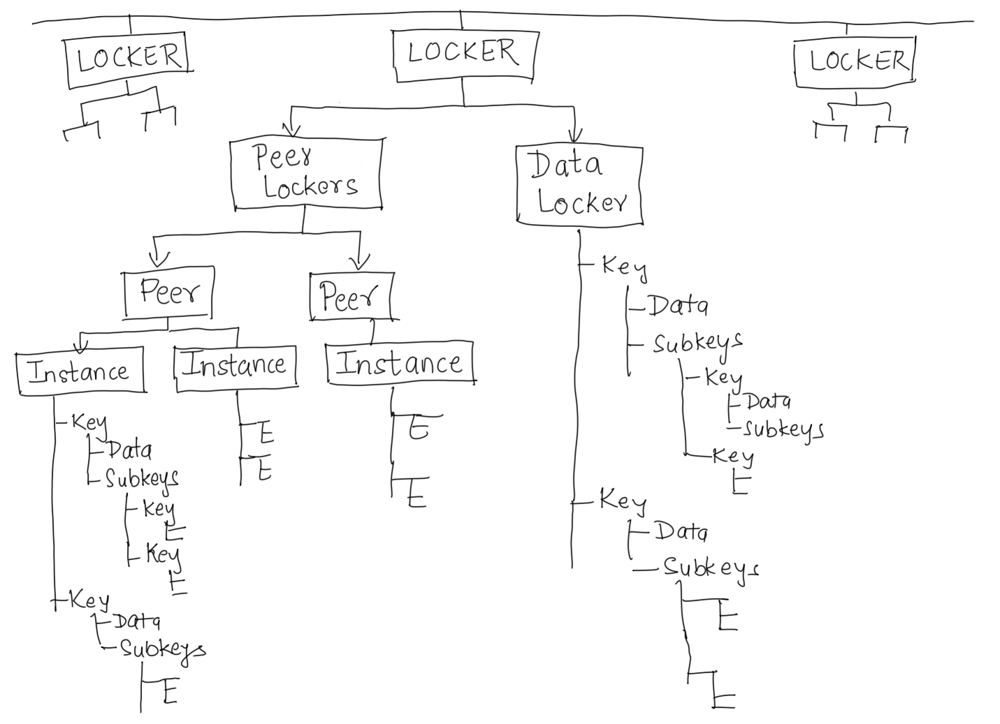
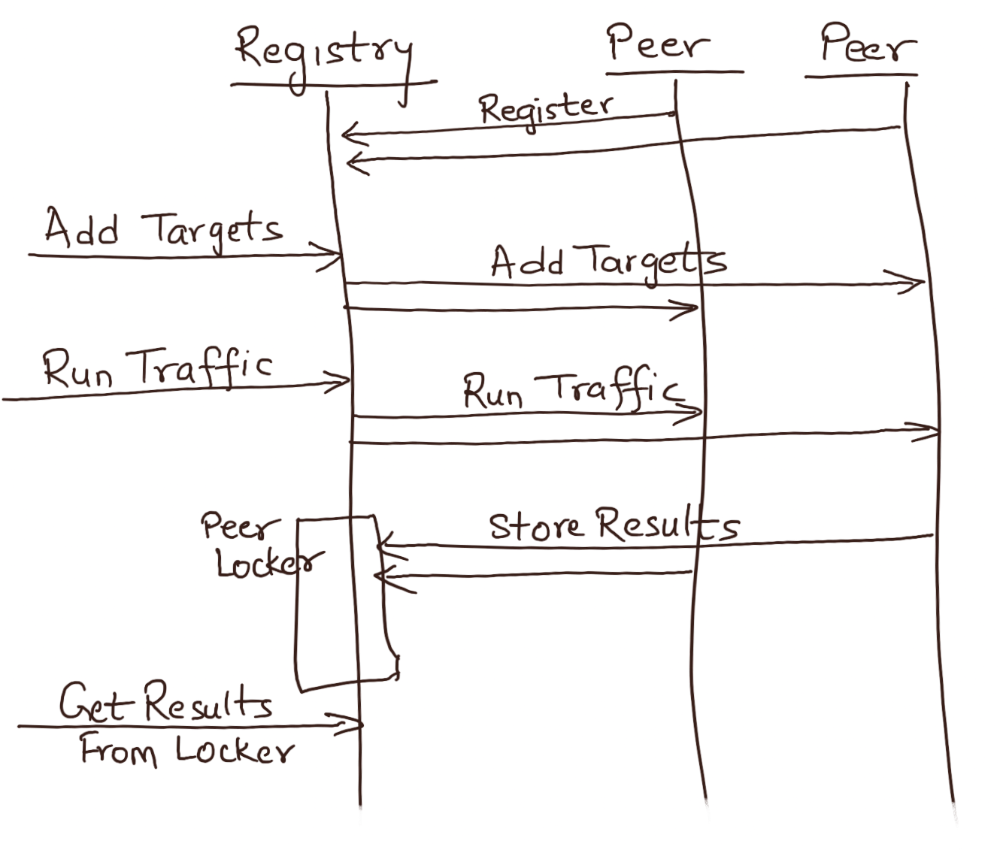

# Goto Lockers

`Goto` providrs `Labeled lockers` as general purpose in-memory key-value store. A locker can be created using `/open` API and removed using `/close`. Each instance starts with a default locker (label `default`). At any point, one locker remains current (can be referenced in various locker APIs using label `current`). Opening a new locker makes it the current locker, but the previous current locker is still accessible via its label. Closing a locker removes it from the memory. If the current locker is removed, the `default` locker becomes current again. Calling `/open` for an existing locker makes it the current locker again.

A locker consists of two parts: 
- `Peer Lockers`: used to store results reported by various peer `goto` instances
- `Data Locker`: available for custom data storage/retrieval using `/store`, `/get` and `/find` APIs.

 
 

## Data Lockers
A `Data Locker` is a recursive key-value storage structure. Each key may hold some `data` as text, and/or hold a set of `subkeys`. Each subkey points to a `Data Locker` of its own, capable of holding data as well as subkeys, and the structure keeps recursing. The recursive tree is built on the fly based on the key paths added via the `/store` APIs.

The `/store` and `/get` APIs hide the complexity of the recursive storage by providing a simple interface that takes all the component keys of a path as comma-separated list, and creates/reads data from the given path. E.g. `/lockers/current/store/A,B,C` with store the given payload (POST) in the data field at the leaf (i.e. at node `C`) under key path `A -> B -> C`. 

Similarly, `/lockers/X/get/A,B,C` reads data stored under subkey `C` under path `A -> B -> C` in locker `X`. 

If no data was stored under the given path, the `/get` API returns the sub-locker tree at that node, which makes it useful to read an entire portion of locker using the same API. E.g. given the following store calls: `/lockers/X/store/A,B` and `/lockers/X/store/A,C`, which result in keys `B` and `C` created under parent key `A`, call to `/lockers/X/get/A` returns A's subtree, which includes subkeys `B` and `C` and their corresponding sublockers. Thus just a small set of APIs can be used in several flexible ways, making the lockers a useful data store for testing purposes (store results, logs, etc.).

 

## Peer Lockers

`Peer Lockers` store data organized by peer labels (as reported by the peer instances). For each peer label, a sublocker is created for each instance of the peer that connects to the registry. Each instance sublocker is essentiatelly a `Data Locker` that uses the same sub-structure. 

When the peers invoke some traffic and collect results, they send their invocations results to the registry in real-time, and registry stores each instance's results in its instance locker.

Data from peer lockers can be viewed by inspecting the entire locker using various `/get` or `/dump` APIs. Invocation results reported by various peer clients can be viewed in processed for using various `/results` API instead (e.g. `/lockers/targets/results` and `/lockers/targets/results?detailed=y`).

See [Registry Lockers APIs](../README.md#registry-lockers-apis)