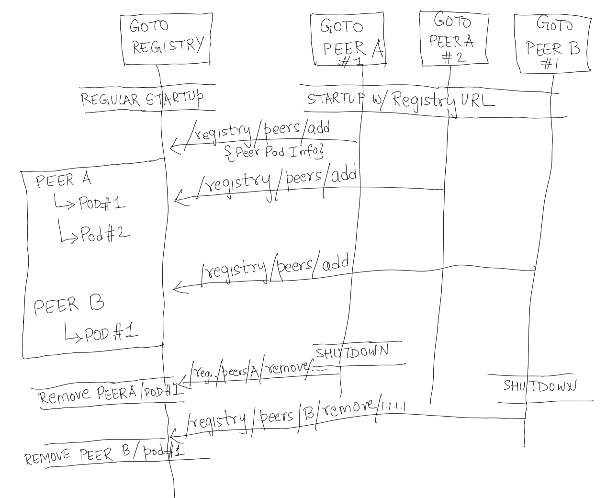

# Goto Registry - Peers Interactions

Peer instances register with the configured `Goto` registry at startup, and deregister at shutdown.

 

 
 

All target management and traffic invocation operations for multiple peer instances can be done via the registry.

 

 
 

Some examples of registry APIs used for peers targets management and traffic invocation.

 

 
 

See [Registry Peers APIs](../README.md#registry-peers-apis)