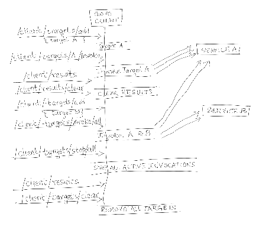
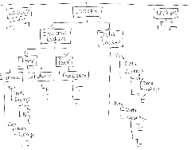

## `Use Case`: Test a client application's behavior when the upstream service goes down mid-request
Say you have a client application that connects to some remote service for some APIs. You intend to test how your application behaves if the server died before or during a request.

What's needed is:
- A `stand-in` test server that can respond to the exact API your client invokes and send valid responses too (headers, JSON payload, etc.). This requires the server to be configurable such that you can define a custom API along with a custom response for the API.
- We should be able to ask the service to die anytime! But we don't really want the server process to die, because we want the service to also become available at some later point. We want the service downtime to be such that it can be scripted and tested without losing any observable metrics/logs/results server may have collected so far.
- Although the requirement didn't ask for this, wouldn't it be nice if we could reconfigure the API to respond with a slightly different response (v2.0) so that when the Service API is back up again, we can see that the client is indeed getting a different response now! But how do we configure a dead port? Well, how do we configure any port? Hmm... what's a port anyway?

Quite some ask. This example shows how `Goto` can be of help: [Using Goto for upstream service chaos](goto-upstream-chaos.md#scenario-mocking-upstream-service-death).

#
## `Use Case`: Test a client application's behavior against invalid upstream TLS certs
Similar to the previous scenario but going one step further, let's say your client application's users have reported that the application acts funny randomly. You suspect it may have to do with the TLS certs presented by some of the upstream service nodes. In order to validate your hypothesis, you need to be able to manipulate the server TLS certs on-the-fly, to switch between valid and invalid certs.

In addition to the previous scenario's requirements, what we need is:
- The server should give us a way to change the TLS certs used for a port via some backdoor access, preferably by calling some `admin` API so that it can be scripted. 
- The server should provide enough observability so we can validate that a request indeed reached the server with certain parameters, and a response was sent. The traffic observed on the server can be correlated with the behavior observed on the client.

Well, not to despair, we have `goto`. See the solution here: [Using Goto for upstream service TLS chaos](goto-upstream-chaos.md#scenario-mocking-upstream-tls-certs-chaos).

#
## `Use Case Pattern`: Test a client against upstream chaos
Now that you have seen the previous two use cases, you may already be thinking of several similar scenarios where `goto` may help. The pattern here is that a client application needs to be tested against a chaotic upstream service. The upstream service can introduce various kinds of chaos at any point in the client-service interaction, and we need to assess the client behavior in presence of the chaos.
Examples of chaotic situations that the upstream server may present are:
- Service switches from HTTP to HTTP/2
- Service port dies while the client was connected
- Service takes a long time to respond to a request, causing the client to time out.
- Service response time is longer than the HTTP/TCP timeouts configured on any intermediate gateway/proxy.
- Service takes too long to respond and triggers an HTTP server timeout on the service end
- Service switches from HTTPS to HTTP and vice-versa 
- Service switches between various kinds of TLS certs with different encryption parameters, etc.
- Server response exceeds some HTTP protocol limits: too big header, too big payload, etc.

There can be many more chaotic scenarios that you may think of. Many such scenarios can be recreated in the artificial testing setup using some basic configurable patterns that `goto` offers:
- Generic server that can listen and respond on one or more ports with different protocols (HTTP, HTTPS, HTTP/2, TCP, gRPC)
- Being able to open/close ports on the fly to mimic a service going down and recovering
- Change a port's protocol on-the-fly before reopening it
- Add/remove custom TLS certs for certain ports
- Auto-generate TLS certs for certain ports
- Configure a custom URI that the server can respond to with a custom response (status code, headers, payload)
- Introduce artificial delays for all or specific requests
- Configure dynamic response for certain APIs, where the response can be based on values received in the request (performing transformations).

#
## `Use Case`: Test traffic behavior between a pair of client and service in the face of network or proxy chaos
Another aspect of chaos testing, perhaps in a more advanced setup, is where we want to observe the behavior of a client and a service as their communication gets disrupted in the network or in some intermediate proxy/gateway. The key idea is that the chaos gets introduced by an intermediary that sits in the traffic path but is outside the control of both the client and the server. Such intermediary chaos is hard to produce without disrupting the network or forcibly introducing bad behavior in the intermediate gateway/proxy. 

Hmm, hard you say. What's needed is a tool (obvious by now what that tool would be) that can sit between a client and a service, allowing the traffic to flow through it while giving us the knobs that we can turn to disrupt the traffic.

Capabilities needed to make this happen:
- Make certain upstream calls based on downstream requests, and use upstream response to build a dynamic response to send back to the downstream client (performing transformations). This ensures at the minimum that the client and the service are unaware of the presence of a middleman.
- Introduce some chaos into the traffic as an intermediary.

This is what `Goto`'s [Proxy](../README.md#proxy) and [Tunnel](../README.md#tunnel) features aim to provide. See, it's only hard until you bring `goto` into the mix. See one such example usage in this doc: [Scenario: Creating chaos with Goto as an HTTP proxy](goto-proxy-chaos.md#scenario-creating-chaos-with-goto-as-an-http-proxy).

#
## `Use Case`: Test TCP clients and services with some network or proxy chaos
Taking things up a notch, the previous scenario can be re-imagined with TCP clients and services, trying to create some network or proxy chaos and observing the client/service behaviors.

Capabilities needed to make this happen:
- A TCP proxy that can sit between a client and a service transparently.
- Introduce some chaos into the traffic at this intermediary proxy.

See an example in this doc: [Scenario: Creating TCP chaos with Goto](goto-proxy-chaos.md#scenario-creating-tcp-chaos-with-goto)

Going even further, `goto` proxy allows for routing to multiple upstream TCP endpoints based on SNI from client's TLS handshake. `Goto` would still act as an opaque TCP proxy and actual TLS handshake gets done between the client and the service, but `goto` can inspect the client handshake packets to read the SNI information and route to one of the multiple upstream TCP endpoints that are configured for SNI-based routing. Too much? Well, at least see the example in this doc: [Scenario: TCP Proxy with SNI matching using Goto](goto-proxy-chaos.md#scenario-tcp-proxy-with-sni-matching-using-goto)

See more [Proxy Examples](proxy-example.md)

#
## `Use Case`: Test an upstream gRPC service behavior
`Goto` client module has support for sending gRPC traffic to any arbitrary gRPC service. 
- You'd need a proto file for the upstream service that describes the service methods, inputs, outputs, etc. 
- `Goto` gRPC APIs allow you to upload proto files that `goto` can parse and learn about the available gRPC services. 
- Then it's just a matter of adding targets to the `goto` client module and asking it to trigger the traffic. 

See [Client gRPC Examples](grpc-client-examples.md) for full working samples.

#
## What Else?
- You need to inspect some existing traffic between two applications in order to investigate some issue. The traffic passes through various network layers, and you wish to analyze the state of a request at a certain point in its journey, e.g. what does the request look like once it goes through a K8s ingress gateway. You're staring at the right tool.
- You wish to test a proxy/gateway behavior sitting between a pair of client and service in the face of upstream and/or downstream chaos. Here our focus of testing is an intermediate proxy (e.g. service mesh).

TODO: Many more scenarios can benefit from `goto`. More scenarios will be added here soon.

---

## Some Flow Diagrams and Scenarios Explained

Check these flow diagrams to get a visual overview of `Goto` behavior and usage.

### Flow: [Use client APIs to register and invoke traffic to targets ](goto-client-targets.md) 

### Flow: [Configuring Server Listeners](goto-listeners.md) 

### Flow: [<small>`Goto`</small> Registry - Peer interactions](goto-registry-peers-interactions.md) 

### Overview: [Goto Lockers](goto-lockers.md) 
